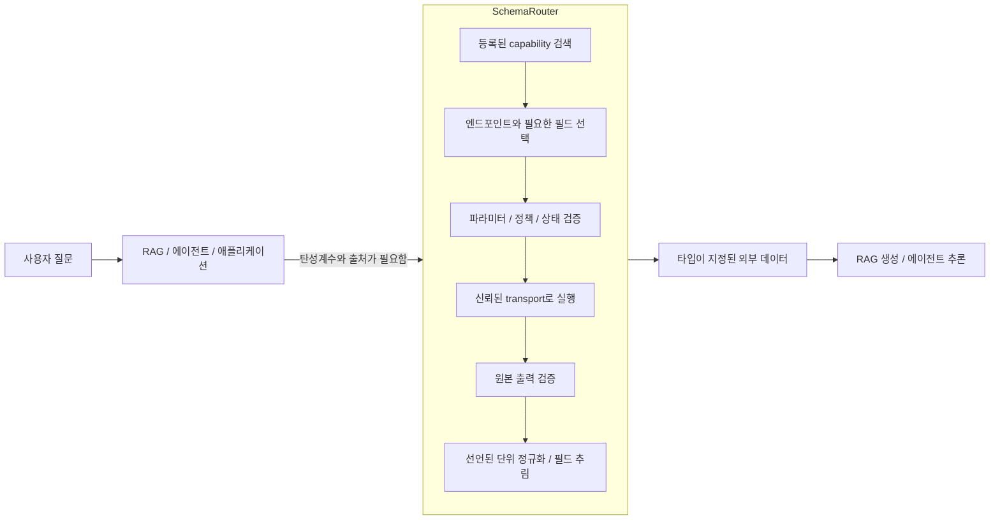
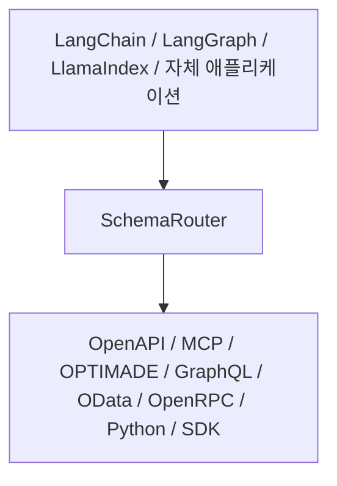

<p align="center">
  <picture>
    <source media="(prefers-color-scheme: dark)" srcset="https://raw.githubusercontent.com/JDeun/SchemaRouter/main/docs/assets/brand/schemarouter-lockup-dark.svg">
    
  </picture>
</p>

<p align="center"><strong>서로 다른 스키마를 쓰는 도구들 사이에 타입 기반 capability 경계를 둡니다.</strong></p>

<p align="center">
  <a href="README.md">English</a> ·
  <a href="README.ko.md">한국어</a> ·
  <a href="https://jdeun.github.io/SchemaRouter/ko/">Docs</a> ·
  <a href="examples/README.md">Examples</a> ·
  <a href="CONTRIBUTING.md">Contributing</a> ·
  <a href="https://github.com/JDeun/SchemaRouter/releases/latest">Latest release</a>
</p>

<p align="center">
  <a href="https://github.com/JDeun/SchemaRouter/actions/workflows/ci.yml"></a>
  <a href="https://github.com/JDeun/SchemaRouter/actions/workflows/docs.yml"></a>
  <a href="https://github.com/JDeun/SchemaRouter/actions/workflows/codeql.yml"></a>
  <a href="https://github.com/JDeun/SchemaRouter/actions/workflows/security.yml"></a>
  <a href="https://pypi.org/project/schemarouter/"></a>
  <a href="https://pypi.org/project/schemarouter/"></a>
  <a href="https://github.com/JDeun/SchemaRouter/blob/main/LICENSE"></a>
</p>

> **현재 안정판: 0.15.0** · Beta / pre-1.0

SchemaRouter는 MCP, OpenAPI, Python, 프레임워크 도구를 하나의 **타입 기반 검색·실행 경계**로
묶어 주는 LLM/RAG용 라이브러리입니다.

서로 다른 provider와 protocol의 도구가 섞이고, 비슷한 operation 사이에서 field semantics,
단위, qualifier, policy 조건까지 구별해야 할수록 routing은 어려워집니다. SchemaRouter는 질문에
필요한 **데이터 필드**를 먼저 찾고, 그 값을 제공할 수 있는 등록된 capability만 후보로 좁힙니다.
호출 전에는 인자·정책·fingerprint를 확인하고, 응답을 받은 뒤에는 등록된 schema와 field
contract를 다시 검사합니다. 단위, 측정 조건, 출처도 field contract에 명시할 수 있습니다.

측정한 break-even matrix에서는 **도구 개수 자체가 결정적인 변수가 아니었습니다**. low/medium
ambiguity의 합성 fixture에서는 강한 schema-aware lexical baseline만으로도 충분했지만, high
ambiguity에서는 그 baseline의 required-tool recall이 약 58–67%로 떨어지는 동안 SchemaRouter는
required-tool recall과 unsupported rejection을 모두 100%로 유지했습니다. 이는 production
utility를 증명한다는 뜻이 아니라 제품의 적용 경계를 보여 주는 결과입니다. 즉 SchemaRouter는
단순히 도구가 많을 때보다 **서로 다른 스키마와 의미를 가진 capability가 섞여 있거나 이름과
설명만으로 구별하기 어려울 때** 더 유용합니다.

[고정된 break-even matrix, latency trade-off, provenance 보기 →](docs/research/realistic-break-even-result.md)

`pip install schemarouter`

대화 루프, 메모리, 그래프, 최종 답변 생성은 SchemaRouter의 역할이 아닙니다.

[outputSchema를 공개하지 않는 MCP 서버에 결과 계약 선언하기 →](docs/guides/mcp.md#declare-a-result-contract-the-server-does-not-publish) ·
[측정된 agent-utility 결과 보기 →](docs/research/agent-utility-b1-result.md)

## 안정성 및 검증

SchemaRouter `0.15.0`은 **Beta / pre-1.0**입니다. Python 3.10–3.14는 릴리스 차단 CI 대상이며,
Python 3.15는 비차단 preview로 검증합니다.

검색 결과나 plan만으로는 tool을 실행할 수 없습니다. 실제 호출 직전에 schema/tool fingerprint,
binding, argument, policy를 다시 확인하고, 응답을 받은 뒤에는 raw output과 field projection을
검증합니다. 파괴적 동작이나 side effect가 분류되지 않은 원격 동작은 로컬 정책이 허용해야만
실행됩니다.

공개 릴리스에는 wheel, sdist, SPDX SBOM이 포함됩니다. 릴리스 파이프라인은 GitHub artifact
attestation을 만들고, 공개 PyPI에서 다시 내려받은 wheel/sdist의 digest가 신뢰된 빌드 산출물과
동일한지 검증합니다. 연구 결과는 안정 제품 보장과 분리되어 있으며 live decision-backend 실측은
#15에서 계속 추적합니다.

[릴리스 자산·CI/보안·hardening 이력·연구 claim 경계 검증하기 →](docs/project/trust-and-evidence.md)

## 빠른 시작

첫 사용자용 예제는 공개 provider 이름 `apis-guru`에서 시작합니다. SchemaRouter가 내장
provider profile을 해석해 OpenAPI adapter와 schema URL을 연결하므로 사용자가 먼저 프로토콜과
URL을 알 필요가 없습니다. 출력값은 하드코딩한 데모 값이 아니라 외부 provider의 실제 데이터입니다.

```python
import asyncio

from schemarouter import PlanRequest, SchemaRouter


async def main():
    router = SchemaRouter()
    async with router:
        registration = await router.add_provider("apis-guru")
        tool = router.registry.get(registration.registered_tool_keys[0])

        plan = router.plan(
            PlanRequest(
                query="API directory metrics total number of APIs",
                preferred_tools=[tool.key],
                max_calls=1,
            )
        )
        result = (await router.execute(plan))[0]
        print(result.tool, result.endpoint, result.data["numAPIs"])


asyncio.run(main())
```

이 예제는 **provider identity → adapter/schema 해석 → capability 등록 → 후보 선택 → 검증 후 실행 → 결과 반환**의
전체 흐름을 보여 줍니다. APIs.guru 데이터가 바뀌면 출력되는 숫자도 달라집니다.

필수 CI와 패키지 검증은 외부 서비스 장애에 영향을 받지 않도록
[`examples/quickstart.py`](examples/quickstart.py)의 결정론적 로컬 예제를 사용합니다. 위 실데이터
provider-first 실데이터 예제는 [`examples/live_openapi_quickstart.py`](examples/live_openapi_quickstart.py)에서 그대로
실행할 수 있습니다.

[실행 가능한 예제·데모 갤러리 보기 →](examples/README.md)

## 에이전트에 넘길 도구 후보만 추리기

SchemaRouter는 계획도 실행도 하지 않고 등록된 capability의 **Top-K 후보만** 돌려줄 수 있습니다.

```python
candidates = router.retrieve(
    "MAT-7의 현재 Young's modulus",
    k=5,
)

for candidate in candidates.candidates:
    print(candidate.route_id, candidate.output_fields)
```

로컬 실행 바인딩까지 지금 준비된 후보만 필요하면 `retrieve_executable(..., k=5)`을 씁니다.
비동기 API는 `aretrieve`, `aretrieve_executable`입니다.

현재 `main`에는 **실험 단계이고 기본값이 꺼져 있는** structural retrieval 프로파일도 들어
있습니다.

```python
router = SchemaRouter(structural_retrieval=True)
candidates = router.retrieve("등록된 job을 취소해줘", k=3)
```

이 프로파일은 보수적인 도구 식별자·연산 계열 근거와 스키마 구체성 기반 동점 처리를 더합니다.
실행 권한은 달라지지 않고, 제품 기본값도 아닙니다. 고정된 Top-3 후보군에 대한 독립 검색 확인은
통과했지만, 사전 등록한 강한 에이전트 K3-vs-K5 하위 게이트는 task-pass -2pp 승격 기준을 넘지
못했습니다. 그래서 Top-3는 held-out 벤치마크로 승격하지 않았습니다. 이후 릴리스가 이 상태를
바꾸기 전까지 structural retrieval은 선택형 연구 영역으로 다뤄야 합니다.

후보에는 완전한 유효 입출력 JSON Schema와 등록된 파라미터·출력 필드, semantic ID, 선택적 단위와
측정 조건, 제공자·접근 경로 식별 정보, 읽기/쓰기/파괴적 동작 메타데이터, 스키마 fingerprint가
그대로 남습니다.
검색 자체는 부수 효과가 없고 실행 권한도 주지 않습니다. 후보 중에서 고르는 일은 상위 에이전트가
하고, 실제 실행은 여전히 SchemaRouter의 검증과 정책을 통과해야 합니다.

## 작동 방식

### RAG에서 SchemaRouter의 위치

SchemaRouter는 최종 생성을 맡지 않습니다. 명시적인 스키마와 정책 아래 API와 도구에서 실시간
외부 데이터를 받아야 하는 애플리케이션에 검색·실행 경계를 제공합니다.



문서 중심 RAG의 retriever가 문서 조각이나 레코드를 찾는다면, SchemaRouter가 다루는 검색 대상은
**실행 가능한 capability와 그 capability가 돌려줄 수 있는 구조화된 데이터**입니다.

[RAG에서의 위치와 capability 모델](https://jdeun.github.io/SchemaRouter/concepts/capability-catalog/)

### Field-first, route-second

SchemaRouter는 **어떤 데이터가 필요한지**를 먼저 풀고, 그다음 그 데이터를 실제로 줄 수 있는
등록된 경로를 고릅니다.

예를 들어:

```text
질문: "이 소재의 300 K 탄성계수는?"

필요 field
  semantic_id: mechanical.elastic_modulus
  datatype: number
  unit: 해당되는 경우에만 선언
  qualifiers:
    temperature: 300 K

가능한 경로
  provider A / REST endpoint
  provider A / OPTIMADE access
  provider B / MCP tool
```

가용성 때문에 경로가 바뀔 수는 있습니다. 하지만 요청한 데이터 계약이 조용히 바뀌어서는
안 됩니다.

필드 계약에는 다음을 담을 수 있습니다.

- JSON 자료형과 구조
- semantic ID와 별칭
- 원본 단위(선택)
- 정규 단위로의 명시적 변환
- temperature, pressure, phase, orientation, method 같은 정확한 측정 조건
- 출처, 라이선스, 소스 유형 근거
- 제공자·접근 경로 식별 정보와 가용성

단위가 늘 필요하지는 않습니다. 텍스트, 식별자, 불리언, 구조화된 객체, 무차원 값은 단위가 없는
것이 정상입니다. 또 SchemaRouter는 단위 문자열만 보고 과학적 동등성이나 변환 계수를 추론하지
않습니다.

### 실행 경계



상위 프레임워크가 대화, 질의 분해, 생성, 메모리, 그래프, 에이전트 루프를 맡고, SchemaRouter는
타입이 붙은 capability와 실행 경계를 맡습니다.

Laya, Ollama, Jev/System-One, 호스팅 모델, 임베딩, pairwise 결정 백엔드는 이미 등록된 후보를
고르는 일을 도울 수 있습니다. 다만 실행 권한을 갖지는 못하고, 도구·필드·자격 증명·권한·부수
효과를 새로 만들어낼 수도 없습니다.

## capability 연결

원하는 **provider**는 알지만 그 provider가 제공하는 모든 protocol/SDK는 모른다면 provider
identity에서 시작할 수 있습니다.

```python
router = SchemaRouter()
result = await router.add_provider("materials-project")
```

SchemaRouter는 알려진 access method를 해석해 현재 환경에서 안전하고 사용할 수 있는 method만
등록합니다. 내장 acceptance set은 Materials Project, Crossref, Tavily, APIs.guru,
OData.org V4 reference service를 포함합니다. Credential과 optional dependency는 추측하거나
자동 설치하지 않고 명시적인 상태로 보고합니다.

[Provider 중심 등록 →](docs_ko/guides/provider-first-registration.md)

현재 `main`은 여러 범용 수집 경로를 지원합니다. 가능한 경우 가장 풍부하고 권위 있는
기계 판독 계약을 우선하고, SDK나 스키마가 약한 REST만 제공되는 경우에는 신뢰된 wrapper/binding을
사용합니다.

| 소스 | 적합한 경우 | 진입점 |
| --- | --- | --- |
| Provider identity | 서비스/provider는 알지만 protocol 구성을 모를 때 | `await router.add_provider("materials-project")` |
| SQLite DB | 로컬/embedded RDB의 schema를 자동 파악할 때 | `router.add_sqlite_database(connection, ...)` |
| SQLAlchemy Engine | RDB/warehouse connection을 caller가 소유할 때 | `router.add_sqlalchemy_database(engine, ...)` |
| Vector store | collection/index discovery + bounded similarity search | `router.add_vector_store(backend, embed_query, ...)` |
| Qdrant | caller-owned Qdrant client | `router.add_qdrant_vector_store(client, embed_query, ...)` |
| Milvus | caller-owned MilvusClient | `router.add_milvus_vector_store(client, embed_query, ...)` |
| Graph/RDF store | graph schema discovery + bounded traversal | `router.add_graph_store(backend, ...)` |
| NoSQL record store | document/search/KV/time-series schema discovery + bounded query | `router.add_record_store(backend, ...)` |
| 직접 ToolSpec | 애플리케이션이 이미 정규 계약을 갖고 있을 때 | `router.add_tool(...)` |
| Python | capability가 로컬에 있고 타입이 붙어 있을 때 | `router.add_callable(...)` |
| ToolSpec + SDK/client | transport는 신뢰하지만 안전한 자동 introspection이 어려울 때 | `router.add_bound_tool(...)` |
| OpenAPI | HTTP API가 OpenAPI/Swagger를 낼 때 | `SchemaRouter.from_url(..., kind="openapi")` |
| MCP Streamable HTTP | MCP 서버가 HTTP로 접근 가능할 때 | `SchemaRouter.from_url(..., kind="mcp")` |
| MCP stdio | 로컬 MCP 서버를 신뢰된 subprocess로 실행할 때 | `router.add_mcp_stdio(...)` |
| MCP custom transport | 애플리케이션이 MCP client lifecycle을 이미 소유할 때 | `router.add_mcp_client_factory(...)` |
| OPTIMADE | 소재 데이터가 OPTIMADE로 노출돼 있을 때 | `SchemaRouter.from_url(..., kind="optimade")` |
| GraphQL | introspection과 selection set을 쓸 수 있을 때 | `SchemaRouter.from_url(..., kind="graphql")` |
| OData | CSDL/`$metadata`와 `$select`를 제공할 때 | `SchemaRouter.from_url(..., kind="odata")` |
| OpenRPC | JSON-RPC 서비스가 OpenRPC를 낼 때 | `SchemaRouter.from_url(..., kind="openrpc")` |
| LangChain tool | 이미 LangChain tool로 존재할 때 | `router.add_langchain_tool(...)` |
| LlamaIndex tool | 이미 LlamaIndex tool로 존재할 때 | `router.add_llamaindex_tool(...)` |
| REST/JSON | 신뢰된 계약은 있지만 discoverable schema가 없을 때 | `router.add_http_tool(...)` |
| 커스텀 프로토콜 | 별도 discovery/transport가 필요할 때 | `router.register_adapter(...)` |
| 사람이 읽는 문서 | 기계가 읽을 수 있는 계약이 없을 때 | 검사 → 제안 → 명시적 승인 |

하나의 provider에 여러 접근 경로를 동시에 등록할 수도 있습니다. 예를 들어 Materials Project는
같은 provider 아래 OpenAPI, OPTIMADE, Python/mp-api, 명시적 SDK binding을 서로 다른
`access_mode`로 둘 수 있습니다.

[범용 ingestion matrix와 여러 도메인 예시 보기 →](docs/guides/universal-ingestion.md)

LangChain, LangGraph, LlamaIndex 브리지와 선택형 OpenTelemetry 내보내기를 제공합니다. 표준이
아닌 결정 런타임은 `schemarouter.decision_backends` entry-point 플러그인으로 연결할 수 있습니다.

## 0.15.0에서 실제로 작동하는 것

지금 배포된 패키지는 핵심 아키텍처가 실제로 도는 베타 구현입니다.

- 타입이 붙은 Tool / Endpoint / Parameter / Field 레지스트리 계약
- `retrieve` / `aretrieve`와 실행 준비 확인 변형을 통한 first-class bounded Top-K capability 검색
- 직접 ToolSpec/Python/SDK binding, schema introspection 기반 SQLite/SQLAlchemy DB, OpenAPI, MCP, OPTIMADE, GraphQL, OData, OpenRPC, declarative HTTP/JSON, LangChain/LlamaIndex tool 수집 경로
- field-first 계획 수립과 bounded 다중 제공자 필드 커버리지
- 입력과 원본 출력의 JSON Schema 검증
- 스키마 fingerprint와 바인딩 드리프트 차단
- 읽기/쓰기/파괴적 동작에 대한 로컬 정책과 호출별 승인
- 명시적인 서버 측 필드 투영과 최종 로컬 투영
- 선택적 자료형·단위 정규화와 정확한 과학적 측정 조건
- 제공자·접근 경로 폴백, 유한한 쿨다운, 신뢰된 헬스 복구
- 동기/비동기 호출, 배치, 스트리밍, 타입 이벤트, 트레이스, 검사·대시보드 화면
- LangChain, LangGraph, LlamaIndex, Jev/System-One, Laya, Ollama, OpenTelemetry 연동 지점

그래서 등록된 capability와 지원되는 라우팅 상황에서는 **지금도 아키텍처가 동작합니다**.
0.15.0에는 0.14의 source probe, startup rebinding, storage migration, 명시적인 schema-drift review, 통합 shutdown, Capability Explorer에 더해 provider-first onboarding, state-aware corrective retrieval, incremental capability graph/snapshot, versioned artifact, unified decision trace가 포함됩니다.


## 현재 연구 방향: 에이전트를 위한 압축된 capability 검색

0.12.0에서 확립한 stable-core 실행 경계는 0.15.0에서도 그대로입니다. 바뀐 것은 연구 질문입니다. SchemaRouter 자체를 최종
open-set 분류기로 만드는 쪽에서, 하위 LLM 에이전트에 **타입이 붙은 capability를 공급하는 검색
기반**으로 평가하는 쪽으로 옮겼습니다.

의도한 역할 분리는 이렇습니다.

```text
등록된 capability catalog
  -> SchemaRouter Top-K typed candidate
  -> downstream agent가 후보 안에서 선택
  -> local schema / argument / permission / destructive policy
  -> execution
```

이 구분이 중요한 이유는 이렇습니다. 보정된 0.14 Phase-A 고정 벤치마크에서 Top-1의 필요 경로
재현율은 68.97%였지만, Top-5는 필요한 capability를 100% 보존했습니다. 등록된 엔드포인트가
250개일 때 Top-5가 노출한 직렬화 스키마 컨텍스트는 FULL 대비 평균 2.38%에 그쳤습니다.

표준 B1 Qwen3-0.6B 에이전트 벤치마크는 종료됐습니다. SR-5는 task pass 91.30%를 기록해 FULL의
68.48%를 넘었고, tool-schema 토큰은 FULL의 5.42%만 썼으며, 승인 없이 일어난 파괴적 실행은
0건이었습니다. 이는 통제된 조건에서 메커니즘을 보인 근거이지 폭넓은 운영 주장은 아닙니다.
실질적으로 더 강한 SmolLM3-3B B2 재현 실험(#423)도 성공으로 종료됐습니다. 별도로 진행한
structural K3-vs-K5 최적화는 사전 등록한 task-pass 승격 게이트를 넘지 못해 K3는 held-out
벤치마크로 가져가지 않았습니다. 지금 열려 있는 게이트는 실행 상태를 반영한 교정 검색(#431)이고,
780-task held-out 벤치마크(#432)와 최종 답변 품질(#424)이 자동 컨베이어의 후속 확인 단계로
이어집니다.

앞선 0.11–0.13 open-set 분류기·veto 실험은 여전히 값진 부정적 증거입니다. 0.15.0에서는 실험적
learned router도, structural retrieval 프로필도 무조건적인 운영 기본값으로 올리지 않습니다.

자세한 내용:

- [라우팅 연구 현황](https://jdeun.github.io/SchemaRouter/research/routing-status/)
- [선행연구 로드맵](https://jdeun.github.io/SchemaRouter/research/prior-art-roadmap/)
- [전체 실험 인덱스](https://jdeun.github.io/SchemaRouter/research/experiment-index/)
- [0.14 논문 근거 체크포인트](https://jdeun.github.io/SchemaRouter/research/0.14-paper-evidence-checkpoint/)
- [0.15.0 릴리스 노트](https://jdeun.github.io/SchemaRouter/ko/releases/0.15.0/)
- [0.14.0 릴리스 노트](https://jdeun.github.io/SchemaRouter/ko/releases/0.14.0/)
- [변경 이력](CHANGELOG.md)

## 레지스트리와 실행 기록 확인

```bash
schemarouter inspect registry --db ./registry.sqlite3
schemarouter inspect tool materials --db ./registry.sqlite3
schemarouter inspect diff materials \
  --old-db ./registry-before.sqlite3 \
  --new-db ./registry-current.sqlite3
schemarouter inspect traces --db ./traces.sqlite3
schemarouter inspect trace <RUN_ID> --db ./traces.sqlite3
schemarouter dashboard \
  --registry ./registry.sqlite3 \
  --traces ./traces.sqlite3 \
  --output ./artifacts/schemarouter-dashboard.html
```

## 문서

- [설치](https://jdeun.github.io/SchemaRouter/getting-started/installation/)
- [빠른 시작](https://jdeun.github.io/SchemaRouter/getting-started/quickstart/)
- [SchemaRouter란](https://jdeun.github.io/SchemaRouter/concepts/schema-router/)
- [RAG에서의 위치와 capability 모델](https://jdeun.github.io/SchemaRouter/concepts/capability-catalog/)
- [Field-first 실행](https://jdeun.github.io/SchemaRouter/concepts/field-first-execution/)
- [OpenAPI](https://jdeun.github.io/SchemaRouter/guides/openapi/)
- [MCP](https://jdeun.github.io/SchemaRouter/guides/mcp/)
- [아키텍처와 성숙도](https://jdeun.github.io/SchemaRouter/architecture/)
- [보안 모델](https://jdeun.github.io/SchemaRouter/security/threat-model/)
- [선행연구 로드맵](https://jdeun.github.io/SchemaRouter/research/prior-art-roadmap/)
- [라우팅 연구 현황](https://jdeun.github.io/SchemaRouter/research/routing-status/)
- [전체 실험 인덱스](https://jdeun.github.io/SchemaRouter/research/experiment-index/)

## 범위

SchemaRouter는 또 하나의 채팅 추상화, 프롬프트 프레임워크, 모델 공급자 계층, 대화 메모리,
체크포인트 저장소, 그래프 런타임을 다시 만들지 않습니다.

> **Natural-language request → typed capability plan → validated external data → surrounding RAG/agent**

## 연구와 라이선스

SchemaRouter는
[SchemaRouter: Field-Aware Tool Routing for Efficient Heterogeneous Agentic RAG](https://github.com/JDeun/paper_SchemaRouter)
연구에서 출발했습니다.

[MIT](LICENSE) © 2026 Yong-eun Cho
