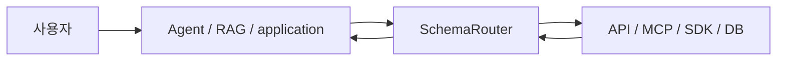

<p align="center">
  <picture>
    <source media="(prefers-color-scheme: dark)" srcset="https://raw.githubusercontent.com/JDeun/SchemaRouter/main/docs/assets/brand/schemarouter-lockup-dark.svg">
    
  </picture>
</p>

<p align="center"><strong>서로 다른 스키마의 도구와 데이터 사이에 타입 기반 capability 경계를 둡니다.</strong></p>

<p align="center">
  <a href="README.md">English</a> ·
  <a href="README.ko.md">한국어</a> ·
  <a href="https://jdeun.github.io/SchemaRouter/ko/">문서</a> ·
  <a href="examples/README.md">예제</a> ·
  <a href="CONTRIBUTING.md">기여</a> ·
  <a href="https://github.com/JDeun/SchemaRouter/releases/latest">최신 릴리스</a>
</p>

<p align="center">
  <a href="https://github.com/JDeun/SchemaRouter/actions/workflows/ci.yml"></a>
  <a href="https://github.com/JDeun/SchemaRouter/actions/workflows/docs.yml"></a>
  <a href="https://github.com/JDeun/SchemaRouter/actions/workflows/codeql.yml"></a>
  <a href="https://github.com/JDeun/SchemaRouter/actions/workflows/security.yml"></a>
  <a href="https://pypi.org/project/schemarouter/"></a>
  <a href="https://pypi.org/project/schemarouter/"></a>
  <a href="https://github.com/JDeun/SchemaRouter/blob/main/LICENSE"></a>
</p>

> **현재 안정판: 0.17.0** · Beta / pre-1.0

SchemaRouter는 API, 도구, 데이터 시스템 전반에서 AI 에이전트를 위한 **typed capability routing + governed execution layer**를 제공합니다.

상위 agent/orchestrator와 외부 도구·데이터 소스 사이에서 서로 다른 스키마를 하나의 capability
모델로 정리하고, 필요한 후보만 좁힌 뒤 실제 실행 직전에 스키마·권한·바인딩을 다시 검증합니다.
범용 agent framework, identity provider, DB proxy, LLM gateway를 대체하려는 프로젝트는 아닙니다.

```bash
pip install schemarouter
```

## 왜 SchemaRouter인가

일반적인 tool router가 주로 **어떤 도구를 고를 것인가**에 집중한다면, SchemaRouter는
**어떤 endpoint·parameter·output field·schema version·access path·policy·binding으로
실행해야 유효한가**까지 계약으로 다룹니다.

```text
사용자 질문
  -> 필요한 semantic field
  -> 제한된 capability 후보
  -> endpoint + parameter + output field
  -> policy / availability / schema 검증
  -> trusted execution
  -> projected typed result
```

API, MCP, SDK, DB, framework tool이 섞여 있고 이름은 비슷하지만 실제 스키마와 실행 제약이
다를 때 특히 유용합니다.

[핵심 개념 →](docs_ko/concepts/schema-router.md) ·
[Capability retrieval →](docs_ko/concepts/capability-catalog.md) ·
[실행 경계 →](docs_ko/concepts/execution.md)

## 빠른 시작

Provider-first onboarding은 사용자가 원하는 서비스 이름에서 시작하고, 내부 프로토콜은
SchemaRouter가 등록 가능한 경로로 해석합니다.

```python
import asyncio

from schemarouter import PlanRequest, SchemaRouter


async def main():
    router = SchemaRouter()

    async with router:
        registration = await router.add_provider("apis-guru")
        tool = router.registry.get(registration.registered_tool_keys[0])

        plan = router.plan(
            PlanRequest(
                query="API directory metrics total number of APIs",
                preferred_tools=[tool.key],
                max_calls=1,
            )
        )

        result = (await router.execute(plan))[0]
        print(result.tool, result.endpoint, result.data["numAPIs"])


asyncio.run(main())
```

전체 흐름은 다음과 같습니다.

**provider identity → schema/adapter 해석 → typed capability 등록 → bounded selection → 검증된 실행 → typed result**

[빠른 시작 문서 →](docs_ko/getting-started/quickstart.md) ·
[실행 가능한 예제 →](examples/README.md)

## 어디에 위치하는가



상위 애플리케이션이 대화, decomposition, memory, checkpoint, 최종 생성을 담당하고,
SchemaRouter는 **등록된 capability와 실행 경계**를 담당합니다.

Retrieval 자체는 side effect가 없습니다.

```python
candidates = router.retrieve("current Young's modulus for MAT-7", k=5)

for candidate in candidates.candidates:
    print(candidate.route_id, candidate.output_fields)
```

실제로 호출 가능한 binding까지 보장된 후보가 필요하면 `retrieve_executable(...)`을 사용합니다.

## 도구와 데이터 연결

서로 다른 source family를 같은 capability 모델 아래 연결할 수 있습니다.

| 계열 | 대표 진입점 |
| --- | --- |
| Provider identity | `await router.add_provider(...)` |
| Typed Python / ToolSpec | `add_callable(...)`, `add_tool(...)`, `add_bound_tool(...)` |
| API protocol | OpenAPI, MCP, OPTIMADE, GraphQL, OData, OpenRPC |
| 관계형 DB | SQLite, caller-owned SQLAlchemy Engine |
| Vector DB | Qdrant, Milvus, Pinecone, Weaviate, Chroma, PostgreSQL/pgvector |
| Graph / RDF | Neo4j, Neptune, ArangoDB, FalkorDB, SPARQL |
| Document / search / KV / time-series | MongoDB, Elasticsearch/OpenSearch, DynamoDB, Cosmos DB, Couchbase, ClickHouse, InfluxDB |
| Framework bridge | LangChain, LangGraph, LlamaIndex |

Credential, connection pool, DB client, transport state는 caller-owned로 유지합니다. Vendor raw
query language를 모델의 실행 권한으로 노출하지 않습니다.

[연결 경로 선택 →](docs_ko/getting-started/ingestion-paths.md) ·
[전체 ingestion matrix →](docs_ko/guides/universal-ingestion.md) ·
[Provider-first 등록 →](docs_ko/guides/provider-first-registration.md) ·
[Enterprise data onboarding →](docs_ko/guides/enterprise-data-onboarding.md)

## 권한관리와 Enterprise Data

Host application이 검증한 `PrincipalContext`를 받아 deny-by-default RBAC/ABAC를 retrieval
이전과 실행 직전에 적용할 수 있습니다.

같은 정책 모델로 다음 범위를 좁힐 수 있습니다.

- 노출 가능한 tool/endpoint;
- DB table과 field;
- trusted row/tenant filter;
- vector metadata filter;
- document/search field;
- graph relationship과 최대 hop.

SchemaRouter가 사용자를 인증하는 것은 아니며 DB-native role, grant, RLS, ACL, network control도
대체하지 않습니다.

[권한관리 →](docs_ko/guides/authorization.md) ·
[DB onboarding →](docs_ko/guides/database-onboarding.md)

## 실행 경계

Retrieval 결과나 모델의 선택만으로 실행 권한이 생기지 않습니다. 결과가 runtime 경계를 넘기
전에 다음을 다시 확인할 수 있습니다.

- tool/endpoint/schema fingerprint;
- argument와 JSON Schema;
- principal policy와 data scope;
- 현재 execution binding과 availability;
- raw output schema;
- 최종 field projection.

원격 mutation/destructive operation은 로컬 정책이 명시적으로 허용하지 않으면 fail-closed합니다.

[보안 모델 →](docs_ko/security/threat-model.md) ·
[신뢰성 및 릴리스 근거 →](docs_ko/project/trust-and-evidence.md)

## 안정성

SchemaRouter `0.17.0`은 **Beta / pre-1.0**입니다. Public API는 발전할 수 있지만,
breaking change는 문서화하고 release gate를 통과하도록 관리합니다.

Python 3.10–3.14는 release-blocking 대상이며 Python 3.15는 preview 대상입니다.

연구 benchmark는 안정 제품 보장과 분리합니다. 특정 실험 수치가 좋아졌다는 이유만으로
experimental retrieval/ranking을 자동으로 기본 동작으로 승격하지 않습니다.

[버전 정책 →](docs_ko/versioning.md) ·
[연구 현황 →](docs_ko/research/routing-status.md) ·
[변경 내역 →](CHANGELOG.md)

## 문서

| 주제 | 문서 |
| --- | --- |
| 설치와 첫 실행 | [시작하기](docs_ko/getting-started/installation.md) |
| 아키텍처와 핵심 개념 | [SchemaRouter란](docs_ko/concepts/schema-router.md) |
| Provider/API 등록 | [연결 가이드](docs_ko/guides/provider-first-registration.md) |
| Enterprise DB와 접근 범위 | [Enterprise data onboarding](docs_ko/guides/enterprise-data-onboarding.md) |
| Runtime policy와 권한 | [권한관리](docs_ko/guides/authorization.md) |
| 운영 상태 확인 | [Inspection](docs_ko/guides/inspection.md) |
| Public API | [Reference](docs_ko/reference/api.md) |
| 연구 근거 | [Research index](docs_ko/research/experiment-index.md) |

전체 문서: **https://jdeun.github.io/SchemaRouter/ko/**

## 범위

SchemaRouter는 agent loop, 최종 답변 생성, 사용자 인증, credential 저장, arbitrary DB/query
execution을 소유하지 않습니다. 이 기능들은 capability boundary 밖에 둡니다.

## 라이선스

MIT. [LICENSE](LICENSE)를 참고하세요.
