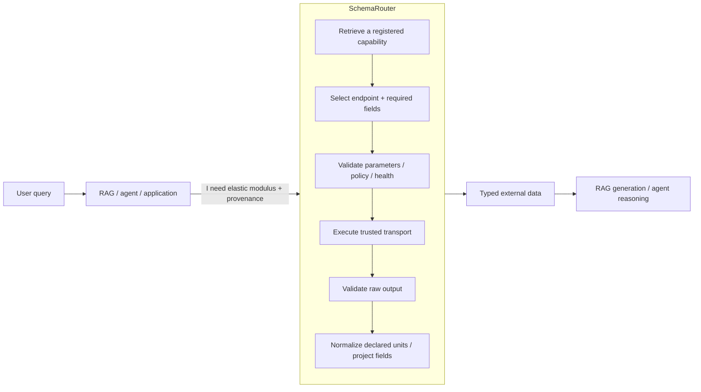
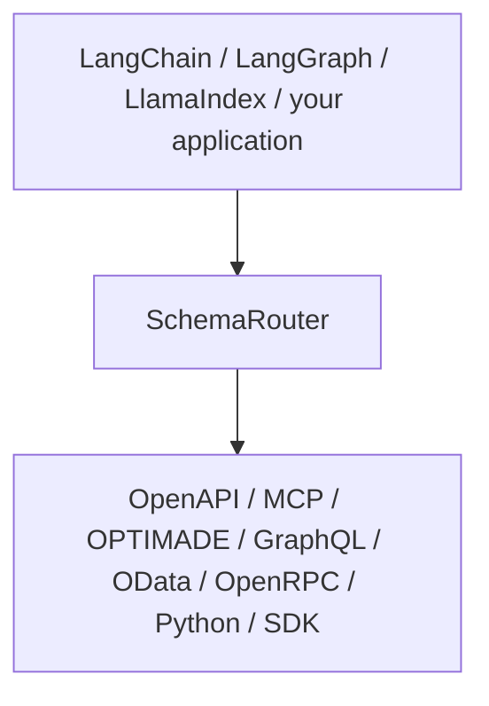

<p align="center">
  <picture>
    <source media="(prefers-color-scheme: dark)" srcset="https://raw.githubusercontent.com/JDeun/SchemaRouter/main/docs/assets/brand/schemarouter-lockup-dark.svg">
    
  </picture>
</p>

<p align="center"><strong>When tools speak different schemas, put a typed capability boundary in between.</strong></p>

<p align="center">
  <a href="README.md">English</a> ·
  <a href="README.ko.md">한국어</a> ·
  <a href="https://jdeun.github.io/SchemaRouter/">Docs</a> ·
  <a href="examples/README.md">Examples</a> ·
  <a href="CONTRIBUTING.md">Contributing</a> ·
  <a href="https://github.com/JDeun/SchemaRouter/releases/latest">Latest release</a>
</p>

<p align="center">
  <a href="https://github.com/JDeun/SchemaRouter/actions/workflows/ci.yml"></a>
  <a href="https://github.com/JDeun/SchemaRouter/actions/workflows/docs.yml"></a>
  <a href="https://github.com/JDeun/SchemaRouter/actions/workflows/codeql.yml"></a>
  <a href="https://github.com/JDeun/SchemaRouter/actions/workflows/security.yml"></a>
  <a href="https://pypi.org/project/schemarouter/"></a>
  <a href="https://pypi.org/project/schemarouter/"></a>
  <a href="https://github.com/JDeun/SchemaRouter/blob/main/LICENSE"></a>
</p>

> **Stable release: 0.15.0** · Beta / pre-1.0

SchemaRouter is a **typed capability retrieval and schema-aware execution layer for LLM/RAG agents**
across MCP, OpenAPI, Python, and framework tools.

Tool routing gets harder when a catalog mixes providers and protocols with overlapping operations,
different field semantics, units, qualifiers, and policy constraints. SchemaRouter works out
**which declared data fields are needed**, exposes a bounded set of registered capabilities that
can supply them, and keeps only declared output fields before the result reaches the model. Typed
contracts can carry units, qualifiers, provenance, and validation rules so one value cannot
silently stand in for another.

The measured break-even matrix shows that **catalog size alone is not the deciding factor**. A
strong schema-aware lexical baseline was sufficient on the low/medium-ambiguity synthetic fixtures,
while SchemaRouter preserved 100% required-tool recall and unsupported rejection on the
high-ambiguity fixtures where that baseline's recall fell to about 58–67%. The result is a
positioning boundary, not a production-utility claim: SchemaRouter is most useful when capabilities
are heterogeneous or difficult to distinguish by names and descriptions alone.

[Read the frozen break-even matrix, latency trade-offs, and provenance →](docs/research/realistic-break-even-result.md)

`pip install schemarouter`

It is **not** a general agent framework, an LLM provider layer, or a RAG generator.

[Declare a result contract for an MCP server that does not publish one →](docs/guides/mcp.md#declare-a-result-contract-the-server-does-not-publish) ·
[See the measured agent-utility result →](docs/research/agent-utility-b1-result.md)

## Stability and verification

SchemaRouter `0.15.0` is **Beta / pre-1.0**. Python 3.10–3.14 are release-blocking CI targets;
Python 3.15 is a non-blocking preview.

Plans and retrieved candidates do not grant execution authority. The runtime revalidates current
schema/tool fingerprints, bindings, arguments, policy, raw output, and field projection before a
result crosses the execution boundary. Destructive and unclassified remote operations fail closed
unless local policy explicitly authorizes them.

The public release includes wheel, sdist, and an SPDX SBOM. The release pipeline creates GitHub
artifact attestations and verifies that public PyPI wheel/sdist digests match the trusted build
artifacts. Research results remain separate from stable product guarantees; live decision-backend
evidence is still tracked in #15.

[Verify release artifacts, CI/security controls, hardening history, and research claim boundaries →](docs/project/trust-and-evidence.md)

## Quickstart

This first example starts from the public provider name `apis-guru`. SchemaRouter resolves
its built-in provider profile to the underlying OpenAPI adapter, so the user does not need to know
the schema URL first. The returned number is provider-owned live data rather than a hard-coded demo
value.

```python
import asyncio

from schemarouter import PlanRequest, SchemaRouter


async def main():
    router = SchemaRouter()
    async with router:
        registration = await router.add_provider("apis-guru")
        tool = router.registry.get(registration.registered_tool_keys[0])

        plan = router.plan(
            PlanRequest(
                query="API directory metrics total number of APIs",
                preferred_tools=[tool.key],
                max_calls=1,
            )
        )
        result = (await router.execute(plan))[0]
        print(result.tool, result.endpoint, result.data["numAPIs"])


asyncio.run(main())
```

The flow is the product in miniature: **provider identity → resolved adapter/schema → typed registered capabilities → bounded selection → validated execution → typed result**. The final integer changes as APIs.guru changes.

For network-independent CI/package acceptance, the repository keeps
[`examples/quickstart.py`](examples/quickstart.py) as a deterministic local smoke. The complete
live provider-first version above is [`examples/live_openapi_quickstart.py`](examples/live_openapi_quickstart.py).

[Browse the runnable example and demo gallery →](examples/README.md)

## Retrieve a compact tool set for an agent

SchemaRouter can return registered capability candidates **without planning or executing them**:

```python
candidates = router.retrieve(
    "current Young's modulus for MAT-7",
    k=5,
)

for candidate in candidates.candidates:
    print(candidate.route_id, candidate.output_fields)
```

Use `retrieve_executable(..., k=5)` when candidates must also have a currently ready local
execution binding. Async counterparts are `aretrieve` and `aretrieve_executable`.

Current `main` also includes an **experimental, default-off** structural retrieval profile:

```python
router = SchemaRouter(structural_retrieval=True)
candidates = router.retrieve("cancel this registered job", k=3)
```

This profile adds conservative tool-identifier and operation-family evidence plus a schema-specificity
tie-break. It does **not** change execution authority, and it is not the product default. Independent
retrieval confirmation passed for a fixed Top-3 shortlist, but the preregistered strong-agent
K3-vs-K5 downstream gate later failed its -2pp task-pass promotion floor. So Top-3 is **not**
promoted into the held-out benchmark. Treat structural retrieval as an opt-in research surface until
a later release changes that status.

The returned candidates retain the full effective input/output JSON Schemas plus registered
parameters/output fields, semantic IDs, optional units and qualifiers, provider/access identity,
read/write/destructive metadata, and schema fingerprints. Retrieval has no side effect and does not grant execution authority; the surrounding
agent still chooses among candidates and execution is still subject to SchemaRouter validation and
policy.

## How it works

### Where SchemaRouter fits in RAG

SchemaRouter does not perform final generation. It provides a structured retrieval and execution
boundary for applications that need live external data from APIs and tools under explicit schemas
and policy.



For document-centric RAG, a retriever commonly searches chunks or records. SchemaRouter addresses a
different retrieval surface: **executable capabilities and the structured data they can return**.

[Read the RAG positioning and capability model](https://jdeun.github.io/SchemaRouter/concepts/capability-catalog/)

### Field-first, route-second

SchemaRouter first resolves **what data is required**, then chooses a registered route that can
provide it.

For example:

```text
Query: "What is the elastic modulus of this material at 300 K?"

Required field
  semantic_id: mechanical.elastic_modulus
  datatype: number
  unit: optional but declared when applicable
  qualifiers:
    temperature: 300 K

Possible routes
  provider A / REST endpoint
  provider A / OPTIMADE access
  provider B / MCP tool
```

Availability can change the route. It must not silently change the requested data contract.

A field contract can carry:

- JSON datatype / shape;
- semantic ID and aliases;
- optional source unit;
- explicit canonical unit normalization;
- exact qualifiers such as temperature, pressure, phase, orientation, or method;
- provenance, license, or source-type evidence;
- provider/access identity and availability metadata.

Units are optional because many legitimate fields are text, identifiers, booleans, structured
objects, or dimensionless values. SchemaRouter does not infer scientific equivalence or conversion
factors from a unit string alone.

### Execution boundary



The surrounding framework owns conversation, decomposition, generation, memory, graphs, and agent
loops. SchemaRouter owns the typed capability and execution boundary.

Optional Laya, Ollama, Jev/System-One, hosted-model, embedding, or pairwise decision backends may
assist selection over locally registered candidates. They do not become execution authority and
cannot invent tools, fields, credentials, permissions, or side effects.

## Connect capabilities

If you know the **provider** you want but not every protocol or SDK it exposes, start from provider
identity:

```python
router = SchemaRouter()
result = await router.add_provider("materials-project")
```

SchemaRouter resolves known access methods for that provider and registers only the methods that are
safe and usable in the current process. The built-in acceptance set covers Materials Project,
Crossref, Tavily, APIs.guru, and the OData.org V4 reference service. Credentials and optional dependencies are reported explicitly rather than
guessed, installed, or persisted.

[Provider-first registration →](docs/guides/provider-first-registration.md)

Current `main` also supports the lower-level ingress styles below. Prefer the richest authoritative
machine-readable contract available; use a trusted wrapper/binding when a provider exposes only an
SDK or weakly described REST surface.

| Source | Use when | Entry point |
| --- | --- | --- |
| Provider identity | you know the service/provider, not its protocols | `await router.add_provider("materials-project")` |
| SQLite database | local/embedded relational data should be schema-introspected | `router.add_sqlite_database(connection, ...)` |
| SQLAlchemy Engine | RDB/warehouse connection is caller-owned | `router.add_sqlalchemy_database(engine, ...)` |
| Vector store | collection/index discovery + bounded similarity search | `router.add_vector_store(backend, embed_query, ...)` |
| Direct ToolSpec | the application already owns the canonical contract | `router.add_tool(...)` |
| Python | capability is local and typed | `router.add_callable(...)` |
| ToolSpec + SDK/client | transport is trusted but not safely introspectable | `router.add_bound_tool(...)` |
| OpenAPI | HTTP API publishes OpenAPI/Swagger | `SchemaRouter.from_url(..., kind="openapi")` |
| MCP Streamable HTTP | server is reachable by MCP over HTTP | `SchemaRouter.from_url(..., kind="mcp")` |
| MCP stdio | local MCP server is a trusted subprocess | `router.add_mcp_stdio(...)` |
| MCP custom transport | application already owns an MCP client lifecycle | `router.add_mcp_client_factory(...)` |
| OPTIMADE | materials data is exposed through OPTIMADE | `SchemaRouter.from_url(..., kind="optimade")` |
| GraphQL | introspection + native selection sets are available | `SchemaRouter.from_url(..., kind="graphql")` |
| OData | CSDL/`$metadata` + `$select` are available | `SchemaRouter.from_url(..., kind="odata")` |
| OpenRPC | JSON-RPC service publishes OpenRPC | `SchemaRouter.from_url(..., kind="openrpc")` |
| LangChain tool | capability already exists as a LangChain tool | `router.add_langchain_tool(...)` |
| LlamaIndex tool | capability already exists as a LlamaIndex tool | `router.add_llamaindex_tool(...)` |
| REST/JSON | contract is trusted locally but no discoverable schema exists | `router.add_http_tool(...)` |
| Custom protocol | custom discovery/transport is required | `router.register_adapter(...)` |
| Human-readable docs | no machine-readable contract exists | inspect → proposal → explicit approval |

A provider may expose multiple access paths at once. Materials Project, for example, can be
represented through OpenAPI, OPTIMADE, Python/mp-api, or an explicit SDK binding under one provider
identity with different `access_mode` values.

[See the universal ingestion matrix and broad-domain examples →](docs/guides/universal-ingestion.md)

Framework bridges are available for LangChain, LangGraph, and LlamaIndex. OpenTelemetry is optional.
Third-party bounded decision backends can be published through the
`schemarouter.decision_backends` entry-point group.

## What works in 0.15.0

The released package provides a working beta implementation of the core architecture:

- typed Tool / Endpoint / Parameter / Field registry contracts;
- first-class bounded Top-K capability retrieval through `retrieve` / `aretrieve`, explicit state-aware filtering, and state-conditioned corrective backfill;
- provider-first registration for known services plus direct ToolSpec/Python/SDK binding, schema-introspected SQLite/SQLAlchemy databases, and OpenAPI, MCP, OPTIMADE, GraphQL, OData, OpenRPC, declarative HTTP/JSON, and inbound LangChain/LlamaIndex ingestion paths;
- field-first planning and bounded multi-provider field coverage;
- input and raw-output JSON Schema validation;
- schema fingerprints and binding-drift rejection;
- read/write/destructive local policy gates and per-call approval hooks;
- explicit server-side field projection plus final local projection;
- optional datatype/unit normalization and exact scientific qualifiers;
- provider/access fallback with finite cooldown and trusted health recovery;
- indexed/incremental capability dependency graphs, atomic versioned snapshot publication, and validated artifact/snapshot migration;
- sync/async invocation, batch, streaming, typed events, unified capability decision traces, and inspection/dashboard surfaces;
- LangChain, LangGraph, LlamaIndex, Jev/System-One, Laya, Ollama, and OpenTelemetry integration
  surfaces.

So **the architecture works today** for declared capabilities and supported routing cases.
0.15.0 includes the 0.14 operational surface—source probing, startup rebinding, storage migrations, explicit schema-drift review, unified shutdown, and the Capability Explorer—plus provider-first onboarding, state-aware corrective retrieval, incremental capability graphs/snapshots, versioned artifacts, and unified decision traces.


## Current research direction: compact capability retrieval for agents

The stable-core execution boundary established in 0.12.0 remains unchanged in 0.15.0. The active research question has shifted from
making SchemaRouter itself the final open-set classifier to evaluating it as a **typed capability
retrieval substrate** for a downstream LLM agent.

The intended separation is:

```text
registered capability catalog
  -> SchemaRouter Top-K typed candidates
  -> downstream agent chooses among candidates
  -> local schema / argument / permission / destructive policy
  -> execution
```

Why this matters: on the corrected frozen 0.14 Phase-A benchmark, Top-1 required-route recall was
68.97%, while Top-5 preserved 100% of required capabilities. At 250 registered endpoints,
Top-5 exposed only 2.38% of the FULL serialized schema context on average.

The canonical B1 Qwen3-0.6B agent benchmark is terminal: SR-5 achieved 91.30% task pass
versus 68.48% for FULL while using 5.42% of FULL tool-schema tokens, with 0
unauthorized destructive executions. This is controlled mechanism evidence rather than a broad
production claim. The materially stronger SmolLM3-3B B2 replication (#423) is also terminal
success. A separate structural K3-vs-K5 optimization failed its preregistered task-pass promotion
gate, so K3 is not carried into the held-out benchmark. Execution-state-aware corrective retrieval
(#431) is the active gate; the 780-task held-out benchmark (#432) and final-answer quality benchmark
(#424) are downstream confirmation stages.

The earlier 0.11–0.13 open-set classifier/veto experiments are still valuable negative evidence. No
experimental learned router or structural retrieval profile is promoted as an unconditional production default in 0.15.0.

See:

- [Routing research status](https://jdeun.github.io/SchemaRouter/research/routing-status/)
- [Prior-art roadmap](https://jdeun.github.io/SchemaRouter/research/prior-art-roadmap/)
- [Complete experiment index](https://jdeun.github.io/SchemaRouter/research/experiment-index/)
- [0.14 paper-evidence checkpoint](https://jdeun.github.io/SchemaRouter/research/0.14-paper-evidence-checkpoint/)
- [0.15.0 release notes](https://jdeun.github.io/SchemaRouter/releases/0.15.0/)
- [0.14.0 release notes](https://jdeun.github.io/SchemaRouter/releases/0.14.0/)
- [Changelog](CHANGELOG.md)

## Inspect the registry and runs

```bash
schemarouter inspect registry --db ./registry.sqlite3
schemarouter inspect tool materials --db ./registry.sqlite3
schemarouter inspect diff materials \
  --old-db ./registry-before.sqlite3 \
  --new-db ./registry-current.sqlite3
schemarouter inspect traces --db ./traces.sqlite3
schemarouter inspect trace <RUN_ID> --db ./traces.sqlite3
schemarouter inspect decision-trace ./decision-trace.json --json
schemarouter dashboard \
  --registry ./registry.sqlite3 \
  --traces ./traces.sqlite3 \
  --output ./artifacts/schemarouter-dashboard.html
```

## Documentation

- [Installation](https://jdeun.github.io/SchemaRouter/getting-started/installation/)
- [Quickstart](https://jdeun.github.io/SchemaRouter/getting-started/quickstart/)
- [What SchemaRouter is](https://jdeun.github.io/SchemaRouter/concepts/schema-router/)
- [RAG positioning and capability model](https://jdeun.github.io/SchemaRouter/concepts/capability-catalog/)
- [Field-first execution](https://jdeun.github.io/SchemaRouter/concepts/field-first-execution/)
- [OpenAPI](https://jdeun.github.io/SchemaRouter/guides/openapi/)
- [MCP](https://jdeun.github.io/SchemaRouter/guides/mcp/)
- [Provider-first registration](https://jdeun.github.io/SchemaRouter/guides/provider-first-registration/)
- [State-aware retrieval](https://jdeun.github.io/SchemaRouter/guides/state-aware-retrieval/)
- [Capability decision traces](https://jdeun.github.io/SchemaRouter/guides/capability-decision-traces/)
- [Architecture and maturity](https://jdeun.github.io/SchemaRouter/architecture/)
- [Security model](https://jdeun.github.io/SchemaRouter/security/threat-model/)
- [Prior-art roadmap](https://jdeun.github.io/SchemaRouter/research/prior-art-roadmap/)
- [Routing research status](https://jdeun.github.io/SchemaRouter/research/routing-status/)
- [Complete experiment index](https://jdeun.github.io/SchemaRouter/research/experiment-index/)

## Scope

SchemaRouter does not implement another chat abstraction, prompt framework,
model-provider layer, conversation memory, checkpoint store, or graph runtime.

> **Natural-language request → typed capability plan → validated external data → surrounding RAG/agent**

## Research and license

SchemaRouter originated from
[SchemaRouter: Field-Aware Tool Routing for Efficient Heterogeneous Agentic RAG](https://github.com/JDeun/paper_SchemaRouter).

[MIT](LICENSE) © 2026 Yong-eun Cho
