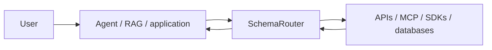

<p align="center">
  <picture>
    <source media="(prefers-color-scheme: dark)" srcset="https://raw.githubusercontent.com/JDeun/SchemaRouter/main/docs/assets/brand/schemarouter-lockup-dark.svg">
    
  </picture>
</p>

<p align="center"><strong>When tools speak different schemas, put a typed capability boundary in between.</strong></p>

<p align="center">
  <a href="README.md">English</a> ·
  <a href="README.ko.md">한국어</a> ·
  <a href="https://jdeun.github.io/SchemaRouter/">Docs</a> ·
  <a href="examples/README.md">Examples</a> ·
  <a href="CONTRIBUTING.md">Contributing</a> ·
  <a href="https://github.com/JDeun/SchemaRouter/releases/latest">Latest release</a>
</p>

<p align="center">
  <a href="https://github.com/JDeun/SchemaRouter/actions/workflows/ci.yml"></a>
  <a href="https://github.com/JDeun/SchemaRouter/actions/workflows/docs.yml"></a>
  <a href="https://github.com/JDeun/SchemaRouter/actions/workflows/codeql.yml"></a>
  <a href="https://github.com/JDeun/SchemaRouter/actions/workflows/security.yml"></a>
  <a href="https://pypi.org/project/schemarouter/"></a>
  <a href="https://pypi.org/project/schemarouter/"></a>
  <a href="https://github.com/JDeun/SchemaRouter/blob/main/LICENSE"></a>
</p>

> **Stable release: 0.16.0** · Beta / pre-1.0

SchemaRouter is a **typed capability retrieval and schema-aware execution layer for LLM/RAG agents**.

It sits between an orchestrator and external tools/data sources, compiles heterogeneous schemas into
one capability model, retrieves a bounded candidate set, and validates the selected call again at
execution time. It is not an agent framework, identity provider, database proxy, or LLM gateway.

```bash
pip install schemarouter
```

## Why SchemaRouter

A normal tool router mainly answers **which tool should I call?** SchemaRouter also keeps track of
**which endpoint, parameters, output fields, schema version, access path, policy, and execution
binding make that call valid**.

```text
user query
  -> required semantic fields
  -> bounded capability candidates
  -> endpoint + parameters + output fields
  -> policy / availability / schema validation
  -> trusted execution
  -> projected typed result
```

This is useful when a catalog mixes APIs, MCP servers, SDKs, databases, and framework tools whose
names overlap but whose schemas and execution constraints differ.

[Concepts →](docs/concepts/schema-router.md) ·
[Capability retrieval →](docs/concepts/capability-catalog.md) ·
[Execution boundary →](docs/concepts/execution.md)

## Quickstart

Provider-first onboarding lets an application start from the service it wants rather than knowing
every underlying protocol first.

```python
import asyncio

from schemarouter import PlanRequest, SchemaRouter


async def main():
    router = SchemaRouter()

    async with router:
        registration = await router.add_provider("apis-guru")
        tool = router.registry.get(registration.registered_tool_keys[0])

        plan = router.plan(
            PlanRequest(
                query="API directory metrics total number of APIs",
                preferred_tools=[tool.key],
                max_calls=1,
            )
        )

        result = (await router.execute(plan))[0]
        print(result.tool, result.endpoint, result.data["numAPIs"])


asyncio.run(main())
```

The flow is:

**provider identity → schema/adaptor resolution → typed capability registration → bounded selection → validated execution → typed result**

[Quickstart →](docs/getting-started/quickstart.md) ·
[Runnable examples →](examples/README.md)

## Where it fits



The surrounding application owns conversation, decomposition, memory, checkpoints, and final
generation. SchemaRouter owns the **registered capability and execution boundary**.

Retrieval is side-effect free:

```python
candidates = router.retrieve("current Young's modulus for MAT-7", k=5)

for candidate in candidates.candidates:
    print(candidate.route_id, candidate.output_fields)
```

Use `retrieve_executable(...)` when the shortlist must also have a currently valid execution
binding.

## Connect tools and data

SchemaRouter supports several ingress families behind the same capability model.

| Family | Typical entry points |
| --- | --- |
| Provider identity | `await router.add_provider(...)` |
| Typed Python / ToolSpec | `add_callable(...)`, `add_tool(...)`, `add_bound_tool(...)` |
| API protocols | OpenAPI, MCP, OPTIMADE, GraphQL, OData, OpenRPC |
| Relational databases | SQLite, caller-owned SQLAlchemy Engine |
| Vector databases | Qdrant, Milvus, Pinecone, Weaviate, Chroma, PostgreSQL/pgvector |
| Graph / RDF | Neo4j, Neptune, ArangoDB, FalkorDB, SPARQL |
| Document / search / KV / time-series | MongoDB, Elasticsearch/OpenSearch, DynamoDB, Cosmos DB, Couchbase, ClickHouse, InfluxDB |
| Framework bridges | LangChain, LangGraph, LlamaIndex |

Credentials, connection pools, database clients, and transport state remain caller-owned. Vendor
query languages are not exposed as model authority.

[Choose an ingestion path →](docs/getting-started/ingestion-paths.md) ·
[Full ingestion matrix →](docs/guides/universal-ingestion.md) ·
[Provider-first registration →](docs/guides/provider-first-registration.md) ·
[Enterprise data onboarding →](docs/guides/enterprise-data-onboarding.md)

## Authorization and enterprise data

SchemaRouter consumes a verified `PrincipalContext` from the host application and can apply
deny-by-default RBAC/ABAC before retrieval and again at execution.

The same policy model can narrow:

- visible tools/endpoints;
- database tables and fields;
- trusted row/tenant filters;
- vector metadata filters;
- document/search fields;
- graph relationships and hop depth.

SchemaRouter does not authenticate users and does not replace database-native roles, grants, RLS,
ACLs, or network controls.

[Authorization →](docs/guides/authorization.md) ·
[Database onboarding →](docs/guides/database-onboarding.md)

## Execution boundary

A retrieved candidate or model choice never grants authority by itself. Before a result crosses the
runtime boundary, SchemaRouter can revalidate:

- tool/endpoint/schema fingerprints;
- arguments and JSON Schema contracts;
- principal policy and data scope;
- current execution binding and availability;
- raw output schema;
- final field projection.

Remote mutation/destructive operations fail closed unless explicitly authorized by local policy.

[Security model →](docs/security/threat-model.md) ·
[Trust and release evidence →](docs/project/trust-and-evidence.md)

## Stability

SchemaRouter `0.16.0` is **Beta / pre-1.0**. Public APIs may still evolve,
but breaking changes are documented and release-gated.

Python 3.10–3.14 are release-blocking targets. Python 3.15 is a preview target.

Research benchmarks are kept separate from stable product guarantees. Experimental retrieval
profiles or ranking methods are not promoted solely because one benchmark improves.

[Versioning policy →](docs/versioning.md) ·
[Research status →](docs/research/routing-status.md) ·
[Changelog →](CHANGELOG.md)

## Documentation

| Topic | Guide |
| --- | --- |
| Installation and first use | [Getting started](docs/getting-started/installation.md) |
| Architecture and concepts | [What SchemaRouter is](docs/concepts/schema-router.md) |
| Provider/API ingestion | [Connect guides](docs/guides/provider-first-registration.md) |
| Enterprise databases and access scope | [Enterprise data onboarding](docs/guides/enterprise-data-onboarding.md) |
| Runtime policy and authorization | [Authorization](docs/guides/authorization.md) |
| Operational inspection | [Inspection](docs/guides/inspection.md) |
| Public API | [Reference](docs/reference/api.md) |
| Research evidence | [Research index](docs/research/experiment-index.md) |

Full documentation: **https://jdeun.github.io/SchemaRouter/**

## Scope

SchemaRouter deliberately does **not** own agent loops, final answer generation, identity
authentication, credential storage, or arbitrary database/query execution. Those remain outside the
capability boundary.

## License

MIT. See [LICENSE](LICENSE).
