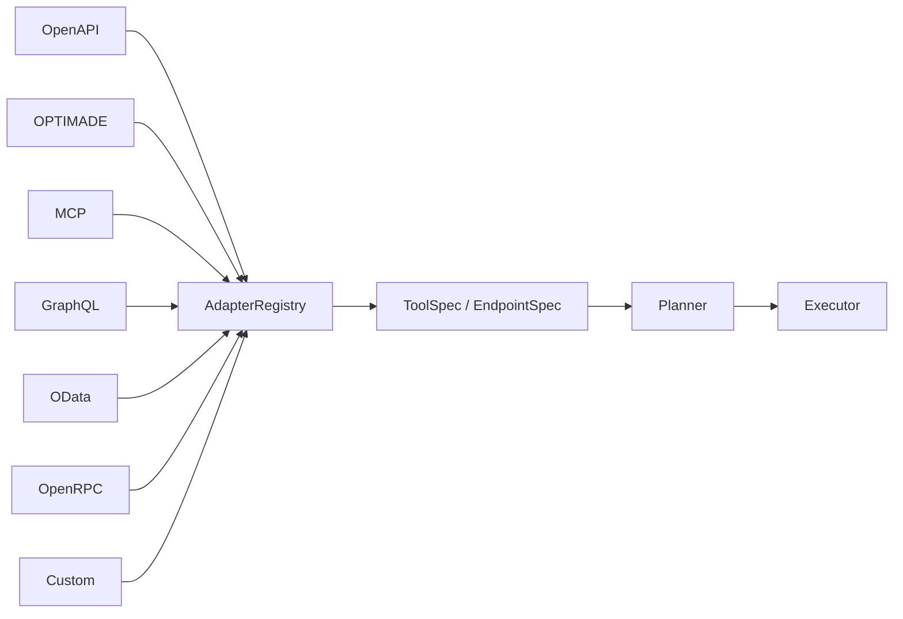

# Adapter ecosystem

SchemaRouter treats external protocols as **compilers into one canonical execution model**.



The planner does not need an `if optimade` or `if graphql` branch. Protocol-specific discovery,
query syntax, and transport rules stay inside adapters.

## AdapterRegistry

The registry owns:

- a unique string `kind`;
- a deterministic priority used only for `kind="auto"`;
- explicit kind lookup;
- registration/replacement of third-party adapters.

It does **not** own execution policy or authorization.

## Canonical boundary

Every structured adapter compiles its source into the same contracts:

```text
ToolSpec
  -> EndpointSpec
      -> ParameterSpec
      -> FieldSpec
      -> input/output JSON Schema
```

This keeps schema fingerprints, planning, validation, policy, retries, and observability independent
of the source protocol.

Runtime-affecting adapter state belongs in fingerprinted `execution_metadata`, not ordinary
descriptive `metadata`. Remote adapters also set the first-class `ToolSpec.remote` contract.
This prevents a transport/origin change from occurring behind an unchanged plan fingerprint.

## Call-aware transport

Most adapters bind a normal `endpoint + arguments` invoker.

Some protocols support server-side field selection. A call-aware invoker receives the full validated
`ToolCall` so it can map `call.fields` onto protocol-native selection:

| Protocol | Field selection |
| --- | --- |
| OPTIMADE | `response_fields` |
| GraphQL | selection set |
| OData | `$select` |
| STAC | fields extension when available |

This is a transport optimization. The executor still validates the current schema and local policy
before invoking it.

## Auto discovery

Built-ins are ordered deterministically by adapter priority. Current main includes:

```text
OpenAPI
OpenRPC
OData
OPTIMADE
MCP (URL/Streamable HTTP discovery)
GraphQL
```

MCP stdio and caller-owned MCP transports are registered through dedicated runtime APIs rather than
URL auto-discovery. Python/SDK bindings and inbound LangChain/LlamaIndex tools likewise bypass URL
adapter probing and compile directly into the same canonical contracts.

Third-party adapters choose their own priority. Explicit `kind="..."` bypasses priority and
selects that adapter directly.
