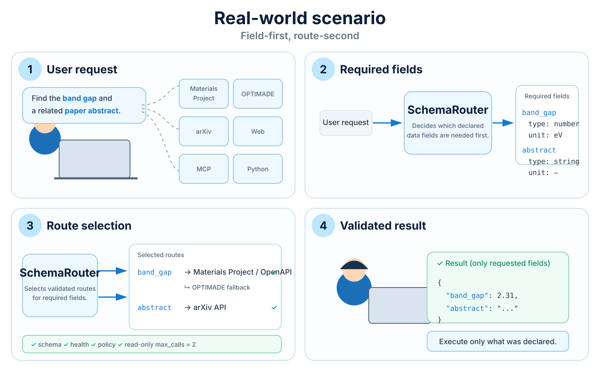

# Examples gallery

Use this page to choose a runnable SchemaRouter path by the system you already have. The source
files live in the repository examples directory.

## Runnable scenarios

| I already have / want to test | Example | Evidence mode |
| --- | --- | --- |
| A public OpenAPI document | [Live OpenAPI quickstart](https://github.com/JDeun/SchemaRouter/blob/main/examples/live_openapi_quickstart.py) | live public provider |
| A typed Python function | [Python callable quickstart](https://github.com/JDeun/SchemaRouter/blob/main/examples/quickstart.py) | offline deterministic |
| An SDK/client with no safe schema introspection | [SDK-bound capability](https://github.com/JDeun/SchemaRouter/blob/main/examples/sdk_bound.py) | offline deterministic |
| Data split across providers | [Mixed-provider execution](https://github.com/JDeun/SchemaRouter/blob/main/examples/mixed_provider.py) | offline deterministic |
| A large tool catalog | [Context reduction](https://github.com/JDeun/SchemaRouter/blob/main/examples/context_reduction.py) | offline deterministic |
| A remote schema that can drift | [Schema drift/watch](https://github.com/JDeun/SchemaRouter/blob/main/examples/schema_drift_watch.py) | offline deterministic |
| MCP Streamable HTTP or stdio | [MCP transports](https://github.com/JDeun/SchemaRouter/blob/main/examples/mcp_transports.py) | pinned local reference |
| LangChain | [LangChain quickstart](https://github.com/JDeun/SchemaRouter/blob/main/examples/langchain_quickstart.py) | offline deterministic |
| LangGraph | [LangGraph quickstart](https://github.com/JDeun/SchemaRouter/blob/main/examples/langgraph_quickstart.py) | offline deterministic |
| LlamaIndex | [LlamaIndex quickstart](https://github.com/JDeun/SchemaRouter/blob/main/examples/llamaindex_quickstart.py) | offline deterministic |
| Registry/run observability | [Inspection dashboard](https://github.com/JDeun/SchemaRouter/blob/main/examples/inspection_dashboard.py) | offline deterministic |

## Before and after: do not dump every tool schema

The context_reduction.py example compares the serialized full registry with the Top-K candidate
surface returned by router.retrieve(...).

~~~text
BEFORE
agent context <- tool A + tool B + tool C + tool D + tool E + tool F

AFTER
query -> SchemaRouter.retrieve(k=2) -> bounded typed candidates -> agent
~~~

This does not delete capabilities from the registry and does not give the retrieval layer execution
authority. It reduces the capability context exposed to the next decision step while the complete
registered contract remains the local source of truth.

## Mixed-provider execution

Routing is field-first rather than "pick one provider at all costs":

~~~text
query: "customer name and account balance"
        |
        +--> CRM provider ------> customer.name
        |
        +--> Billing provider --> billing.account_balance
~~~

The example compiles both calls only because each contributes required semantic-field coverage. The
same pattern is used for materials + literature, search + metadata, inventory + shipping, and other
domains.

## Schema drift is visible and fail-closed

The drift example registers a watched OpenAPI capability, then changes the source so a previously
optional input becomes required. The next check reports breaking / pending_review and retains the
already accepted fingerprint. A remote schema change therefore does not silently rewrite execution
authority.

## MCP transport examples

Install the optional dependency from a checkout:

~~~bash
pip install -e ".[mcp]"
python examples/mcp_transports.py
~~~

The example runs both Streamable HTTP and stdio against repository-owned MCP SDK reference servers.
That is deliberate: there is no assumption that a random unauthenticated public MCP endpoint is a
stable compatibility service.

## Live network adapters

Scheduled/manual compatibility evidence covers real public services where a reasonably stable
read-only provider exists:

| Adapter | Evidence |
| --- | --- |
| OpenAPI | APIs.guru |
| OPTIMADE | COD OPTIMADE |
| GraphQL | Rick and Morty GraphQL API |
| OData | OData.org V4 reference service |
| OpenRPC | pinned local reference implementation |
| MCP Streamable HTTP | pinned local reference implementation |

See [Live adapter compatibility matrix](../guides/live-compatibility-matrix.md) for the exact
commands, recorded fields, and outage policy.

## Visual walkthrough

The key sequence is **declared field need -> bounded capability selection -> validated execution ->
projected typed result**.

## Reproducibility boundary

Mandatory CI executes deterministic examples and pinned reference implementations. Public-provider
checks are deliberately separated because third-party availability, rate limits, and schema changes
are external state. A live failure is recorded as evidence first and is not automatically treated as
a SchemaRouter regression.
