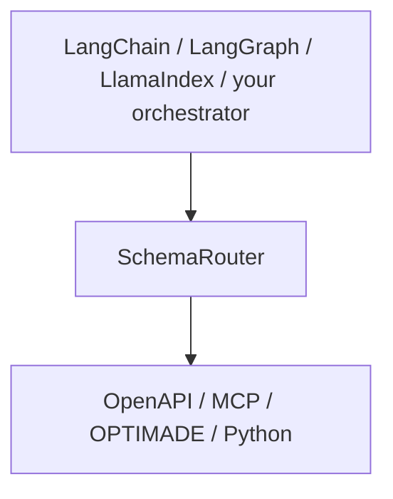

<div class="brand-lockup">
  
  
</div>

<div class="sr-hero" markdown>

<span class="sr-kicker">SchemaRouter 0.15.0</span>

# Put a typed execution boundary between agents and tools

SchemaRouter is a **typed capability retrieval and schema-aware execution layer for LLM/RAG agents**
across MCP, OpenAPI, Python, and framework tools.

Agents get harder to steer as you connect more tools, and each tool can return far more than the
request needs. SchemaRouter decides which **declared data fields** are needed, exposes a bounded set
of registered tools that can supply them, and keeps only declared fields before the result reaches
the model.

```bash
pip install schemarouter
```

[Get started](getting-started/installation.md){ .md-button .md-button--primary }
[Example gallery](getting-started/examples.md){ .md-button }
[Verify trust & release evidence](project/trust-and-evidence.md){ .md-button }
[Declare an MCP result contract](guides/mcp.md#declare-a-result-contract-the-server-does-not-publish){ .md-button }
[GitHub](https://github.com/JDeun/SchemaRouter){ .md-button }

</div>

<div class="grid cards" markdown>

-   **Minimize**

    Resolve the semantic data need first. Request only the planned fields upstream when the endpoint
    explicitly supports server-side projection, then keep only those fields downstream.

-   **Compile**

    Turn OpenAPI, MCP, OPTIMADE, Python callables, or approved documentation into one typed
    Provider / Access path / Tool / Endpoint / Parameter / Field model.

-   **Validate**

    Reject undeclared arguments, invalid raw outputs, stale schema fingerprints, stale bindings,
    and unsupported schema assumptions.

-   **Enforce**

    Keep mutation authority, credentials, retries, budgets, approvals, and execution hooks inside
    trusted local boundaries.

</div>

## Where it fits



SchemaRouter does not replace an agent or RAG pipeline and does not perform final generation. It
provides a structured retrieval/execution boundary when the external source is an API, MCP server,
OPTIMADE service, or typed callable rather than a document corpus.

Its registry is a logical capability graph/index, while the registered schema is execution
authority.

[Read the RAG positioning and capability model →](concepts/capability-catalog.md)

SchemaRouter is narrower than an agent framework. The orchestrator owns conversation,
graphs, model invocation strategy, memory, checkpoints, and agent loops. SchemaRouter owns the
**tool-schema execution boundary**.

Optional decision backends such as Laya, Ollama, and Jev sit **inside the bounded selection step**.
They receive only finite candidate IDs already produced from the local schema catalog. They do not
become orchestrators, cannot invent executable capabilities, and cannot grant execution authority.

Applications that already use GPT, Gemini, Claude, or another hosted model can inject that existing
client through SchemaRouter's provider-neutral analyzer or decision-backend callable contracts.
SchemaRouter does not require a second local model stack.

## Real-world scenario


One request can require a union of semantic fields from different providers. SchemaRouter resolves
that field set first, then selects complementary validated routes within the explicit `max_calls`
bound: for example, Materials Project for `band_gap` and arXiv for `abstract`.

[Read the field-first execution model →](concepts/field-first-execution.md) ·
[Read the design principles →](concepts/design-principles.md)

## Start in five minutes

The first user-facing path uses the public, no-auth APIs.guru OpenAPI document. The value comes from
the provider rather than from a hard-coded local demo.

```python
import asyncio

from schemarouter import PlanRequest, SchemaRouter


async def main():
    router = await SchemaRouter.from_url(
        "https://api.apis.guru/v2/openapi.yaml",
        kind="openapi",
    )
    async with router:
        tool = next(
            tool
            for tool in router.registry.tools()
            if any(endpoint.name == "getMetrics" for endpoint in tool.endpoints)
        )
        plan = router.plan(
            PlanRequest(
                query="API directory metrics total number of APIs",
                preferred_tools=[tool.key],
                max_calls=1,
            )
        )
        result = (await router.execute(plan))[0]
        print(result.tool, result.endpoint, result.data["numAPIs"])


asyncio.run(main())
```

Required CI stays deterministic and offline; the live provider is for first-use and compatibility
evidence, not a release-blocking dependency.

[Continue the real-provider quickstart →](getting-started/quickstart.md)

## Connect a capability source

<div class="grid cards" markdown>

-   **Provider identity**

    Best when you know the service you want, but not every protocol or SDK it exposes.

    `await router.add_provider("materials-project")`

    [Provider-first registration →](guides/provider-first-registration.md)

-   **Python**

    Best when the capability is local and typed.

    [Python tools →](guides/python-tools.md)

-   **OpenAPI**

    Best when an HTTP API already publishes a machine-readable contract.

    [OpenAPI →](guides/openapi.md)

-   **MCP**

    Best when tools are already exposed through MCP.

    [MCP →](guides/mcp.md)

-   **OPTIMADE**

    Best for materials-data providers that expose OPTIMADE.

    [OPTIMADE →](guides/optimade.md)

</div>

Human-readable API documentation follows a separate **inspect → proposal → explicit approval**
flow and never becomes executable automatically.

[Documentation-derived tools →](guides/html-documentation.md)

## Core runtime guarantees

- unknown tools, endpoints, parameters, and fields do not become executable;
- input and raw output are validated with JSON Schema;
- stale schema fingerprints and invoker bindings fail closed;
- remote metadata and model output cannot grant mutation or destructive authority;
- credentials stay outside model-visible planner arguments;
- retries, wall-clock time, remote calls, response size, and optional cost units can be bounded;
- OpenAPI compatibility gaps are reported instead of silently guessed;
- event payloads are redacted unless explicitly enabled;
- temporary access failures use finite cooldowns and optional trusted health probes rather than
  permanent blacklists;
- provider/access fallback never broadens the logical field need compiled from the query.

## Current release

**0.15.0** is the current stable Beta / pre-1.0 release. Python 3.10–3.14 are
release-blocking targets and Python 3.15 is a preview target.

Current development on `main` is the 0.16 line. It extends the same execution boundary with
enterprise authorization and schema-introspected relational, vector, graph/RDF, and non-relational
data onboarding. Research experiments remain separate from the stable product contract.

[0.15.0 release notes →](releases/0.15.0.md) ·
[Enterprise data onboarding →](guides/enterprise-data-onboarding.md) ·
[Research status →](research/routing-status.md)

## Go deeper

<div class="grid cards" markdown>

-   **Execution model**

    Tool, endpoint, schema identity, planning, and policy.

    [Core concepts →](concepts/schema-router.md) · [Design principles →](concepts/design-principles.md)

-   **Runtime controls**

    Retry, execution policy, approvals, hooks, events, traces, and operational inspection.

    [Inspect registries and runs →](guides/inspection.md)

-   **Frameworks and decision backends**

    LangChain/LangGraph/LlamaIndex integrate above SchemaRouter. Laya/Ollama/Jev are optional
    bounded decision providers inside it. OpenTelemetry exports telemetry.

    [Decision backends →](concepts/decision-backends.md)

-   **Architecture**

    Maturity, compatibility policy, security boundaries, and API reference.

    [Architecture →](architecture.md)

-   **Trust & evidence**

    Release digests, SBOM/attestation path, CI/security controls, hardening history, and research
    claim boundaries.

    [Verify public evidence →](project/trust-and-evidence.md)

</div>
