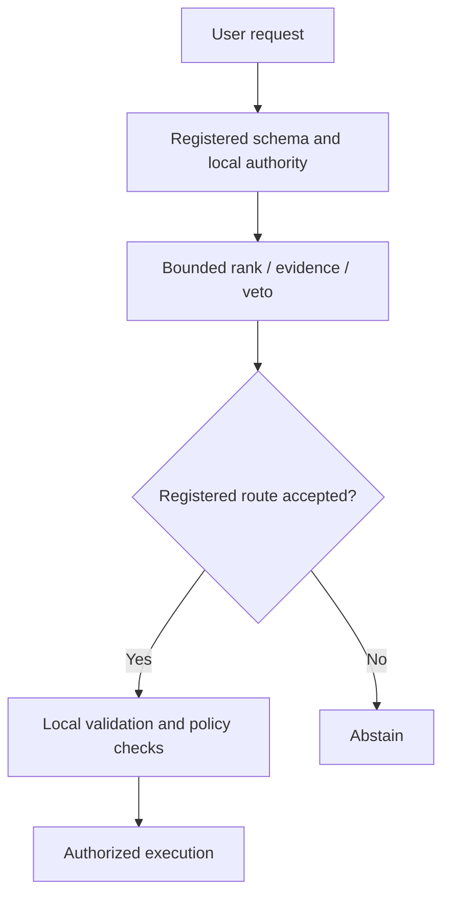

# Research evidence package

SchemaRouter keeps the research record in
`benchmarks/research-experiment-ledger.json`. The ledger is the source of truth; paper
tables are derived views and must not become an independent source of experimental facts.

## Generate

```bash
python scripts/export_research_evidence.py
```

The default output directory is `docs/research/generated/` and contains:

- `research-evidence-package.json` — machine-readable aggregate with targets,
  governance, current conclusion, flattened experiments, and invalidated runs.
- `research-experiments.csv` — table-ready experiment/provenance/metric rows.
- `invalidated-runs.csv` — invalid or pre-result technical runs that must not be cited as
  model-quality evidence.
- `research-evidence-table.md` — compact human-readable experiment table.

Generated files are build artifacts rather than a replacement for the canonical ledger. CI
runs the exporter so schema drift is caught before paper preparation.

## 0.14 terminal report preparation

The [0.14 terminal evidence report template](https://github.com/JDeun/SchemaRouter/blob/main/benchmarks/agent-utility-0.14-terminal-report-prep.md)
records the frozen provenance fields, held-out paired-estimand and final-answer
tables, claim-eligibility gates, invalid-run separation, and terminal checklist.
All open measurements are intentionally marked **Pending**, not estimated.

The controller tracks the frozen [0.14 experiment conveyor](https://github.com/JDeun/SchemaRouter/issues/500).
A green controller run can still mean `waiting_heldout`; a research result only
exists when the complete canonical stage artifact passes provenance and
aggregation checks. A partial model shard, running workflow or infrastructure
retry must never be described as an evaluated held-out outcome.

## Evidence roles

The exporter preserves the ledger's evidence-role distinctions. In particular, tuning DEV,
fresh confirmation, calibration, blind-final, design-known stress, compatibility, and
infrastructure evidence must not be collapsed into one accuracy table without their role.

A development pass is not a generalization claim. A fresh-confirmation failure is consumed
negative evidence and is not eligible for threshold repair. Calibration and blind-final
remain blocked until the exact frozen candidate has passed a new zero-overlap fresh
confirmation under the repository freeze protocol.

## Provenance requirements

A result is paper-ready only when the available record identifies the experiment, source
revision, workflow run, artifact and digest, corpus identity/role, frozen configuration,
metrics, and terminal decision. Missing historical fields are represented as missing values;
the exporter never invents provenance.

The invalidated-run table exists so contract failures, cancelled pre-result runs, leakage
incidents, and other non-evidence executions remain visible instead of disappearing from the
narrative.

## Architecture interpretation

SchemaRouter separates execution authority from semantic evidence:



A semantic model may rank, veto, or abstain over finite registered authority according to the
preregistered experiment. It does not create a new executable tool, endpoint, field, argument,
or pseudo-route.

## Threats to validity

The evidence package should be read with these limits:

- benchmark corpora are synthetic controlled workloads and cannot by themselves establish
  production prevalence or user-distribution performance;
- multilingual template coverage is broader than English-only testing but is not equivalent
  to natural traffic from each language community;
- GitHub-hosted CPU latency is reproducible infrastructure evidence, not a universal hardware
  benchmark;
- repeated architecture search on canonical DEV increases selection pressure, which is why
  zero-overlap fresh confirmation and one-shot calibration/blind evidence are kept separate;
- registry descriptions and trusted aliases are part of the tested system and may differ in
  quality across real integrations;
- provider/model compatibility is not evidence of routing quality;
- aggregate metrics can hide route/language/family collapse, so promotable candidates must
  retain slice diagnostics and authority/error counts.

## Final-paper closure

The package can be regenerated throughout the active 0.14 cycle, but final paper tables must not
treat an active or infrastructure-invalid run as scientific evidence. As of 2026-10-10 the remaining
closure path and already-resolved gates are distinct:

- **#431 resolved:** the frozen corrective condition did **not** qualify for held-out promotion; report this negative gate unchanged rather than listing it as an active experiment.
- **#432 active:** the frozen 780-task large held-out evaluation was dispatched in run [`38012340016`](https://github.com/JDeun/SchemaRouter/actions/runs/38012340016). No canonical aggregate or generalization result is accepted yet.
- **#424 pending:** final-answer fact/value/unit/provenance scoring starts only after canonical #432 success and artifact-digest verification.
- **#510 terminal negative:** none of the preregistered stronger-agent candidates qualified as a grounded-output measurement instrument. The separate #506 output-field projection successor is **not authorized** by that qualification; neither a projection benefit nor equivalence can be claimed from it.

Historical calibration/blind work from the earlier operation-routing lineage remains part of the
ledger, but it is not a substitute for the frozen 0.14 held-out and final-answer evidence above.
Every final table must be reconstructable from the canonical ledger plus immutable workflow/artifact
provenance without semantic retuning from consumed or invalid runs.
