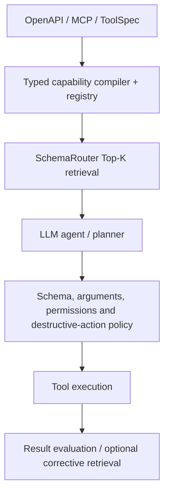
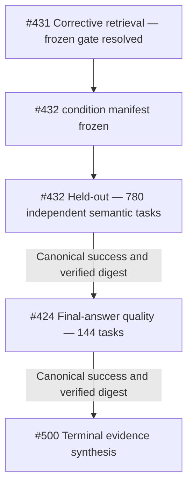

# Research status

This page is the **current-state summary**, not the complete experiment log. Product capability and research evidence are intentionally separated: stable runtime features are documented elsewhere, while this page tracks empirical claims and their evidence boundaries.

For the full research record:

- [Complete experiment index](experiment-index.md) — all 92 machine-readable experiment records;
- [Design and experiment history](design-and-experiment-history.md) — architectural chronology and decisions;
- [0.11 terminal report](operation-routing-v4-terminal-report.md) — the closed-cycle decision;
- [Prior-art roadmap](prior-art-roadmap.md) — cross-session literature/work-item map and experiment-order guardrail;
- [machine-readable prior-art registry](https://github.com/JDeun/SchemaRouter/blob/main/benchmarks/research-prior-art-registry.json) — session bootstrap and canonical workstream state;
- [machine-readable ledger](https://github.com/JDeun/SchemaRouter/blob/main/benchmarks/research-experiment-ledger.json) — exact provenance index.

SchemaRouter publishes routing research evidence separately from the stable library contract.

**Execution checkpoint (2026-10-10):** the frozen #431 corrective gate has been resolved without promotion; [held-out run 38012340016](https://github.com/JDeun/SchemaRouter/actions/runs/38012340016) has entered the 234-shard evaluation matrix. Its canonical result and the subsequent #424 answer-quality result remain **pending**. A successful conveyor/controller job means the orchestration ran, not that held-out scoring has finished.

## Active cycle: 0.14 end-to-end agent utility

The active research question is no longer whether SchemaRouter can act as the final authoritative
open-set classifier.

The active question is:

> **Does SchemaRouter improve an LLM agent's end-to-end tool-use performance by retrieving a
> compact, typed set of executable capabilities from a large registered catalog?**

The intended product boundary is now:

SchemaRouter still owns registry-backed capability identity and typed metadata, but retrieval score
does **not** grant irreversible execution authority. Top-1 exact route remains a useful diagnostic,
not the sole product objective.

### #418 Phase A — passed

The corrected frozen benchmark contains 23 tasks across 20 / 50 / 100 / 250 endpoint catalogs.

| Metric | Result |
| --- | ---: |
| Required-route Recall@1 | 65.52–68.97% by catalog |
| Recall@3 | 96.55% |
| Recall@5 | 100% |
| Recall@10 | 100% |
| All-required task coverage@5 | 100% |
| MRR | 0.80172–0.81897 by catalog |

Mean Top-5 serialized schema context relative to FULL:

| Catalog | Top-5 / FULL |
| --- | ---: |
| 20 endpoints | 26.69% |
| 50 endpoints | 11.44% |
| 100 endpoints | 5.872% |
| 250 endpoints | 2.383% |

This is the decisive reason the research objective changed. A Top-1-only score makes multi-tool
retrieval look artificially poor, while a compact Top-K set preserves every required capability on
this frozen surface and rapidly reduces schema context as the catalog grows.

Canonical B1-v2 freeze identity:
- task SHA256 `bc0b78ff2be11b89e6ac54ea0ee336f944f04b3c203fc61da70a46ff48b4e03c`;
- catalog SHA256 values unchanged from the corrected catalog freeze;
- v2 preflight + exact-pinned smoke are part of canonical workflow `36529108855`.

### #420 Phase B1 — terminal

Canonical B1 workflow `36529108855` completed all 30 frozen micro-shards and exactly 552 unique
`(catalog_size, task_id, condition)` episodes.

| Condition | Task pass | Mean tool-schema tokens | Schema tokens vs FULL |
| --- | ---: | ---: | ---: |
| FULL | 68.48% | 24,269.6 | 100.00% |
| SR-3 | 82.61% | 800.6 | 3.30% |
| **SR-5** | 91.30% | 1,315.9 | **5.42%** |
| SR-10 | 81.52% | 2,476.8 | 10.21% |
| SR-PROGRESSIVE | 82.61% | 2,986.9 | 12.31% |
| ORACLE | 86.96% | 441.3 | 1.82% |

SR-5 preserved 100% required-route retrieval recall on this controlled surface, improved task pass
by +22.83pp versus FULL, and produced 0 unauthorized destructive executions. The
task-clustered bootstrap interval for SR-5 minus FULL was **+9.78pp to +36.96pp**. This remains
mechanism/sanity evidence, not population-level non-inferiority.

### #423 Phase B2 — terminal success

The materially stronger SmolLM3-3B replication completed successfully in canonical run
`36642658406` on the frozen 23-task / 4-catalog / 5-condition / 460-episode protocol.

Canonical provenance:

- source `01edb00fe7e8bff803988ce6bce5e05f79801e43`;
- model revision `a07cc9a04f16550a088caea529712d1d335b0ac1`;
- ARM64 + PyTorch SDPA;
- canonical artifact digest
  `sha256:edbccbbfb44d58ba936af7af82efe844177edc24dd587e3c52cff1505c37c256`.

The earlier duplicate attempt `36641753066` is noncanonical and its partial rows are excluded.

### Structural shortlist-depth result — K3 not promoted

A separately preregistered strong-agent K3-vs-K5 gate completed in run `36670280971`:

- STRUCT-FIXED-3 task pass: 82.61%;
- STRUCT-FIXED-5 task pass: 85.87%;
- paired K3-K5 delta: -3.26pp;
- preregistered floor: -2pp;
- bootstrap 95% interval: **[-13.04pp, +3.26pp]**;
- K3 used fewer tool-schema tokens;
- execution-policy integrity passed and unauthorized destructive executions were 0.

The task-pass gate failed, so K3 is **not** promoted into #432. No K/weight/threshold retuning is
permitted from those evaluated rows.

## External validation status

External comparisons are tracked separately from maintainer-owned product validation. Development fixtures and protocol preparation are **not external evidence**.

| Track | Current state | Evidence boundary |
| --- | --- | --- |
| SmartMCP (#1114) | native development fixture/smoke prepared; maintainer protocol confirmation pending | held-out freeze waits for upstream agreement |
| Clear Your Tools (#839) | v2.17.6 native BM25 development smoke being integrated | visible development fixture only; no held-out claim |
| Jev (#796) | frozen 82-tool / 16-query package delivered upstream | waiting for upstream execution/review; no post-freeze tuning |
| HYSET (#795) | public-code fresh-retraining protocol prepared | must be labeled independently retrained HYSET; no paper-checkpoint reproduction claim |

The canonical freeze rules live in [External validation freeze](external-validation-freeze.md). Negative or null external results remain publishable evidence and must not be repaired from held-out rows.

### Active conveyor

The remaining primary 0.14 sequence is gated rather than manually queued:

Issue #431's canonical corrective/recovery evidence has been consumed by the conveyor. Its optional state-aware condition and the structural K3 condition were **not promoted**. #432 is running on the frozen held-out surface; #424 must start only after #432 reaches canonical success. Neither stage may be manually launched around the conveyor. No held-out pass rate, interval or final-answer quality claim is available yet.

The separate output-field-projection line (#506/#510) remains an independent field-level research
question. Its runtime qualification is instrument evidence and must not be mixed into the
capability-retrieval claim hierarchy.

The active 0.14 promotion criteria remain:
- required-tool-set Recall >= 97% for the effective candidate budget;
- task pass rate >= FULL minus **2 percentage points**;
- tool-schema tokens <= 40% of FULL;
- total input tokens < FULL;
- unauthorized destructive executions = 0.

This page is conservative: development-set success is not presented as production
validation, and consumed fresh-confirmation corpora are never reused for tuning.

## Historical 0.11–0.13 operation-routing target

The current research target for the multilingual open-set operation-routing work is:

| Metric | Target |
| --- | ---: |
| Supported exact route | >= 85% |
| Near-domain unsupported rejection | >= 97% |
| Ordinary OOD rejection | 100% |
| False-route rate | <= 1% |
| Authority / execution errors | 0 |
| Executable p95 | <= 250 ms |

The canonical v4 development corpus contains 1,800 cases. Its SHA-256 is
`fc085c58ed7c667d71024e60cf9e213e66da8f7b43f6e79551ed810a9e328216`.

## What has actually been demonstrated

The strongest executable development candidate in the closed 0.11 architecture-search cycle
(#324/#325) reached:

| Evidence | Exact | Near reject | OOD | False-route | p95 |
| --- | ---: | ---: | ---: | ---: | ---: |
| Canonical DEV | 85.07% | 99.31% | 100% | 0.62% | 176.94 ms |
| Frozen zero-overlap fresh confirmation | 84.81% | 90.45% | 100% | 8.49% | 278.37 ms |

The second row is decisive. The unchanged candidate failed independent request-surface shift, so it
was **not promoted**. Calibration and blind-final evidence were left unconsumed.

So the closed cycle does **not** claim that SchemaRouter has validated the 85/97/100/1 +
250 ms production target under independent surface shift.

## What the experiments indicate

The frozen BGE-M3 registered-route ranker reaches about **88.45% raw top-1** on canonical DEV. Late
experiments suggest that closed-set ranking is no longer the main blocker.

The harder problem is open-set **capability membership**:

> A request can be topically close to a registered domain while asking for an operation that no
> registered endpoint actually supports.

Embedding similarity, route margins, generic NLI, learned DEV geometry, rerankers, several
Jev/System-One model paths, ColBERT evidence, registry alias envelopes and model-consensus variants
were all insufficient to establish the full independent target.

## Conservative reference

The #259 BGE-M3 reference profile remains useful for safety-oriented comparison:

- supported exact: 83.77%;
- near-domain unsupported rejection: 98.96%;
- false-route: 0.93%;
- planner p95: approximately 134.95 ms.

It is not a production-target pass because supported exact routing remains below 85%.

## First registry-compiled capability prototype

Experiment #338 tested a provider-neutral registry-compiled capability verifier after the closed
architecture-search cycle.

The infrastructure objective succeeded: the same compiler accepted native `ToolSpec`, OpenAPI and
MCP registrations, preserved typed field/unit metadata, kept raw BGE route authority unchanged and
introduced no authority or execution errors.

The learned synthetic veto, however, was far too conservative:

| Surface | Exact | Near reject | OOD | False-route | Correct raw-winner retention | p95 |
| --- | ---: | ---: | ---: | ---: | ---: | ---: |
| Canonical DEV (1,800) | 5.03% | 100% | 100% | 0% | 5.69% | 196.93 ms |
| Registration holdout (228) | 2.08% | 100% | 100% | 0% | 2.46% | 192.85 ms |

The registration holdout contained previously unseen native/OpenAPI/MCP tool identities, opaque
endpoint names, empty operation aliases and variable endpoint counts.

This candidate is **terminally rejected** under its preregistered stopping rule. It may not
be repaired using canonical/holdout labels.

The useful result is architectural rather than a promoted quality method: provider-neutral typed
capability/data-contract compilation remains aligned with SchemaRouter's product model, while this
particular synthetic learned veto does not.

Run: `36393153612`  
Source: `ef75100abc1bb03a80ef2d7cfbd9d463accfb623`  
Artifact: `10957952613`  
Digest: `sha256:2a24d50c563ee872fdad8d498e30ab7a55e6c82e0650bf27ac4bfbadc4fc4269`

## 0.12 query-first typed-frame screen

The first 0.12 successor experiment (#347) changed the representation rather than adding another
endpoint-similarity threshold. It parsed a registry-independent explicit request frame, used frozen
BGE-M3 only to anchor the tool/domain, and then filtered that tool's endpoints by trusted typed
contract contradictions before one bounded ranking decision.

A new 936-case DEV corpus and a separate 1,008-case registration confirmation corpus were generated
and frozen before any scoring. The confirmation surface remains **unscored** because DEV failed.

DEV result:

| Metric | Result |
| --- | ---: |
| Supported exact | 97.22% |
| Raw supported tool accuracy | 99.54% |
| Near-domain unsupported rejection | 70.37% |
| OOD rejection | 95.83% |
| False-route | 25.99% |
| p95 | 179.53 ms |
| Authority / execution errors | 0 / 0 |

The result shows that typed query-side filtering can preserve supported routing and runtime very
well, but a high-precision lexical frame does not cover enough natural-language operation intent to
solve open-set membership. This exact candidate is terminal and is not repaired from DEV rows.

The next successor hypothesis must add a materially broader **query-side semantic operation signal**
without turning endpoint similarity back into capability authority.

## 0.12 semantic ontology screens

Two follow-up experiments tested whether a generic operation ontology could provide that broader
signal without route-specific retraining.

| Experiment | Supported exact | Near reject | OOD | False-route | Raw exact | Raw tool | p95 |
| --- | ---: | ---: | ---: | ---: | ---: | ---: | ---: |
| #349 flat semantic action ontology | 44.91% | 56.48% | 100% | 32.64% | 77.31% | 94.44% | 197.55 ms |
| #354 hierarchical capability ontology | 30.42% | 68.65% | 88.89% | 26.85% | 85.42% | 100% | 164.33 ms |

Both candidates were terminally rejected on their newly frozen DEV surfaces; neither confirmation
corpus was opened.

The strongest architectural lesson comes from #354: the raw BGE ranker already met the supported
exact target and selected the correct tool for every supported DEV request, but hard semantic
ontology filtering destroyed that good signal. The ontology is useful as a structured
representation of registered capability semantics, **not as a noisy positive selector with endpoint
removal authority**.

## 0.12 asymmetric ontology veto

Experiment #358 preserved the raw BGE-M3 top-1 as the sole positive selector and allowed ontology
evidence only to veto to `NO_ROUTE`. It never filtered to another endpoint and never reranked a
positive route.

DEV result:

| Metric | Result |
| --- | ---: |
| Supported exact | 96.05% |
| Raw supported exact | 96.05% |
| Raw supported tool accuracy | 99.56% |
| Raw-correct winners vetoed | 0 / 0% |
| Near-domain unsupported rejection | 26.59% |
| OOD rejection | 84.72% |
| False-route | 60.49% |
| Veto precision | 99.22% |
| Veto recall | 39.51% |
| p95 | 236.02 ms |
| Authority / execution errors | 0 / 0 |

This is a useful authority result but not a quality pass. Negative-only ontology evidence can preserve
supported routing when it is not allowed to choose another endpoint, but requiring exact same-leaf
agreement across independent signals is far too conservative to provide enough unsupported recall.

The exact #358 rule is terminal. Its frozen confirmation corpus remains **unscored**.

## 0.12 capability-set membership consensus

Experiment #363 relaxed #358's exact unsupported-leaf agreement into a finite-set membership question:
each independent signal only had to agree that the requested capability lay outside the anchored
tool's registered capability set. Raw BGE-M3 remained the sole positive selector; ontology evidence
could only return `NO_ROUTE`.

DEV result:

| Metric | Result |
| --- | ---: |
| Supported exact | 86.40% |
| Raw supported exact | 94.30% |
| Raw supported tool accuracy | 99.56% |
| Near-domain unsupported rejection | 54.76% |
| OOD rejection | 97.22% |
| False-route | 35.80% |
| Veto precision | 91.23% |
| Veto recall | 64.20% |
| Raw-correct winners vetoed | 18 / 8.37% |
| p95 | 249.73 ms |
| Positive route switches / authority / execution errors | 0 / 0 / 0 |

Set-level consensus materially improved recall over #358 (39.51% -> 64.20%), but still missed the
97% near-domain target and began rejecting correct supported winners. This closes further rule
tuning over the same BGE/MiniLM ontology-projection evidence family on consumed DEV.

The exact #363 rule is terminal. Its separately frozen 552-case confirmation corpus remains
**unscored**. A successor must introduce a materially different semantic membership signal rather
than another threshold or agreement variant over the same projections.

## 0.12 external multilingual zero-shot membership

Experiment #371 replaced the BGE/MiniLM ontology-vote family with an independently pretrained
multilingual zero-shot classifier while keeping frozen BGE-M3 as the sole positive route selector.
For the BGE-anchored tool, registered operation leaves plus one generic
`outside registered capabilities` label were presented as a finite multiclass label set. The
external classifier could only preserve the raw winner or veto to `NO_ROUTE`.

The model was resolved before scoring to immutable revision
`d8c48cf2e7c7640ad5bbb379bdb2f72f5ebde7c4`.

DEV result:

| Metric | Result |
| --- | ---: |
| Supported exact | 93.42% |
| Raw supported exact | 93.86% |
| Raw supported tool accuracy | 99.12% |
| Near-domain unsupported rejection | 1.59% |
| OOD rejection | 2.78% |
| False-route | 98.15% |
| Veto precision | 85.71% |
| Veto recall | 1.85% |
| Raw-correct winners vetoed | 1 / 0.47% |
| External classifier p95 | 93.15 ms |
| End-to-end p95 | 274.52 ms |
| Positive route switches / authority / execution errors | 0 / 0 / 0 |

The architecture remained authority-safe, but the generic OUTSIDE catch-all almost never won
multiclass normalization against concrete supported capability labels. The exact formulation is
terminal and its separately frozen confirmation corpus remains **unscored**.

The next candidate must condition the actual registered capability set directly in the membership
question instead of asking one generic OUTSIDE label to compete with concrete positive labels.

## 0.12 set-conditioned binary entailment

Experiment #374 replaced #371's generic OUTSIDE-label competition with one direct NLI pair whose
hypothesis explicitly enumerated the anchored tool's registered capability descriptions. Frozen
BGE-M3 remained the sole positive selector; the NLI model could only preserve that route or veto to
`NO_ROUTE`.

DEV result:

| Metric | Result |
| --- | ---: |
| Supported exact | 0% |
| Raw supported exact | 92.54% |
| Raw supported tool accuracy | 99.56% |
| Near-domain unsupported rejection | 100% |
| OOD rejection | 100% |
| False-route | 0% |
| Entailment / not-entailment decisions | 0 / 552 |
| Raw-correct winners vetoed | 211 / 100% |
| NLI p95 | 56.16 ms |
| End-to-end p95 | 254.55 ms |
| Positive route switches / authority / execution errors | 0 / 0 / 0 |

The single disjunctive hypothesis collapsed to `not_entailment` for every DEV request, including
all supported requests. The exact formulation is terminal, and its separately frozen confirmation
corpus remains **unscored**.

This establishes that finite capability-set membership should not be encoded as one long
set-membership sentence for this NLI model. A successor must use a different contrastive
representation rather than repairing the consumed hypothesis wording.

## 0.12 independent per-capability entailment

Experiment #377 decomposed the membership question into one independent NLI judgment for each
registered capability leaf under the BGE-anchored tool. All judgments for one query were evaluated
in one batch. Frozen BGE-M3 remained the sole positive route selector; NLI could only preserve that
winner or veto to `NO_ROUTE`.

DEV result:

| Metric | Result |
| --- | ---: |
| Supported exact | 45.61% |
| Raw supported exact | 96.49% |
| Raw supported tool accuracy | 100% |
| Near-domain unsupported rejection | 71.03% |
| OOD rejection | 95.83% |
| False-route | 23.46% |
| Veto precision | 66.85% |
| Veto recall | 76.54% |
| Raw-correct winners vetoed | 116 / 52.73% |
| NLI batch p95 | 79.53 ms |
| End-to-end p95 | 278.09 ms |
| Positive route switches / authority / execution errors | 0 / 0 / 0 |

Per-capability decomposition was more informative than one aggregate set hypothesis, but binary
argmax still over-vetoed supported requests: more than half of raw-correct winners were rejected.
The exact #377 formulation is terminal and its frozen confirmation corpus remains **unscored**.

The next preregistered experiment (#378) compares the strongest supported-leaf entailment with the
strongest counterfactual-leaf entailment, without adding thresholds or positive reranking.

## 0.12 pairwise supported-vs-counterfactual NLI

Experiment #378 compared the strongest independent NLI entailment among the BGE-anchored tool's
registered capability leaves with the strongest counterfactual tool/non-tool leaf. Counterfactual
evidence could only veto to `NO_ROUTE`; frozen BGE-M3 remained the sole positive selector.

DEV result:

| Metric | Result |
| --- | ---: |
| Supported exact | 67.54% |
| Raw supported exact | 95.18% |
| Raw supported tool accuracy | 98.25% |
| Near-domain unsupported rejection | 55.95% |
| OOD rejection | 95.83% |
| False-route | 35.19% |
| Veto precision | 75.54% |
| Veto recall | 64.81% |
| Raw-correct winners vetoed | 63 / 29.03% |
| NLI batch p95 | 387.87 ms |
| End-to-end p95 | 539.92 ms |
| Positive route switches / authority / execution errors | 0 / 0 / 0 |

The exact formulation is terminal and its frozen confirmation corpus remains **unscored**. Together
with #371, #374 and #377, this closes the current Horizon NLI semantic-decomposition family.

Research has moved to #382/#383: schema-derived open-set decision boundaries following the
ADB, hard-negative OOS and energy-based OOD literature.

## Reproducibility

The closed-cycle machine-readable decision is stored at
`benchmarks/operation-routing-v4-terminal-decision.json`.

The full evidence ledger is stored at
`benchmarks/research-experiment-ledger.json`.

The complete design/experiment narrative is stored at
`docs/research/design-and-experiment-history.md`.

The terminal report is available at
[Operation routing v4 terminal report](operation-routing-v4-terminal-report.md).

## 0.13 schema-derived open-set membership sequence

The 0.13 cycle isolates **positive route retrieval** from **open-set capability membership**.
Frozen BGE-M3 remains the sole source of positive endpoint authority. Every 0.13 verifier is
veto-only: it may preserve the raw registered top-1 route or return `NO_ROUTE`, but may never
rerank to another endpoint, use rank-2 fallback, or invent a pseudo-route.

Standing production-oriented gates for this sequence are:

| Metric | Gate |
| --- | ---: |
| Supported exact route accuracy | >= 85% |
| Near-domain unsupported rejection | >= 97% |
| OOD rejection | 100% |
| False-route rate | <= 1% |
| Query p95 | <= 250 ms |
| Authority violations / route switches / execution errors | 0 / 0 / 0 |

### V6A — schema-derived spherical ADB (#384)

Positive-only schema-derived spherical regions catastrophically failed to transfer from synthetic
schema surfaces to natural user requests. Raw BGE supported exact remained 91.67%, but the gate
rejected every supported DEV request and all 209 raw-correct winners. Near-domain and OOD
rejection were both 100% only because every query lay outside every learned region.

**Decision:** terminal. Confirmation remains unopened.

### V6B — hard-negative ellipsoid (#395)

V6B added same-resource unsupported-operation negatives from the registered capability complement
and a low-rank anisotropic ellipsoid. The synthetic evidence separated as intended, but the
synthetic-to-natural surface shift remained: every DEV query still fell outside the boundaries.

| Metric | Result |
| --- | ---: |
| Raw supported exact | 97.37% |
| Raw supported tool accuracy | 97.81% |
| Gated supported exact | 0% |
| Near-domain / OOD rejection | 100% / 100% |
| Raw-correct winners vetoed | 222 / 100% |
| p95 | 139.91 ms |

**Decision:** terminal. The complement-negative evidence remains reusable; the ellipsoid
formulation does not. Confirmation remains unopened.

### V6C — tied-Gaussian density ratio (#397)

Replacing absolute inclusion with a relative positive-vs-complement density score eliminated
catastrophic supported vetoes.

| Metric | Result |
| --- | ---: |
| Supported exact | 93.86% |
| Raw supported tool accuracy | 100% |
| Near-domain rejection | 39.29% |
| OOD rejection | 56.94% |
| False-route | 56.79% |
| Raw-correct winner veto | 0% |
| p95 | 152.15 ms |

The result established that relative evidence is safer for supported traffic, but one Gaussian per
class collapses multimodal operation structure.

**Decision:** terminal. Confirmation remains unopened.

### V6D — component Gaussian-mixture density ratio (#399)

V6D preserved endpoint-level positive components and complement resource×operation components with
one tied diagonal covariance and a fixed zero log-likelihood-ratio boundary.

| Metric | Result |
| --- | ---: |
| Supported exact | 89.91% |
| Raw supported tool accuracy | 95.61% |
| Near-domain rejection | 39.68% |
| OOD rejection | 5.56% |
| False-route | 67.90% |
| Veto precision / recall | 96.30% / 32.10% |
| Raw-correct winner veto | 0% |
| p95 | 250.49 ms |

Component structure preserved supported winners but did not fix the core synthetic-to-natural
membership problem. Natural unsupported/OOD queries were often still more likely under the
registered mixture than under the synthetic complement mixture.

**Decision:** terminal; PR #400 closed without merge. Confirmation remains unopened.

### V6E — non-parametric kNN membership (#401)

V6E removed Gaussian assumptions entirely. For the BGE-anchored tool it compared fixed k=3 cosine
neighborhood distances to three immutable evidence banks: schema positives, same-resource
complement negatives, and the pre-existing #279 16-anchor generic background bank.

| Metric | Result |
| --- | ---: |
| Supported exact | 83.33% |
| Raw supported exact | 84.21% |
| Raw supported tool accuracy | 94.30% |
| Near-domain rejection | 60.71% |
| OOD rejection | 54.17% |
| False-route | 40.74% |
| Veto precision / recall | 95.05% / 59.26% |
| Raw-correct winner veto | 1.04% |
| Background / complement vetoes | 6 / 196 |
| p95 | 176.50 ms |

This is the strongest unsupported recall of the V6C–V6E density/local-geometry sequence while
remaining inside the latency target, but it still misses every open-set quality gate and slightly
damages supported routing. The complement bank supplies most useful veto signal; the generic
background bank is too sparse to cover natural OOD. Positive and complement neighborhoods still
overlap substantially in natural-language embedding space.

**Decision:** terminal; PR #402 closed without merge. Confirmation remains unopened.

### Current 0.13 conclusion

V6A–V6E rule out a progressively broader family of straightforward schema-synthetic geometry:

- absolute spherical and ellipsoidal boundaries fail by synthetic-to-natural radius shift;
- tied single- and multi-component Gaussian density ratios preserve supported traffic but
  under-reject unsupported traffic;
- threshold-free local kNN improves recall but still cannot separate the overlapping natural
  positive/complement manifolds;
- generic background anchors are insufficient as a natural OOD support model.

The next experiment must introduce a **materially different semantic representation or
membership signal**. It must not be a post-hoc sweep over V6E k, distance thresholds, margins,
neighbor weights, background anchors, or schema/complement wording. All V6A–V6E confirmation
surfaces remain unopened.

## 0.13 post-V6E evidence

The first 0.13 open-set sequence is now terminal with **no active frozen child experiment**.

| Experiment | Tested signal | Supported exact | Near reject | OOD | False-route | p95 | Result |
| --- | --- | ---: | ---: | ---: | ---: | ---: | --- |
| #404 | naturalistic MiniLM scope + 18-way operation probes | 75.44% | 59.52% | 95.83% | 32.41% | 297.36 ms | terminal |
| #406 | Tool-Embed-0.6B positive selector | 78.07% | — | — | — | 287.42 ms | terminal; BGE 86.84% on same surface |
| #408 | multilingual relative cross-encoder membership | 79.39% | 19.84% | 59.72% | 71.30% | 2992.17 ms | terminal |
| #409 | frozen GTE multilingual positive selector | 71.49% | — | — | — | 100.14 ms | terminal; BGE 88.16% on same surface |
| #412 | multilingual-E5 + fixed alpha=0.01 split conformal | 10.09% | 99.21% | 100% | 0.62% | 244.24 ms | terminal |

The key contrast is #412: it is the first method in this sequence to satisfy near-domain rejection,
OOD rejection, false-route, authority and runtime gates simultaneously, but it vetoed **158 of 181**
raw-correct BGE winners. The safety calibration worked; the underlying scalar catalog-membership
score did not separate supported traffic strongly enough.

The retained research conclusion is:

> The unresolved bottleneck is a **surface-invariant executable-capability membership
> representation**, not another threshold or calibration rule over a weak score.

No terminal DEV rows may be used to tune a successor, and all confirmation surfaces above remain
unopened. The canonical continuation point is issue #388, then issue #382, the
machine-readable prior-art registry, and the experiment ledger.

### Staged post-B1 work

The following items are preregistered/staged and **must not** be selected from B1 row-level errors:

- #428 — first-class public typed Top-K retrieval API;
- #430 — adaptive per-query shortlist depth after fixed-K validation;
- #431 — execution-state-aware corrective capability re-retrieval;
- #432 — materially larger independent multilingual held-out benchmark with explicit
  sample-size/precision planning.

These are successors to the fixed controlled baseline, not repairs to consumed B1 rows.
