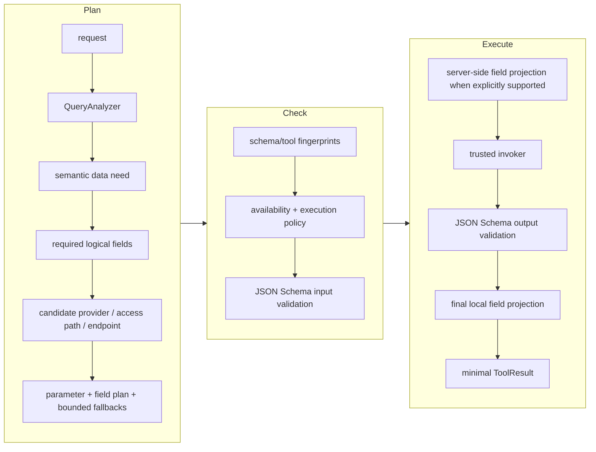

# Architecture 및 adversarial design review

## 설계 결정

SchemaRouter는 API, tool, data system 전반에서 AI agent를 위한 **typed capability routing, planning, governed execution layer**입니다. 범용 agent framework, model router, graph runtime, database proxy 또는 MCP 대체재가 아닙니다.

Core는 하나의 원칙을 중심으로 설계됩니다:

> Model output과 remote schema는 capability를 설명할 수 있지만, execution authority는 오직 신뢰된 local code만 부여합니다.

이 authority는 양방향으로 작동합니다. 신뢰된 local code는 SchemaRouter가 대신 import한 capability의 result contract, 즉 output field, semantic ID, unit, normalization, measurement qualifier도 *선언*할 수 있습니다. 이때 execution binding을 잃거나 invoker를 직접 다룰 필요가 없습니다. 단, execution identity나 validation shape는 변경할 수 없습니다. [Registry and schema identity](concepts/registry.md#what-trusted-local-code-may-amend)를 참고하십시오.

## RAG/agent stack에서의 capability retrieval

RAG는 **Retrieval-Augmented Generation**을 뜻하며 외부 source에서 retrieval한 정보를 조건으로 generation을 수행합니다. SchemaRouter는 이 전체 architecture나 generation 단계를 구현하지 않습니다.

Architecture 관점에서 SchemaRouter는 RAG 또는 agent system 내부의 structured retrieval/execution boundary에 위치할 수 있습니다. Adapter가 API/tool을 endpoint/field contract로 해석하고, registry/index가 capability surface를 구성하며, routing이 요청된 외부 데이터를 반환할 수 있는 제한된 executable subset을 선택합니다.

Registry는 logical capability graph로 볼 수 있습니다. Graph database가 필수인 것은 아니며 embedding은 authority가 아닙니다. Datatype, unit, qualifier, policy, side-effect semantic은 신뢰된 registered contract에서 나옵니다.

[Structured retrieval and execution for RAG and agents](concepts/capability-catalog.md)를 참고하십시오.

## Core flow



## Module boundary

```text
schemarouter.models        typed tool / endpoint / plan contracts
schemarouter.capability_contracts  provider-neutral typed capability/effect/precondition contracts
schemarouter.capability_graph      indexed/incremental dependency graph + bounded SCC cycle analysis
schemarouter.capability_snapshot   content-addressed graph snapshots + versioned document envelope
schemarouter.capability_publication  atomic validated successor snapshot publication
schemarouter.capability_artifact   portable versioned graph artifacts + migration/integrity checks
schemarouter.capability_decision_trace  privacy-safe aggregation of existing decision explanations
schemarouter.provider_profiles     provider identity -> declared protocol/SDK access methods
schemarouter.registry      versioned namespaced catalog + optional SQLite persistence
schemarouter.planner       exact-recall candidate indexing + deterministic scoring + recall-first projection
schemarouter.analyzers     optional model-assisted intent extraction
schemarouter.validation    JSON Schema runtime validation
schemarouter.policy        trusted local side-effect + approval authority
schemarouter.runs          run configuration, retry policy, budgets, typed lifecycle events
schemarouter.traces        validated append-only run-event persistence + non-executing replay
schemarouter.hooks         trusted snapshot-only before/after execution middleware
schemarouter.health        explicit read-only health probes + bounded background monitoring
schemarouter.executor      plan, binding, schema, policy, availability and hook enforcement
schemarouter.adapters      adapter contracts + Python/SDK/OpenAPI/MCP/OPTIMADE/GraphQL/OData/OpenRPC implementations
schemarouter.ingestion     AdapterRegistry dispatch, safe source loading, registry binding
schemarouter.proposals     evidence-grounded HTML documentation proposals
schemarouter.integrations  optional LangChain/LlamaIndex/System One/Laya/OpenTelemetry integrations
schemarouter.decision_plugins  explicit third-party bounded decision-backend discovery/loading
schemarouter.runtime       high-level registration/retrieval/invoke/batch/stream facade
```

## Adversarial finding과 대응

### 1. Tool routing만으로는 차별화하기 어렵다

Semantic `query -> tool` router만으로는 충분한 차별화가 되지 않습니다. SchemaRouter는 tool, endpoint, parameter, output field, evidence requirement, schema identity, execution authority, result projection을 명시적 contract로 만듭니다.

### 2. Research harness가 endpoint identity를 평탄화했다

Research artifact에서는 관례적으로 tool 하나당 search endpoint 하나를 사용했습니다. 실제 OpenAPI와 MCP server는 여러 operation을 노출하므로 `ToolSpec`은 여러 first-class `EndpointSpec` object를 가집니다.

### 3. Candidate indexing이 planner recall을 바꾸면 안 된다

대규모 registry라고 해서 모든 요청마다 모든 endpoint를 scoring할 필요는 없어야 하지만 approximate prefilter가 유효한 tool을 조용히 제거해서도 안 됩니다. SchemaRouter는 현재 scorer에서 양의 deterministic score를 만들 수 있는 모든 input을 index하고, 결과 candidate에는 변경되지 않은 동일 scoring function을 적용합니다. Index는 registry version별로 cache되며 exhaustive parity check를 위해 비활성화할 수 있습니다.

### 4. Field-first execution은 확실한 범위에서 최소화하되 확실성을 꾸며내면 안 된다

SchemaRouter는 단순한 tool-first가 아니라 field-first입니다. Planner는 먼저 요청에 답할 수 있는 가장 작은 선언된 logical data surface를 식별하고, 그 surface를 제공할 수 있는 route를 선택해야 합니다. 이는 upstream byte/latency를 줄이고 관련 없는 값이 downstream LLM context에 들어가는 것을 막습니다.

연구 결과는 지나치게 공격적인 projection이 답변에 중요한 정보를 제거할 수도 있음을 보여주었으므로 경계를 명시적으로 둡니다:

- 명확한 query-to-field match -> 일치한 field와 필수 identifier를 선택;
- 명시적인 server projection 지원 -> planned field만 upstream request에 전달;
- raw response -> projection 전에 검증;
- downstream result -> planned logical field만 유지;
- 모호한 field intent -> 하나의 field면 충분하다고 가장하지 않고 선언된 field를 보존.

`FieldSpec.path`는 임의 JSONPath syntax를 planning에 노출하지 않고 제한된 logical field ID를 nested object path에 매핑할 수 있습니다.

### 5. Remote schema는 독립적으로 drift한다

모든 endpoint와 tool에는 canonical schema fingerprint가 있습니다. 이전 endpoint를 기준으로 compile된 plan은 거부됩니다. Registry가 변경된 뒤 이전 tool contract에 묶인 invoker 역시 거부됩니다.

### 6. Model analysis는 신뢰하지 않는다

`ModelQueryAnalyzer`는 executable command가 아니라 structured proposal을 반환합니다. 알 수 없는 tool, endpoint, parameter, field 및 추가 JSON key는 거부하거나 제거합니다. Caller가 명시한 argument는 model이 만든 값보다 우선합니다.

Remote schema의 description은 신뢰하지 않는 데이터로만 model에 전달되며 registry나 execution authority를 확장할 수 없습니다.

### 7. Remote authorization metadata는 신뢰하지 않는다

MCP annotation과 OpenAPI description은 permission을 부여하지 않습니다. 민감한 runtime credential은 model-visible schema 밖에 유지합니다.

OpenAPI에서는 `Authorization`, `Cookie`, `Host`, proxy authorization, connection framing 및 기타 민감한 runtime header를 tool argument로 제공할 수 없습니다.

### 8. Schema fetch credential과 API credential은 서로 다른 trust domain이다

`schema_headers`는 OpenAPI schema retrieval에만 사용합니다. `trusted_headers`는 runtime invoker만 주입합니다. OpenAPI document redirect는 수동으로, 원래 origin 내부에서만 따라가므로 schema-fetch credential이 다른 origin으로 넘어가지 않습니다. Cross-document `$ref` retrieval은 기본적으로 비활성화되어 있으며, 명시적으로 활성화한 경우에도 same-origin reference document에만 schema header를 재사용하고 redirect/depth/document/byte limit을 준수합니다.

### 9. OpenAPI document는 다른 host를 가리킬 수 있다

Cross-origin `servers` entry는 executable authority가 아니라 descriptive data로 취급합니다. SchemaRouter는 schema를 import하지만 신뢰된 local code가 `base_url`을 제공하거나 `bind_openapi()`를 호출할 때까지 binding하지 않습니다.

Runtime HTTP redirect는 비활성화되며 endpoint path는 승인된 origin/base path로 제한됩니다.

### 10. 선언된 parameter name만으로는 충분하지 않다

Executor는 invocation 직전에 실제 argument object를 JSON Schema로 검증합니다. `ToolCall`을 수동으로 구성해도 type, enum, range, required-property, pattern 등 지원되는 constraint를 우회할 수 없습니다.

Raw structured tool output은 projection 전에 검증되므로 field projection으로 잘못된 response를 숨길 수 없습니다.

### 11. Side effect에는 local authority가 필요하다

기본 `ExecutionPolicy`는 알려진 remote mutation과 destructive operation을 차단합니다. MCP annotation은 신뢰하지 않으므로 side effect가 local에서 신뢰되지 않은 MCP operation도 차단합니다.

Local application code는 다음 권한을 명시적으로 opt-in할 수 있습니다:

- `allow_mutations=True`
- `allow_destructive=True`
- `allow_unclassified_remote=True`

Model이나 remote schema는 이 flag들을 설정할 수 없습니다.

### 12. 사람이 읽는 documentation은 executable contract가 아니다

`inspect_url()`은 실행할 수 없는 `SchemaProposal`을 생성합니다. 승인되는 모든 endpoint, parameter, field는 가져온 document에서 확인되는 정확한 quote를 근거로 가져야 합니다. Model analysis 전에 script/style content는 제거됩니다.

`approve_proposal()`은 grounding threshold, 명시적 API base URL, mutation opt-in을 갖는 별도의 authority transition입니다. Runtime execution policy는 독립적인 두 번째 gate입니다.

### 13. Protocol 다양성이 planner로 누출되면 안 된다

v0.2는 `AdapterRegistry`를 도입했습니다. OpenAPI, OPTIMADE, MCP 및 향후 structured protocol은 동일한 `ToolSpec` / `EndpointSpec` model로 compile됩니다. Planner는 protocol type에 따라 분기하지 않습니다.

Protocol이 transport 시점에 selected field를 필요로 하면 call-aware invoker가 검증된 `ToolCall`을 받을 수 있습니다. 그래도 schema, policy, retry, binding-drift enforcement의 authority는 executor에 남습니다.

### 14. Decision model은 제한된 비권위적 역할에 머물러야 한다

`DecisionBackend`는 local에서 생성된 유한한 option ID 집합만 받습니다. 알 수 없는 ID, 중복 선택, 범위를 벗어나거나 finite하지 않은 score, malformed result는 fail-closed됩니다. Jev / TypeSafe System One은 optional provider adapter이며 낮은 confidence의 유효한 선택은 abstain할 수 있고 deterministic fallback은 local control에 남습니다.

Decision provider는 `ToolCall` object를 생성하지 않으며 execution credential이나 authority를 받지 않습니다. Bounded field selection에서 provider는 declared non-identifier output field만 받습니다. Identifier field는 local에서 보존되며 provider가 제거할 수 없습니다. For evidence
Evidence sufficiency에서는 provider를 호출하기 전에 local schema metadata가 요청된 provenance/license/unit/source-type requirement를 이미 충족해야 합니다. Provider는 call을 preserve 또는 veto만 할 수 있으며 missing evidence를 upgrade할 수 없습니다. Jev additionally does not receive
`DecisionOption.metadata`.

### 15. Remote runtime response에는 memory bound가 필요하다

Schema와 documentation fetch는 이미 제한되어 있었고 OPTIMADE runtime execution도 bounded reader를 사용했습니다. OpenAPI runtime execution도 같은 원칙을 적용합니다. Response를 stream으로 읽고 기본 16 MiB로 제한하며 JSON/text decoding 전에 선언된 `Content-Length`와 실제 수신 byte를 모두 검사합니다.

### 16. 지원하지 않는 OpenAPI semantic은 드러나야 한다

OpenAPI parsing 성공이 완전한 semantic fidelity를 의미하지는 않습니다. 따라서 import된 OpenAPI tool은 partial 또는 unsupported construct를 표시하는 machine-readable compatibility report를 가집니다. Same-origin cross-document reference는 제한된 범위에서 명시적으로 bundle할 수 있지만 unresolved external reference, `$id` rebasing, non-JSON-Pointer anchor, composition, cookie parameter, non-JSON body, callback, webhook, server variable은 추측하지 않고 그대로 드러냅니다.

### 17. 인증된 MCP도 credential separation을 보존해야 한다

MCP authentication은 신뢰된 HTTP transport/client boundary에 속합니다. MCP URL에 포함된 credential은 거부하고 protocol-controlled header는 override할 수 없습니다. Custom OAuth/mTLS/gateway 동작은 tool schema에 표현하지 않고 신뢰된 client factory로 주입합니다.

### 18. Runtime permission과 call별 approval은 별도 gate다

Local `ExecutionPolicy`는 category-level authority를 부여합니다. Optional trusted approval callback은 schema/policy validation 이후 개별 call을 gate하며 callback 누락, 거부 또는 exception 발생 시 fail-closed됩니다.

### 19. Execution budget은 retry를 포함해야 한다

하나의 logical call이 여러 실제 invoker attempt를 만들 수 있으므로 budget은 logical call, total attempt, remote attempt, wall-clock execution, tool별 quota, application-defined cost unit을 각각 계산합니다. Retry는 invocation 전에 attempt/remote/cost budget을 소비합니다.

### 20. Observability가 payload privacy를 약화하면 안 된다

OpenTelemetry integration은 typed RunEvent를 소비하지만 structural attribute만 export합니다. Argument/result value, RunConfig metadata, tag, exception message는 제외합니다.

### 21. 설치된 adapter plugin은 executable code다

Plugin metadata는 import 없이 발견할 수 있습니다. Entry-point loading에는 비어 있지 않은 명시적 allowlist가 필요하므로 설치된 package가 발견 가능하다는 이유만으로 자동 실행되지 않습니다.

### 22. 신뢰된 middleware가 transformation authority가 되어서는 안 된다

Execution hook은 schema/policy/approval validation 이후에만 실행되며 detached snapshot을 받습니다. Before hook은 실패하여 veto할 수 있지만 executable call을 변경할 수 없습니다. After hook은 검증·projection된 result만 받고 caller에게 반환되는 result를 변경할 수 없습니다. Non-None return은 거부되고 hook error는 fail-closed되며 after-hook failure를 tool failure로 retry하지 않습니다.

Sync/async before hook이 local state가 변하는 동안 대기할 수 있으므로 SchemaRouter는 hook 완료 후 invocation 전에 현재 schema와 binding state를 다시 확인합니다.

### 23. Trace replay가 execution authority가 되어서는 안 된다

Persistent trace는 검증된 `RunEvent` envelope를 저장합니다. Replay는 detached historical event만 반환하며 planner, executor, network, tool binding을 절대 호출하지 않습니다. Sequence gap, identity mismatch, timestamp regression, 손상된 stored JSON, terminal event 이후 추가된 event는 fail-closed됩니다.

Trace database는 source event의 privacy level을 보존합니다 stream: default redacted events
기본 trace는 structural 상태로 유지되며 명시적인 `include_payloads=True` 선택은 payload-bearing data를 저장하여 application-managed sensitive-data store를 만듭니다.

### 24. Schema drift 설명이 compatibility gate를 우회하면 안 된다

정확한 fingerprint는 계속 execution boundary이지만 단순 mismatch만으로는 운영상 원인을 파악하기 어렵습니다.
따라서 `compare_endpoint_specs()`와 `compare_tool_specs()`는 trusted snapshot change를 identical, compatible, breaking, security-review change로 분류합니다. JSON Schema에 대해서는 보수적으로 분류합니다.

Compatibility report는 진단용일 뿐입니다. 오래된 `ToolCall`이나 invoker binding이 현재 fingerprint에 대한 replanning/rebinding 없이 실행되도록 허용하지 않습니다.

### 25. Category-wide permission은 지나치게 넓을 수 있다

기존 `allow_mutations` / `allow_destructive` switch는 안전한 기본값으로 유지되지만 production application에는 더 좁은 authority가 필요할 수 있습니다. 순서가 있는 local `PolicyRule`은 제한된 `tool.endpoint` pattern과 optional side-effect predicate에 대해 allow, deny 또는 approval requirement를 설정할 수 있습니다.

Rule은 신뢰된 application configuration입니다. Remote schema, description, decision backend, model output은 이를 생성하거나 변경할 수 없습니다.

### 26. Planning explanation은 chain-of-thought가 아니라 audit 가능해야 한다

각 planned call은 deterministic score component, field-retention reason, 무시된 undeclared argument, bounded decision backend의 candidate 선택 여부를 담은 structured `PlanExplanation`을 가질 수 있습니다.

이 정보는 local에서 관찰 가능한 routing fact입니다. SchemaRouter는 private model reasoning을 노출하거나 재구성하려 하지 않습니다.

### 27. Descriptive metadata가 숨은 execution authority가 되어서는 안 된다

Adversarial review 결과 adapter/runtime 동작이 ordinary `metadata`의 값에 우연히 의존할 수 있는데 fingerprint는 이 bag을 제외한다는 문제가 확인되었습니다. Execution이나 policy가 이런 값을 읽으면 schema/binding drift 없이 runtime 의미가 바뀔 수 있습니다.

SchemaRouter는 다음을 분리합니다:

- ordinary `metadata`: descriptive/inspection data 전용;
- `EndpointSpec.execution_metadata`: fingerprint 대상 endpoint runtime semantic;
- `ToolSpec.execution_metadata`: fingerprint 대상 transport/binding identity;
- `ToolSpec.remote`: fingerprint 대상 local/remote authority classification.

내장 어댑터는 이전 버전과 호환되는 조회를 위해 일부 값을 일반 `metadata`에도 복사하지만, 런타임 코드는 지문에 포함된 계약 필드를 읽습니다. 저장된 이전 형식의 내장 메타데이터는 모델 검증 시 해당 계약 필드로 이전됩니다. 호출 대상을 결정하지 않는 스키마·검색 출처 URL은 설명용 데이터로 유지하며, 실제 런타임 호출 대상만 실행 계약에 포함합니다.
Credential이 포함된 runtime URL은 persist하지 않고 거부합니다.

계획기가 만든 `ToolCall`도 현재 도구 지문을 고정합니다. 따라서 전송 대상의 출처(origin)나 로컬·원격 분류가 변경되면, 신뢰된 재바인딩이 수행됐더라도 이미 컴파일된 계획은 무효화됩니다.

### 28. Parallel execution이 orchestration이 되어서는 안 된다

`parallel_read_only`는 모든 call이 preflight에 성공하고 `read_only is True`인 flat plan으로 제한됩니다. Task launch 전에 schema, binding, policy validation을 수행하며 모든 task는 동일한 run budget과 concurrency bound를 공유합니다.

Dependency, branching, checkpointing, write coordination, compensation, DAG semantic은 core 밖에 있으며 주변 orchestration framework의 책임입니다.

### 29. Provider redundancy가 autonomous replanning이 되어서는 안 된다

하나의 logical provider가 여러 transport/access contract를 노출할 수 있고 request에 semantically compatible한 alternative provider가 있을 수도 있습니다. Availability fallback은 유용하지만 open-ended runtime search는 agent/workflow semantic을 다시 끌어들이고 provenance를 조용히 바꿀 수 있습니다.

SchemaRouter는 provider redundancy를 bounded execution contract로 취급합니다:

- `ToolSpec.provider`는 logical information provider를 식별;
- `ToolSpec.access_mode`는 하나의 access path를 식별;
- planning은 명시적으로 요청된 경우에만 `FallbackRoute` alternative를 precompile;
- same-provider path를 cross-provider candidate보다 먼저 배치;
- 모든 alternative는 자체 schema/tool fingerprint, argument, field projection, evidence를 가집니다;
- automatic fallback은 명시적인 read-only call로 제한;
- runtime fallback은 일반 same-route retry 후 `InvocationUnavailableError`가 발생한 경우에만 수행됩니다;
- 검증·정책·승인·오래된 상태 관련 실패와 결정론적인 HTTP 4xx 또는 애플리케이션 오류는 폴백을 유발하지 않음;
- primary invocation 전에 전체 fallback chain을 preflight.

Access path가 서로 다른 name을 노출할 때 field alias가 local semantic bridge 역할을 합니다. Local contract로 semantic compatibility를 증명할 수 없다면 model에게 추측시키지 않고 fallback을 제외합니다.

### 30. Availability memory는 영구 blacklist가 아니라 복구되어야 한다

Passive transport failure로 route가 일시적으로 불리해질 수 있지만 한 번의 outage가 capability를 영구 제거해서는 안 됩니다. 따라서 SchemaRouter는 bounded cooldown state를 사용합니다. Timeout, connection failure, HTTP 429 또는 transient 5xx exhaustion 이후 access path를 유한한 interval 동안 건너뛰고 cooldown 만료 후 자동으로 다시 eligible하게 만듭니다.

더 빠른 recovery가 필요한 application은 명시적인 read-only access path에 trusted local health probe를 등록할 수 있습니다. Optional background `AccessHealthMonitor`는 등록된 callback만 실행하고 실패한 probe를 일시 unavailable로 표시하며 probe 성공 시 route를 즉시 reopen합니다. Remote metadata에서 health request를 만들어내거나 임의 data retrieval을 implicit probe로 바꾸지 않습니다.

### 31. Upstream field projection은 추측이 아니라 명시적이어야 한다

Local result projection만으로도 LLM context는 보호하지만 upstream API가 full record를 반환한다면 provider bandwidth나 latency는 줄지 않습니다. `ServerProjectionSpec`은 server-side field selection을 fingerprint 대상 endpoint contract로 만듭니다.

Trusted adapter는 planned logical field를 `fields=...` 또는 OPTIMADE `response_fields=...` 같은 declared query selector에 mapping할 수 있습니다. Generic OpenAPI support는 parameter name만 보고 이 semantic을 추론하지 않습니다. Trusted projection contract가 없어도 SchemaRouter는 raw-output validation과 최종 local projection을 수행합니다.

## Core invariant

1. Plan은 등록되지 않은 tool 또는 endpoint를 호출할 수 없습니다.
2. Plan은 선언되지 않은 parameter를 전달할 수 없습니다.
3. Required parameter는 execution 시 다시 계산되므로 forged plan이 이를 숨길 수 없습니다.
4. Argument는 현재 endpoint input JSON Schema를 만족해야 합니다.
5. 요청된 projection field는 current endpoint의 declared logical field ID여야 하며 nested wire path는 trusted `FieldSpec.path` metadata에서만 옵니다.
6. Raw tool output은 projection 전에 현재 endpoint output JSON Schema를 만족해야 합니다.
7. Stale endpoint fingerprint는 실행할 수 없습니다.
8. Tool replacement 이후 stale invoker binding은 실행할 수 없습니다.
9. Remote metadata는 authorization을 부여할 수 없습니다.
10. 알려진 remote mutation/destructive operation에는 local policy opt-in이 필요합니다.
11. 분류되지 않은 remote MCP operation에는 local policy opt-in이 필요합니다.
12. Schema-fetch credential은 origin redirect 또는 명시적으로 활성화된 external-ref fetch boundary를 넘을 수 없습니다.
13. Cross-origin OpenAPI server declaration과 external-ref target에는 explicit local authority가 필요하며 built-in resolver에서 external-ref target은 same-origin으로 제한됩니다.
14. Runtime API secret은 model-visible tool parameter가 아닙니다.
15. Ambiguous output selection은 aggressive pruning보다 recall을 우선합니다.
16. Automatic retry는 local code가 opt-in하지 않는 한 trusted read-only endpoint에만 적용됩니다. Built-in OpenAPI/OPTIMADE transport는 known non-transient HTTP 및 deterministic response-contract failure에서 즉시 실패하며 trusted custom invoker는 `NonRetryableInvocationError`로 retry loop에서 제외할 수 있습니다.
17. Payload tracing을 명시적으로 활성화하지 않으면 run-event argument와 result payload는 redaction됩니다.
18. Optional framework integration은 policy/validation을 우회하지 않고 동일한 executor boundary를 통해 callback합니다.
19. Optional decision provider는 locally offered option ID만 선택할 수 있고 execution authority를 부여할 수 없습니다.
20. OpenAPI runtime response는 Content-Length가 없거나 잘못된 경우를 포함해 decoding 전에 bounded됩니다.
21. MCP runtime credential은 trusted transport configuration 내부에만 존재하며 planner-visible하지 않습니다.
22. Local approval이 필요한 call은 approval이 없거나 거부되거나 error가 발생하면 fail-closed합니다.
23. Execution budget은 각 logical call과 실제 invoker attempt 전에 검사됩니다. Async approval callback, execution hook, invocation, retry backoff는 남은 wall-clock budget으로 제한되며 synchronous trusted callback은 반환 직후 검사됩니다.
24. Adapter plugin은 discovery만으로 auto-import되지 않습니다.
25. OpenTelemetry export는 payload value와 exception message를 제외합니다.
26. OpenAPI compatibility limitation은 조용히 추측하지 않고 명시적으로 노출됩니다.
27. Candidate indexing은 scorer 작업을 줄일 수 있지만 exhaustive deterministic planner recall을 보존해야 합니다.
28. Execution hook은 detached snapshot을 받으며 call이나 result를 변환할 수 없습니다.
29. Hook failure는 fail-closed하며 추가 tool invocation attempt를 만들지 않습니다.
30. Schema compatibility analysis는 exact plan/binding fingerprint validation을 절대 우회하지 않습니다.
31. Fine-grained policy rule은 trusted local configuration에만 존재하며 model이나 remote capability metadata가 제공할 수 없습니다.
32. 구조화된 계획 설명에는 결정론적이거나 런타임에서 관측 가능한 신호만 포함하며 모델의 비공개 사고 과정은 포함하지 않습니다.
33. Parallel execution은 모든 call이 명시적인 read-only로 preflight되어야 하며 concurrent call 전체가 하나의 run budget을 공유합니다.
34. 일반 descriptive metadata는 policy authority를 부여하거나 built-in transport semantic을 변경할 수 없습니다. Execution-affecting value는 fingerprinted contract field에 존재합니다.
35. Planner-generated call은 endpoint와 tool fingerprint를 모두 pin하며 tool fingerprint가 없는 remote/runtime-sensitive legacy call은 fail-closed합니다.
36. Automatic provider/access fallback은 precompiled, read-only, budgeted이며 명시적 invocation-unavailable marker에서만 trigger됩니다. Validation/policy/approval을 우회하지 않습니다.
37. Same-provider access path가 cross-provider fallback보다 우선하며 모든 fallback은 자체 schema/tool fingerprint와 evidence contract를 유지합니다.
38. Inspection/dashboard provenance는 URL userinfo, query string, fragment를 노출하지 않습니다. Runtime target identity는 fingerprinted 상태를 유지하고 schema/document provenance는 model-visible 또는 persisted descriptive state에 보존되기 전에 sanitize됩니다.
39. Availability cooldown은 유한합니다. 등록된 trusted read-only health probe는 path를 조기에 reopen할 수 있지만 model/remote schema는 health state를 설정하거나 probe를 정의할 수 없습니다.
40. Server-side field projection은 trusted fingerprinted `ServerProjectionSpec`이 선언한 경우에만 사용하며 raw validation 후에도 final local projection을 강제합니다.
41. Availability fallback은 provider/access path를 바꿀 수 있지만 plan이 답하도록 compile된 logical field need를 넓힐 수 없습니다.
42. Provider-first registration은 알려진 access method를 resolve할 수 있지만 SDK auto-install, credential persistence, execution authority 부여는 할 수 없습니다.
43. State-conditioned corrective re-retrieval은 동일한 host-visible/available capability surface에서만 동작하며 stable stateless retrieval facade를 보존합니다.
44. Capability-graph indexing과 incremental rebuild는 search/update optimization일 뿐입니다. Canonical compatibility comparator가 계속 authoritative하며 compatibility-context 변경에는 full rebuild가 필요합니다.
45. Capability snapshot publication은 atomic합니다. Reader는 complete predecessor 또는 complete successor만 보며 partially rebuilt graph는 보지 않습니다. Runtime health는 immutable snapshot의 일부가 아닙니다.
    identity.
46. Capability artifact/snapshot migration은 explicit/versioned이며 corrupt 또는 unknown future format에서 fail-closed합니다. Migration은 secret, invoker, execution authority를 복원할 수 없습니다.
47. Decision trace는 host-visible structured result만 aggregate할 수 있으며 hidden inventory, rank score, payload, credential, chain-of-thought를 노출하거나 policy/execution decision을 변경해서는 안 됩니다.

## 현재 extension backlog

- 개별 MCP 도구의 부작용에 대한 신뢰할 수 있는 로컬 분류와 개선된 MCP 재시도 의미론;
- OpenAPI `$id`·앵커를 인식하는 참조 처리와 복합 구성을 인식하는 계획·실행;
- 타당성이 확인되는 경우 객체가 아닌 요청 본문의 사용 편의성과 타입 기반 배열 원소 투영;
- 조직별 정책·승인 및 라이선스·출처 추적 확장;
- 보상 작업, 트랜잭션 및 분산 실행;
- 내장 SQLite 지속성 저장소를 넘어서는 분산·원격 레지스트리 구현;
- 여러 페이지 및 클라이언트 렌더링 문서 크롤링;
- 신뢰할 수 있는 추가 실행 추적·내보내기 저장 대상;
- 날짜가 명시된 실제 제공자 벤치마크 근거와 호환성 대시보드.

이들은 extension layer이며 위 core fail-closed contract를 약화해서는 안 됩니다.
