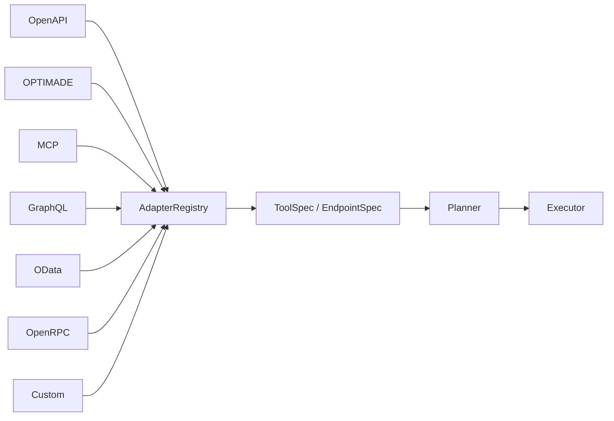

# Adapter 생태계

SchemaRouter는 외부 프로토콜을 **하나의 canonical execution model로 컴파일하는 계층**으로 취급합니다.



planner에는 `if optimade`나 `if graphql` 같은 분기가 필요하지 않습니다. 프로토콜별 discovery, query syntax, transport 규칙은 adapter 내부에 머뭅니다.

## AdapterRegistry

registry가 관리하는 것은 다음과 같습니다.

- 고유 문자열 `kind`
- `kind="auto"`에서만 사용하는 deterministic priority
- 명시적 kind lookup
- 서드파티 adapter 등록/교체

실행 정책이나 권한 부여는 관리하지 **않습니다**.

## Canonical 경계

모든 structured adapter는 원본을 동일한 contract로 컴파일합니다.

```text
ToolSpec
  -> EndpointSpec
      -> ParameterSpec
      -> FieldSpec
      -> input/output JSON Schema
```

따라서 schema fingerprint, planning, validation, policy, retry, observability를 원본 프로토콜과 독립적으로 유지할 수 있습니다.

runtime에 영향을 주는 adapter state는 일반 descriptive `metadata`가 아니라 fingerprint 대상인 `execution_metadata`에 둡니다. remote adapter는 first-class `ToolSpec.remote` contract도 설정합니다. transport/origin이 바뀌었는데 plan fingerprint는 그대로인 상황을 방지하기 위한 것입니다.

## Call-aware transport

대부분의 adapter는 일반적인 `endpoint + arguments` invoker를 바인딩합니다. 일부 프로토콜은 server-side field selection을 지원합니다. call-aware invoker는 검증된 전체 `ToolCall`을 받아 `call.fields`를 프로토콜 고유 selection으로 매핑합니다.

| 프로토콜 | Field selection |
| --- | --- |
| OPTIMADE | `response_fields` |
| GraphQL | selection set |
| OData | `$select` |
| STAC | 지원되는 경우 fields extension |

이는 transport 최적화일 뿐입니다. executor는 호출 전에 현재 schema와 local policy를 계속 검증합니다.

## Auto discovery

내장 adapter는 priority에 따라 deterministic하게 정렬됩니다.

```text
OpenAPI
OpenRPC
OData
OPTIMADE
MCP (URL/Streamable HTTP discovery)
GraphQL
```

MCP stdio와 호출자 소유 MCP transport는 URL auto-discovery 대신 전용 runtime API로 등록합니다. Python/SDK binding과 LangChain/LlamaIndex inbound tool도 URL probing을 거치지 않고 동일한 canonical contract로 직접 컴파일됩니다.

서드파티 adapter는 자체 priority를 선택합니다. 명시적 `kind="..."`는 priority를 건너뛰고 해당 adapter를 바로 선택합니다.
