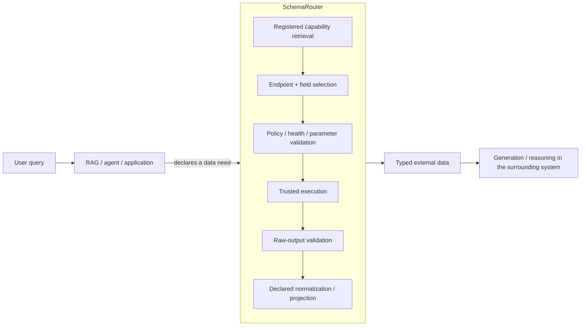
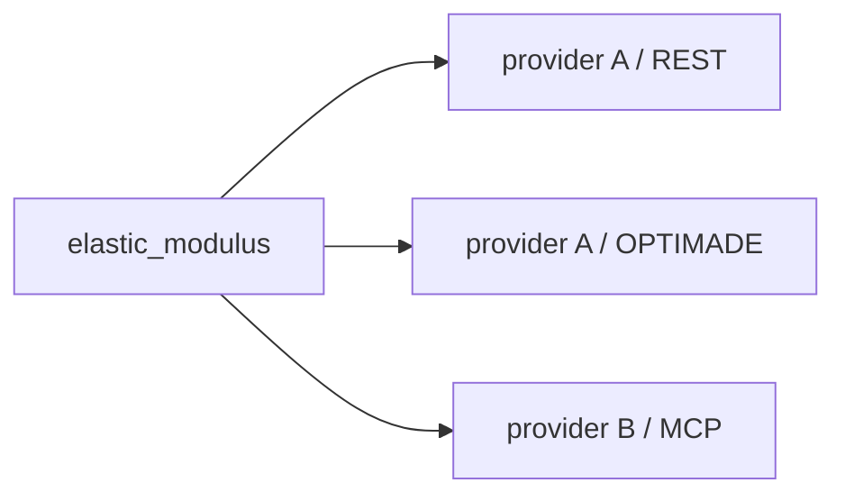
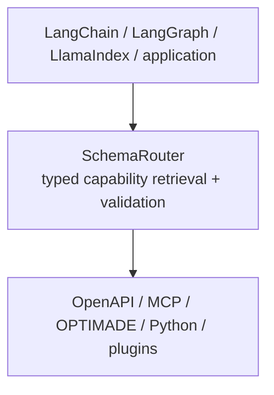

# RAG와 에이전트를 위한 구조화된 검색과 실행

**RAG(Retrieval-Augmented Generation, 검색 증강 생성)**는 외부의 비매개변수적 정보원에서 검색한 내용을 모델의 출력 생성에 활용하는 아키텍처입니다.

SchemaRouter는 **RAG 자체가 아니며** 답변 생성 단계를 담당하지 않습니다. 외부 정보를 OpenAPI 엔드포인트, MCP 도구, OPTIMADE 서비스, 타입이 지정된 Python callable과 같은 구조화된 실행 가능 정보원에서 가져와야 할 경우, RAG 또는 에이전트 시스템의 검색 측면에 참여할 수 있습니다.



문서 중심 RAG에서는 외부 원천이 문단이나 레코드의 모음이며 검색기가 관련 문맥을 반환할 수 있습니다. SchemaRouter는 이와 다른 검색 대상을 다룹니다. 바로 **등록된 기능(capability)과 해당 기능이 반환할 수 있는 구조화 데이터**입니다.

SchemaRouter의 레지스트리는 공급자, 접근 경로, 도구, 엔드포인트, 파라미터, 출력 필드, 정책, 가용성, 증거 계약의 관계를 담는 논리적 기능 그래프입니다. 이를 위해 별도의 그래프 DB나 벡터 DB가 반드시 필요한 것은 아닙니다. 결정론적 인덱스, 임베딩, 제한된 의사결정 백엔드를 사용해 카탈로그 검색을 보조할 수 있지만, **실행 권한의 기준은 언제나 등록된 스키마**입니다.

## 에이전트 선택 전에 작은 후보 집합 검색하기

에이전트 시스템에서는 계획을 세우거나 실행하지 않고도 SchemaRouter가 등록된 기능의 순위화된 후보 목록을 노출할 수 있습니다.

```python
candidates = router.retrieve(
    "current Young's modulus for MAT-7",
    k=5,
)

for item in candidates.candidates:
    print(item.route_id, item.score)
    for field in item.output_fields:
        print(field.semantic_id, field.json_schema, field.unit)
```

현재 로컬 실행 바인딩이 준비된 경로로 후보를 제한하려면 `retrieve_executable(..., k=5)`를 사용합니다. 대응하는 비동기 인터페이스는 `aretrieve`와 `aretrieve_executable`입니다.

호스트가 명시적인 타입 기반 실행 상태를 제공하는 경우 `retrieve_state_aware(...)`는 기존의 안정적인 무상태 인터페이스를 변경하지 않고 고정된 Top-K 결과를 필터링합니다. 별도의 `reretrieve_state_aware(...)`는 동일한 호스트 표시 순위 목록에서 상태 조건을 만족하는 최상위 K개를 다시 채우기 위한 교정 검색 인터페이스입니다.

반환되는 후보 묶음에는 유효한 전체 입력·출력 JSON Schema, 등록된 파라미터, 출력 필드, 의미 식별자(semantic ID), 단위, 한정 조건(qualifier), 읽기·쓰기·파괴적 작업 분류, 공급자와 접근 경로의 식별 정보, 스키마 지문(fingerprint)이 포함됩니다.

검색만으로는 부수 효과가 발생하지 않으며 실행 권한도 주어지지 않습니다.

```text
query
  -> SchemaRouter Top-K registered candidates
  -> downstream agent chooses among candidates
  -> local validation / policy
  -> execution
```

애플리케이션은 LLM 프롬프트에서 후보의 순위나 점수를 빼고 계약 자체만 전달할 수도 있습니다. SchemaRouter의 랭킹 점수를 실행 정책으로 취급하지 않으면서 도구 카탈로그로 인한 컨텍스트 비용을 낮추려는 경우에 유용합니다.

## 검색된 기능에는 실행 가능한 계약이 있습니다

문서 검색기는 관련 문맥을 돌려줄 수 있습니다. 반면 SchemaRouter는 작업, 입력, 출력, 정책 메타데이터가 선언된 엔드포인트인 **등록된 실행 계약**을 검색합니다. 일반 `retrieve()`는 현재 로컬 invoker가 바인딩됐거나 정상 상태라고 주장하지 않습니다. 현재 실행 바인딩의 준비 상태까지 필요하다면 `retrieve_executable()`를 사용하십시오.

반환되는 기능 계약에는 다음 정보가 포함됩니다.

```text
Endpoint
  operation
  input contract
  output fields
  read/write/destructive semantics
  provider/access identity
  availability
  policy/evidence requirements
```

모델은 이미 등록된 후보의 순위를 조정하거나 거부하는 데 도움을 줄 수 있지만, 새로운 엔드포인트, 파라미터, 필드, 권한, 자격 증명, 상태 정보 또는 부수 효과를 만들어 낼 수 없습니다.

## 필드 우선, 경로 선택 후순위

주된 의미 단위는 공급자가 아니라 **데이터 요구사항**입니다.

예를 들어 다음 질문을 받았다고 가정하겠습니다.

```text
"What is the elastic modulus of this material?"
```

SchemaRouter는 먼저 논리적인 필드 요구사항을 확인해야 합니다.

```text
semantic field = elastic_modulus
```

그 다음에야 해당 필드를 제공할 수 있도록 등록된 경로를 선택합니다.



가용성이나 정책에 따라 경로는 달라질 수 있지만, 그 과정에서 요청된 필드가 암묵적으로 바뀌어서는 안 됩니다.

하나의 요청에 여러 필드가 필요하고 애플리케이션이 다중 호출을 명시적으로 허용했다면, SchemaRouter는 호출자가 정한 `max_calls` 상한 안에서 서로 보완적인 경로를 선택할 수 있습니다.

## 데이터 타입과 단위도 필드 계약의 일부입니다

필드 이름만 같다고 해서 두 필드가 동등하다고 볼 수는 없습니다.

SchemaRouter는 선언된 JSON 값의 타입과 형태, 의미 식별자, 원천 단위, 정규화된 표준 단위 계약, 정확한 한정 조건, 증거 메타데이터를 필드와 함께 유지할 수 있습니다.

예를 들면 다음과 같습니다.

```text
semantic_id: mechanical.elastic_modulus
type: number
source_unit: GPa
canonical_unit: Pa
dimension: pressure
normalization: value * 1e9
qualifiers:
  temperature: 300 K
  phase: alpha
```

두 공급자가 모두 `elastic_modulus`라는 필드를 제공하더라도 자동으로 상호 교환할 수 있는 것은 아닙니다.

공급자 간 자동 대체(fallback)는 보수적으로 판단합니다.

```text
same semantic field
AND compatible declared datatype/shape
AND compatible declared unit/canonical-unit contract
AND exact qualifier compatibility where qualifiers are present
```

SchemaRouter는 단위 문자열만 보고 변환 계수를 추론하지 않으며, 서로 다른 측정 조건이 과학적으로 동등하다고 추정하지도 않습니다. 단위 정규화는 신뢰할 수 있는 `UnitNormalizationSpec`에서 변환을 선언했을 때만 적용합니다.

단위는 선택 항목입니다. 문자열, 식별자, 불리언, 구조화 메타데이터, 무차원 수치에는 단위가 없어도 됩니다. 단위의 존재 여부는 원천 데이터 타입이 아니라 필드의 의미에 의해 결정됩니다.

## 등록은 범용적이어야 합니다

사용자는 실제로 알고 있는 식별자에서 시작할 수 있어야 합니다. 프로토콜 URL이 아닌 공급자 이름만 아는 경우, `add_provider(...)`는 신뢰할 수 있는 `ProviderProfile`을 통해 선언된 접근 방법을 해석한 다음 해당 방법을 동일한 표준 어댑터 파이프라인에 등록합니다.

제품 설계의 의도는 애플리케이션에서 벤치마크 전용 라우팅 규칙을 직접 작성하지 않고도 기능 제공원을 등록하고 사용할 수 있도록 하는 것입니다.

```text
provider identity or new OpenAPI / MCP / Python capability
  -> resolve declared access method when needed
  -> parse declared schema
  -> compile the same typed registry contracts
  -> update indexes / dependency graph
  -> immediately participate in bounded routing
```

기계가 읽을 수 있는 원천 메타데이터를 우선합니다. 사람이 읽는 문서는 명시적인 **검사 → 계약 제안 → 승인** 절차를 거칩니다. 자연어 문장만으로는 실행 권한을 인정할 수 없기 때문입니다.

새로 등록한 경로를 사용하기 위해 경로마다 별도의 전용 분류기를 작성할 필요가 없어야 합니다. 선택적 학습 구성요소는 일반적인 의미 매칭을 학습할 수 있지만, 경로 식별자와 권한은 계속 로컬 레지스트리에 등록된 사실로 남습니다.

## SchemaRouter가 담당하지 않는 영역

SchemaRouter는 기능 검색과 실행의 경계를 담당하며 에이전트의 전체 실행 루프를 소유하지 않습니다.



상위 계층은 대화, 작업 분해, 메모리, 그래프 오케스트레이션, 답변 생성을 담당합니다. SchemaRouter가 답하는 질문은 더 좁습니다.

> 등록된 기능 가운데 이 요청을 충족할 수 있는, 신뢰할 수 있는 실행 가능 데이터 표면의 최소 집합은 무엇입니까?

이 범위는 의도적으로 제한했습니다. 따라서 RAG나 에이전트 시스템은 전체 도구 카탈로그에 대한 무제한 실행 권한을 모델에 주지 않고도 외부의 실시간 구조화 데이터를 활용할 수 있습니다.
