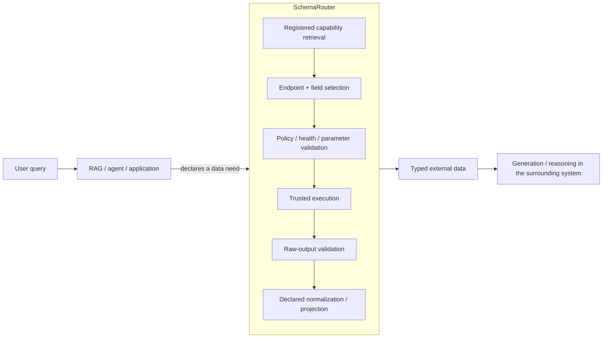
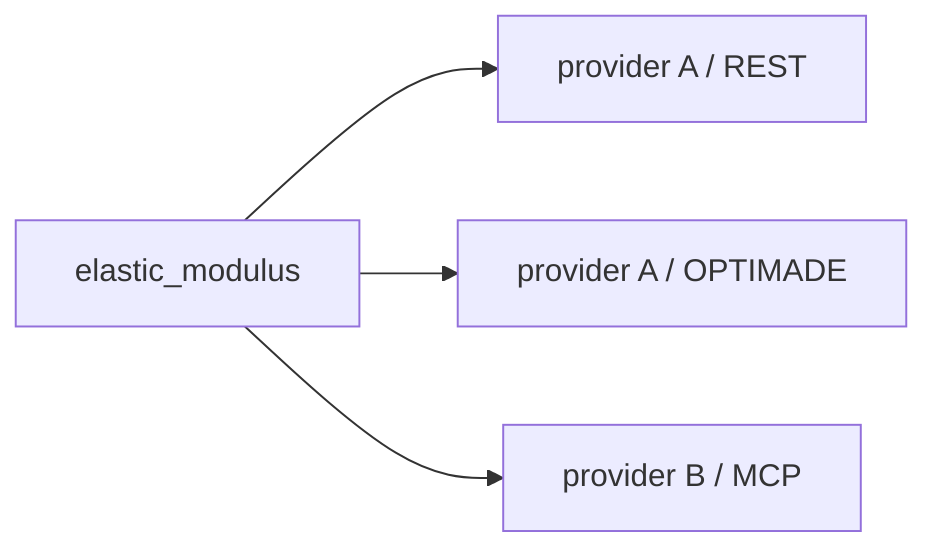
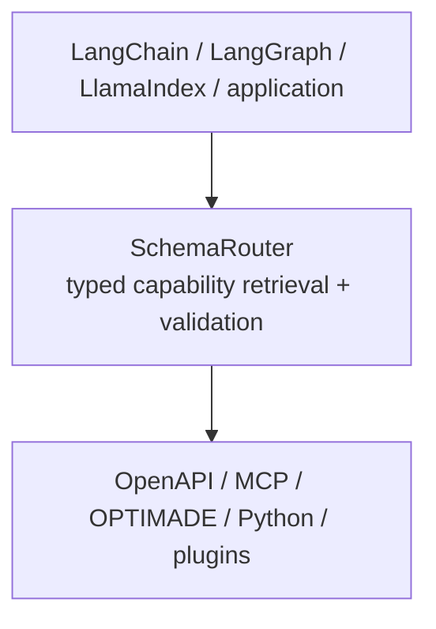

# RAG 및 agent를 위한 structured retrieval과 execution

**RAG (Retrieval-Augmented Generation)** is a generation architecture in which a model's output is
augmented with information retrieved from external, non-parametric sources.

SchemaRouter는 **RAG 자체가 아니며** generation step을 소유하지 않습니다. It can serve as part of the
retrieval side of a RAG or agent system when the external information must be obtained from
structured, executable sources such as OpenAPI endpoints, MCP tools, OPTIMADE services, or typed
Python callables.



For document-centric RAG, the external source may be a corpus of passages or records and the
retriever returns context. SchemaRouter addresses a different retrieval surface: **registered
capabilities and the structured data they can return**.

Its registry forms a logical capability graph whose relationships include providers, access paths,
tools, endpoints, parameters, output fields, policy, availability, and evidence contracts. A graph
database or vector database is not required. Deterministic indexes, embeddings, or bounded decision
backends may help search the catalog, but the registered schema remains the authority.

## Retrieve a compact candidate set before agent selection

For agent systems, SchemaRouter can expose ranked registered capabilities without planning or
executing them:

```python
candidates = router.retrieve(
    "current Young's modulus for MAT-7",
    k=5,
)

for item in candidates.candidates:
    print(item.route_id, item.score)
    for field in item.output_fields:
        print(field.semantic_id, field.json_schema, field.unit)
```

Use `retrieve_executable(..., k=5)` when the candidate set should be limited to routes whose local
execution binding is currently ready. Async counterparts are `aretrieve` and
`aretrieve_executable`.

When a host has explicit typed execution state, `retrieve_state_aware(...)` filters the fixed Top-K
without changing the stable stateless facade. `reretrieve_state_aware(...)` is the separate
corrective surface for collecting the best K state-eligible candidates from the same host-visible
ranked surface.

The returned bundle carries the full effective input/output JSON Schemas together with registered
parameters, output fields, semantic IDs, units, qualifiers, read/write/destructive classification,
provider/access identity and schema fingerprints.

Retrieval itself has no side effect and does not grant execution authority:

```text
query
  -> SchemaRouter Top-K registered candidates
  -> downstream agent chooses among candidates
  -> local validation / policy
  -> execution
```

Applications may omit rank/score from the LLM prompt and use only the candidate contracts. This is
useful when the goal is to reduce tool-catalog context without turning SchemaRouter's ranking score
into execution policy.

## The retrieved capability has an executable contract

A document retriever can return relevant context. SchemaRouter retrieval instead returns a
**registered executable contract**: an endpoint whose declared operation, inputs, outputs and policy
metadata are known. Plain `retrieve()` does not claim that a local invoker is currently bound or
healthy; use `retrieve_executable()` when current local binding readiness is also required.

The resulting capability contract includes:

```text
Endpoint
  operation
  input contract
  output fields
  read/write/destructive semantics
  provider/access identity
  availability
  policy/evidence requirements
```

A model may help rank or veto already registered candidates. It cannot create a new endpoint,
parameter, field, permission, credential, health state, or side effect.

## Field-first, route-second

The primary semantic object is the data need, not the provider.

For a query such as:

```text
"What is the elastic modulus of this material?"
```

SchemaRouter should first resolve the logical field requirement:

```text
semantic field = elastic_modulus
```

and only then choose a registered route that can provide it:



Availability or policy may change the route. It must not silently change the required field.

When a query needs several fields and the application explicitly permits multiple calls,
SchemaRouter can select complementary routes within the caller's `max_calls` bound.

## Datatype and unit are part of the field contract

A field name alone is not enough to establish equivalence.

SchemaRouter can carry the declared JSON value type/shape, semantic identity, source unit, canonical
normalization contract, exact qualifiers, and evidence metadata with the field.

For example:

```text
semantic_id: mechanical.elastic_modulus
type: number
source_unit: GPa
canonical_unit: Pa
dimension: pressure
normalization: value * 1e9
qualifiers:
  temperature: 300 K
  phase: alpha
```

Two providers exposing a field named `elastic_modulus` are not automatically
interchangeable.

Automatic cross-provider fallback is conservative:

```text
same semantic field
AND compatible declared datatype/shape
AND compatible declared unit/canonical-unit contract
AND exact qualifier compatibility where qualifiers are present
```

SchemaRouter does **not** infer a conversion factor merely from a unit string and does not infer that
two measurement conditions are scientifically equivalent. Unit normalization is applied only when a
trusted `UnitNormalizationSpec` declares the conversion.

Units are optional. Strings, identifiers, booleans, structured metadata and dimensionless numbers
may legitimately be unitless. The field semantics, not the source type, decide whether a unit exists.

## Registration should be generic

Users should be able to start from the identity they actually know. If that identity is a provider
rather than a protocol URL, `add_provider(...)` resolves a trusted `ProviderProfile` into its
declared access methods before those methods enter the same canonical adapter pipeline.

The intended product boundary is that an application can register a capability source and use it
without writing benchmark-specific routing rules.

```text
provider identity or new OpenAPI / MCP / Python capability
  -> resolve declared access method when needed
  -> parse declared schema
  -> compile the same typed registry contracts
  -> update indexes / dependency graph
  -> immediately participate in bounded routing
```

Machine-readable source metadata is preferred. Human-readable documentation follows an explicit
inspect -> proposal -> approval flow because prose alone is not execution authority.

A newly registered route should not require a route-specific classifier to become usable. Optional
learned components may learn generic semantic matching, but route identities and permissions remain
local registered facts.

## Where SchemaRouter stops

SchemaRouter owns the capability retrieval and execution boundary. It does not own the full agent
loop.



The layer above owns conversation, decomposition, memory, graph orchestration and answer generation.
SchemaRouter answers a narrower question:

> Given the registered capabilities, what is the smallest trusted executable data surface that can
> satisfy this request?

That scope is deliberate. It lets Retrieval-Augmented Generation or agent systems consume live
structured data without giving an unconstrained model authority over the entire tool catalog.
