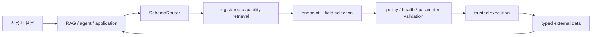

# RAG와 에이전트를 위한 구조화된 retrieval/execution

**RAG (Retrieval-Augmented Generation)** 는 외부에서 찾은 정보를 모델 입력에 보태 답변을
생성하는 방식입니다.

SchemaRouter 자체가 RAG인 것은 아닙니다. 대신 OpenAPI endpoint, MCP tool, OPTIMADE service,
typed Python callable처럼 **실행 가능한 구조화 source**에서 데이터를 가져와야 할 때 그 검색과
실행 경계를 맡을 수 있습니다.



## 작은 candidate set을 agent에 넘기기

```python
candidates = router.retrieve(
    "current Young's modulus for MAT-7",
    k=5,
)

for item in candidates.candidates:
    print(item.route_id, item.score)
    for field in item.output_fields:
        print(field.semantic_id, field.json_schema, field.unit)
```

현재 실행 가능한 binding까지 준비된 route만 원하면:

```python
router.retrieve_executable("current Young's modulus for MAT-7", k=5)
```

비동기 API는 `aretrieve`, `aretrieve_executable`입니다.

반환되는 후보에는 실제 input/output JSON Schema와 parameter, output field, semantic ID, unit,
qualifier, side-effect 분류, provider/access identity, fingerprint가 함께 들어 있습니다.

검색 결과만으로 실행 권한이 생기지는 않습니다.

```text
query
  -> SchemaRouter Top-K registered candidates
  -> downstream agent chooses
  -> local validation / policy
  -> execution
```

## Capability는 실행 계약입니다

문서 검색기가 문맥 조각을 돌려준다면, SchemaRouter는 등록된 **실행 계약**을 돌려준다고 보면
됩니다.

```text
Endpoint
  operation
  input contract
  output fields
  read/write/destructive semantics
  provider/access identity
  availability
  policy/evidence requirements
```

모델은 등록된 후보를 rank/veto하는 데 도움을 줄 수 있지만 새 endpoint, field, permission,
credential, health state를 만들 수 없습니다.

## Field-first, route-second

```text
"What is the elastic modulus of this material?"
        ↓
semantic field = elastic_modulus
        ↓
provider A / REST
provider A / OPTIMADE
provider B / MCP
```

Availability나 policy 때문에 route는 바뀔 수 있지만 **요청된 field contract 자체는 바뀌면 안
됩니다**.

## Datatype / unit / qualifier

같은 이름의 field라고 자동으로 같은 의미가 되지는 않습니다.

예:

```text
semantic_id: mechanical.elastic_modulus
type: number
source_unit: GPa
canonical_unit: Pa
dimension: pressure
qualifiers:
  temperature: 300 K
  phase: alpha
```

Cross-provider fallback은 semantic field, datatype/shape, unit normalization contract, qualifier
compatibility를 보수적으로 확인합니다. SchemaRouter는 unit 문자열만 보고 conversion factor나
과학적 동등성을 추론하지 않습니다.

Unit은 optional입니다. 문자열, identifier, boolean, metadata, dimensionless number는 unit이
없을 수 있습니다.

## 범용 registration

새 OpenAPI/MCP/Python source도 같은 registry 계약으로 정리되어야 합니다.

```text
new source
  -> parse declared schema
  -> compile typed registry
  -> update indexes
  -> bounded routing
```

새 route를 쓰기 위해 route-specific classifier를 따로 만들어야 하는 구조를 목표로 하지 않습니다.

## 경계

상위 계층은 conversation, decomposition, memory, graph, final answer generation을 소유합니다.
SchemaRouter는 더 좁은 질문에 답합니다.

> 등록된 capability 중에서 이 요청을 만족할 수 있는 가장 작은 trusted executable data surface는 무엇인가?
