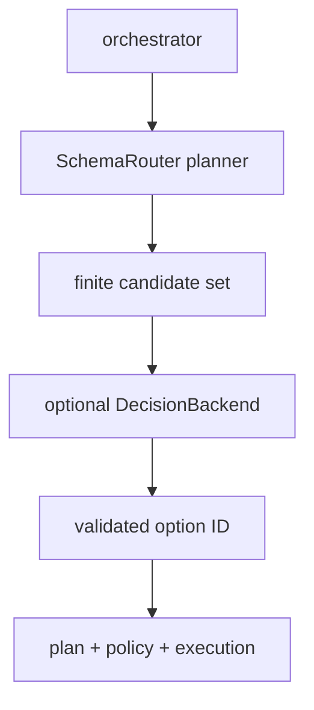

# Decision backend

SchemaRouter는 local schema catalog에서 이미 도출한 **유한한 선택지**를 다듬기 위해 optional bounded decision model을 사용할 수 있습니다. 기본값은 off입니다. backend는 plan generator나 agent가 아니며 tool을 만들거나 실행하거나 memory/conversation loop를 소유하지 않습니다.

`DecisionPolicy`는 tool/endpoint/field selection, evidence sufficiency, empty-recall behavior를 개별 opt-in합니다. semantic candidate recall은 registered catalog에서 bounded top-k만 추가하고 capability-fit/operation-fit/endpoint-disambiguation 단계는 이미 허가된 candidate를 좁히거나 재정렬할 뿐입니다. unknown ID, malformed score, overflow는 fail-closed합니다.

field selection에서도 identifier는 local에서 보존하고 backend에는 declared non-identifier field만 제공합니다. evidence gate는 local metadata가 먼저 요구사항을 만족해야 하며 provider는 충분한 evidence를 veto할 수 있을 뿐 없는 provenance/unit/licence를 만들어낼 수 없습니다.

지원 형태에는 deterministic/embedding, pairwise reranker, application-owned cloud LLM callable, Laya, Ollama, Jev/System One 등이 있습니다. 어떤 backend도 execution policy/schema fingerprint/argument-output validation authority를 받지 않습니다. threshold와 confidence는 workload별 calibration/holdout 평가가 필요합니다.
