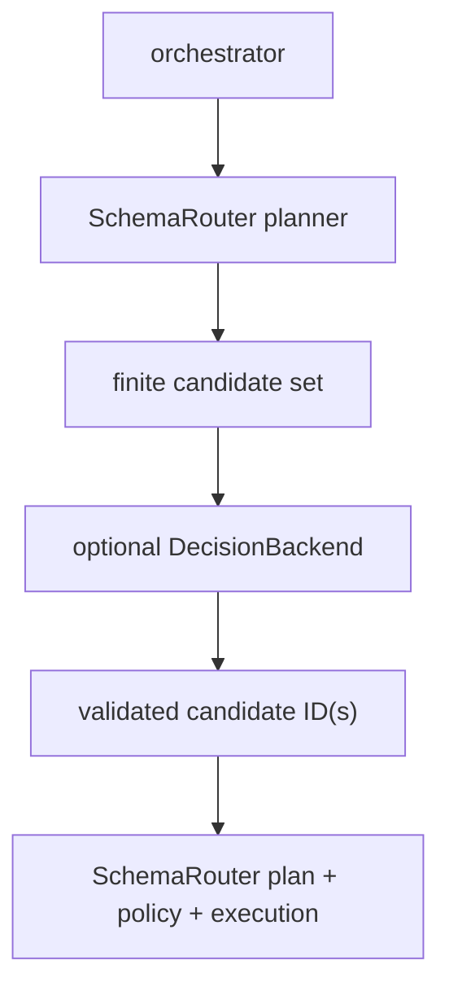

# Decision backend

SchemaRouter can optionally use a bounded decision model to refine choices that were already
derived from the local schema catalog. This feature is **off by default**.

Decision backend는 plan generator가 아닙니다. locally authorized된 유한 option ID 집합만 받고 그 안에서만 선택할 수 있습니다. typed execution plan은 계속 SchemaRouter가 구성하며 policy, schema validation, fingerprint, execution authority도 SchemaRouter에 남습니다.

provider layer는 교체 가능합니다. Laya와 Ollama 같은 direct backend 외에도 `SystemOneDecisionBackend`는 설정을 통해 Jev-compatible hosted/self-hosted System One endpoint를 사용할 수 있습니다. 새로운 compatible model family를 위해 별도의 SchemaRouter planner를 만들 필요는 없지만 동일한 local option validation과 workload-specific quality evaluation을 통과해야 합니다.

또한 이들은 **agent나 orchestrator가 아닙니다**. decision backend는 conversation loop를 소유하지 않고 tool 호출 시점을 결정하지 않으며 tool을 실행하거나 memory를 관리하거나 임의의 multi-step plan을 만들지 않습니다. SchemaRouter 내부의 bounded decision point 뒤에 위치하는 교체 가능한 classifier/ranker에 가깝습니다.



## 활성화

```python
from schemarouter import CallableDecisionBackend, DecisionPolicy, SchemaPlanner

backend = CallableDecisionBackend(my_decision_model)
planner = SchemaPlanner(
    registry,
    decision_backend=backend,
    decision_policy=DecisionPolicy(
        enabled=True,
        endpoint_selection=True,
        fallback="deterministic",
    ),
)
```

The master `enabled` switch must be true. Individual surfaces are separately configurable:

- `tool_selection`
- `endpoint_selection`
- `field_selection`
- `evidence_sufficiency`
- `recall_on_empty`

도구 또는 엔드포인트 선택 기능을 활성화하면 제한된 후보 선택 기능도 동작합니다. `field_selection`은 식별자 필드를 로컬에 보존하면서, 백엔드가 선언된 비식별자 출력 필드에서만 선택하도록 합니다. `evidence_sufficiency` 역시 보수적인 이진 게이트로 구현되어 있습니다. SchemaRouter가 먼저 로컬 스키마 메타데이터에서 요구된 출처·라이선스·단위·원본 유형의 근거를 확인한 다음, 백엔드는 로컬에서 충분하다고 판정된 호출을 유지하거나 불충분하다는 이유로 거부할 수만 있습니다. 제공자는 로컬에 없는 근거를 새로 만들어 충분한 상태로 바꿀 수 없습니다.

### 제한된 semantic candidate recall

다국어 질의나 바꿔 쓴 질의에서는 등록된 스키마에 적절한 기능이 기술되어 있어도 어휘 기반 검색이 올바른 엔드포인트를 놓칠 수 있습니다. `SchemaPlanner`는 최종 후보 선택 전에 별도의 **후보 재현율 개선 백엔드**를 선택적으로 추가할 수 있습니다.

```python
from schemarouter import EmbeddingDecisionBackend, SchemaPlanner

recall = EmbeddingDecisionBackend(multilingual_embed_batch)

planner = SchemaPlanner(
    registry,
    candidate_recall_backend=recall,
    candidate_recall_limit=4,
    decision_backend=final_decider,
    decision_policy=policy,
)
```

이 단계는 후보를 찾아내는 역할만 합니다. 유한한 등록 엔드포인트 카탈로그를 입력받아 최대 `candidate_recall_limit`개의 선택지 ID를 반환할 수 있습니다. SchemaRouter는 의미 기반 top-k 후보를 일반 어휘 검색 후보와 합친 후, 기존의 제한된 결정·정책·스키마·근거·런타임 파이프라인을 통해 실제 실행 가능 여부를 판단합니다.

의미 기반 재현율 백엔드는 도구, 호출, 인수, 필드 또는 실행 권한을 새로 만들지 **않습니다**. 백엔드가 실패하거나 선택을 포기하면 SchemaRouter는 어휘 기반 후보를 유지하고 경고를 남깁니다. 어휘 검색 결과가 없더라도 의미 기반 검색 백엔드가 설정된 경우 `recall_on_empty`를 통해 전체 카탈로그를 추가 노출하지 않습니다. 의미 기반 top-k 범위가 그대로 적용됩니다.

다국어 임베딩 모델은 자연스러운 선택이지만 SchemaRouter가 특정 모델에 종속되지는 않습니다. 기존 `EmbeddingDecisionBackend`는 애플리케이션이 소유한 SentenceTransformers, FastEmbed, 원격 임베딩 API 또는 도메인 전용 인코더를 감쌀 수 있습니다.

### 제한된 capability-fit / no-route gate

의미 기반 후보 검색은 재현율을 높이지만 이것만으로는 도메인 밖 질의에도 카탈로그 내 후보를 억지로 선택할 수 있습니다. `SchemaPlanner`는 어휘·의미 검색 이후 최종 후보 선택 이전에 선택적 `candidate_fit_backend`도 지원합니다.

```python
fit = EmbeddingDecisionBackend(
    multilingual_embed_batch,
    min_similarity=0.45,
)

planner = SchemaPlanner(
    registry,
    candidate_recall_backend=recall,
    candidate_recall_limit=2,
    candidate_fit_backend=fit,
)
```

적합성 백엔드는 이미 허용 범위로 제한된 후보 집합만 전달받습니다. 구체적인 선택을 반환해도 그 의미는 ‘제시된 기능 중 하나 이상이 질의에 그럴듯하게 맞는다’는 것뿐입니다. SchemaRouter는 일반 후속 순위 결정기를 위해 전체 후보 집합을 유지합니다. 적합성 백엔드는 최종 경로를 선택하거나 실행 권한을 만들 수 없습니다.

명시적으로 선택을 포기하면 모든 후보 경로를 억제하고 경로 없는 계획을 생성합니다. 반대로 백엔드 예외가 발생했다고 해서 이미 허용된 경로를 차단하지는 않습니다. SchemaRouter는 후보 집합을 유지하고 경고를 남깁니다. 따라서 이 게이트는 새로운 보안 권한이 아니라 품질·선택 포기 판단의 경계입니다.

For embedding-based fit gates, calibrate `min_similarity` and `min_margin` on development or
calibration data. Do not tune these thresholds against a held-out test split.

### 제한된 operation-capability fit

광범위한 `candidate_fit_backend`는 검색된 기능 중 하나라도 질의의 도메인에 해당하는지 판단합니다. 그러나 유사 도메인에서 지원되지 않는 작업을 가려내기에는 부족합니다. 예를 들어 레지스트리에는 `lookup`, `update`만 등록돼 있는데 사용자가 계정 `delete`를 요청하더라도 질의가 `users` 도메인에 속한다는 사실 자체는 명확할 수 있습니다.

For that case, `SchemaPlanner` supports an optional `operation_fit_backend` between broad capability
fit and same-tool endpoint disambiguation:

```python
operation_fit = EmbeddingDecisionBackend(
    multilingual_embed_batch,
    min_similarity=0.25,
)

planner = SchemaPlanner(
    registry,
    candidate_recall_backend=recall,
    candidate_recall_limit=2,
    candidate_fit_backend=fit,
    operation_fit_backend=operation_fit,
    endpoint_disambiguation_backend=disambiguator,
)
```

작업 적합성 판단 범위는 일반 기능 적합성보다 좁습니다. 현재 가장 앞선 도구 도메인에 속하는 형제 엔드포인트만 살펴보고, 엔드포인트 작업 이름, 신뢰할 수 있는 `EndpointSpec.operation_aliases`, 엔드포인트 설명, 작업 분류 및 선택적인 HTTP 메서드를 입력받습니다. 단순히 도메인이나 필드가 유사하다는 이유로 미지원 작업을 지원 대상으로 바꾸지 않도록 임베딩 텍스트에는 도구 설명, 도구 이름 레이블, 답변 필드 레이블을 넣지 않습니다. 최상위 도구의 식별자는 로컬 요청 메타데이터로만 제공하며 기본 임베딩 선택지 텍스트에는 포함하지 않습니다.

작업 별칭은 애플리케이션에서 명시적으로 관리하는 라우팅 어휘입니다. 예를 들어 `["current conditions", "live conditions"]`나 `["create support ticket", "open support case"]`가 있습니다. SchemaRouter는 사용자 입력이나 모델 출력에서 별칭을 추론하지 않고 수집 어댑터도 임의로 만들지 않습니다. 별칭은 계획 단계의 힌트일 뿐이며 엔드포인트 생성, 인수 수정, 부작용 분류·정책 변경 또는 실행 권한 부여에 사용할 수 없습니다. 별칭의 변경은 지문으로 기록되며 검사·대시보드 출력에서 확인할 수 있습니다.

긍정적인 판단은 제시된 작업 중 하나가 요청과 그럴듯하게 일치한다는 뜻일 뿐입니다. 이 단계는 후보의 순서를 바꾸지 않으므로 최종 경로를 결정할 수 없습니다. 명시적으로 선택을 포기하면 후보 집합을 억제하고, 백엔드 실패 시에는 이미 허용된 후보를 경고와 함께 유지합니다. `max_calls > 1`에서는 이 단계를 건너뜁니다.

As with all model-assisted routing stages, operation-fit thresholds are workload/model specific.
Calibrate them on development/calibration data and evaluate any claimed improvement on a fresh
untouched holdout.

### 제한된 same-tool endpoint disambiguation

의미 기반 검색과 기능 적합성 게이트를 통과해도 선두 도구의 형제 엔드포인트 여러 개가 여전히 적합해 보일 수 있습니다. `SchemaPlanner`는 이 형제 엔드포인트의 순서만 바꾸기 위해 `endpoint_disambiguation_backend`를 선택적으로 사용할 수 있습니다.

```python
disambiguator = EmbeddingDecisionBackend(multilingual_embed_batch)

planner = SchemaPlanner(
    registry,
    candidate_recall_backend=recall,
    candidate_recall_limit=2,
    candidate_fit_backend=fit,
    endpoint_disambiguation_backend=disambiguator,
)
```

이 단계는 일반 후보 선택보다 범위가 좁습니다. 이미 선두에 있는 도구 도메인의 엔드포인트만 받고, 그중 한 형제 엔드포인트를 맨 앞으로 이동할 수 있습니다. 다른 도구로 바꾸거나 후보를 추가·삭제하거나 인수·필드를 만들거나 실행 권한을 부여할 수 없습니다. 백엔드가 실패하거나 선택을 포기하면 기존 후보 순서가 유지됩니다.

이 단계는 `max_calls > 1`일 때 건너뜁니다. 이 경우 단일 경로의 순서보다 의미적으로 필요한 필드의 포괄 범위가 선택을 좌우해야 하기 때문입니다. 엔드포인트 설명에는 신뢰할 수 있는 읽기 전용·데이터 변경 작업 분류와 선언된 답변 필드 레이블이 포함돼 있어 일반 의미 기반 백엔드도 `search/update`, `lookup/update`, `list/create`, `current/forecast` 같은 조합을 구별할 수 있습니다.

As with the recall and fit stages, evaluate disambiguation on development/calibration data and use a
fresh untouched holdout for any claimed improvement.
### 빈 lexical recall

`recall_on_empty=True`는 후보 선택에 추가로 설정할 수 있는 선택 사항입니다. 한국어 질의를 영어 전용 스키마 카탈로그로 라우팅해야 하는 경우처럼 결정적인 어휘 검색 단계가 엔드포인트를 전혀 찾지 못할 때 의미가 있습니다.

`tool_selection` 또는 `endpoint_selection`과 함께 활성화하면 모든 결정적 스키마 점수가 0이더라도 SchemaRouter가 유한한 등록 엔드포인트 카탈로그를 제한된 결정 백엔드에 보여줄 수 있습니다. 백엔드는 여전히 로컬 선택지 ID만 받으며 도구나 엔드포인트를 임의로 만들어낼 수 없습니다.

기본값은 `False`입니다. 카탈로그를 확장한 뒤 백엔드가 오류를 내거나 선택을 포기하면 SchemaRouter는 임의의 엔드포인트를 고르지 않고 호출 없는 결과를 반환합니다. 대체할 결정적 후보가 없기 때문입니다. 구체적인 선택지를 반환한 경우에는 등록된 경로를 선택하므로, 도메인 밖 요청을 억제하려면 필요에 따라 보정된 신뢰도와 `candidate_abstention="no_route"`를 함께 사용해야 합니다. 특히 다국어, 도메인 밖 또는 적대적 요청에서는 운영 환경에 이 정책을 켜기 전에 해당 작업 부하를 벤치마크하세요.

후보 선택 포기 동작은 `candidate_abstention="inherit" | "deterministic" | "no_route" | "error"`로 별도 설정할 수 있습니다. 기본값 `"inherit"`는 `fallback`을 따르는 기존 동작을 보존하므로 이미 설정된 `fallback="deterministic"`, `fallback="error"`의 의미가 유지됩니다. `"no_route"`는 제한된 백엔드가 명시적으로 선택을 포기할 때 후보 경로를 억제하며, 신뢰도 기준으로 도메인 밖 요청을 처리할 때 유용합니다. 제공자 예외나 잘못된 출력은 여전히 `fallback`이 처리하므로 `"no_route"`를 택했다고 해서 제공자 장애가 조용히 경로 없음으로 바뀌지는 않습니다.

## 제한된 field selection

Enable field selection explicitly:

```python
policy = DecisionPolicy(
    enabled=True,
    field_selection=True,
    fallback="deterministic",
)
```

For each already-selected endpoint, SchemaRouter offers only declared non-identifier output fields
as finite `field:N` options. Identifier fields never enter the provider's choice set and are
always retained locally.

The decision request's `max_selections` never exceeds the deterministic projection's answer-field
width. When deterministic projection is in recall-first mode and keeps all fields, the backend may
select any bounded subset of those declared fields.

Provider failure, malformed/unknown field IDs, duplicate IDs, overflow, or abstention follows the
same fallback policy as candidate routing. Evidence requirements are recomputed from the final
locally validated field set.

## 제한된 evidence sufficiency

Enable the surface explicitly and request evidence on the plan request:

```python
policy = DecisionPolicy(
    enabled=True,
    evidence_sufficiency=True,
    fallback="deterministic",
)

request = PlanRequest(
    query="band gap",
    evidence=EvidenceRequirements(
        provenance=True,
        license=True,
        units=True,
        source_type="calculated",
    ),
)
```

SchemaRouter performs a deterministic local precheck before contacting the backend. Tool-level
`source_type` / `license` metadata and selected answer-field `source_type`, `license`, and
`unit` metadata are the only evidence that can satisfy this precheck.

If any requested requirement is locally missing, the call is rejected without asking the provider.
If local evidence is sufficient, the provider receives exactly two finite options:
`evidence:sufficient` and `evidence:insufficient`. Selecting `insufficient` acts only as a
conservative veto. Selecting `sufficient` cannot add provenance, licenses, units, fields, tools, or
execution authority.

Provider failure or abstention can fall back to the local evidence assessment when
`fallback="deterministic"`; `fallback="error"` fails planning instead.

## Fallback

`fallback="deterministic"` is the default. Invalid output, provider failure, unknown option IDs,
or abstention falls back to SchemaRouter's deterministic ranking and adds a warning to the plan.

Use `fallback="error"` when a decision failure must stop planning.

## Contract invariant

A decision provider:

- receives finite opaque option IDs;
- cannot create a `ToolCall`;
- cannot add tools, endpoints, fields, parameters, credentials, or execution permissions;
- cannot make an unknown option executable;
- cannot upgrade locally missing evidence;
- may only veto a call that already passed the local evidence precheck;
- must return bounded, finite scores;
- may abstain;
- supplies metadata that is always non-authoritative.

The planner, execution policy, schema fingerprint checks, argument validation, and output validation
remain unchanged.

## Decision backend 선택

The optional backends serve different deployment goals:

| Backend | Best fit | Trade-off |
| --- | --- | --- |
| Deterministic / embedding | Zero provider dependency and predictable local behavior | Lower semantic flexibility on ambiguous language |\n| Pairwise scorer / reranker | Direct query-option relevance scoring with bounded local authority | Application owns model/runtime and score calibration |
| Hosted general LLM via `CallableDecisionBackend` | Reuse an existing GPT, Gemini, Claude, or other cloud-model client | Provider latency/cost; application owns structured-output prompting and credentials |
| Laya | Fast local finite decisions, including Apple Silicon through PyTorch MPS/Metal | Single-selection adapter today; quality is checkpoint/domain dependent |
| Ollama | Reuse a general local LLM that is already deployed for other application tasks | Autoregressive generation is heavier and slower than a purpose-built decision model |
| Jev / TypeSafe | Hosted purpose-built bounded decisions without local model operations | External service/network dependency |

Ollama is **not required** when Laya or a deterministic backend meets the workload. It
remains useful as a broad compatibility path for teams that already operate local instruction
models, for side-by-side benchmark evidence, and as a fallback when a task benefits from a general
language model rather than a specialized System-One decision model.

## 기존 cloud LLM client

SchemaRouter does not require Ollama or Laya when the application already uses a hosted model API.
The provider-neutral `CallableDecisionBackend` can wrap the same application-owned GPT, Gemini,
Claude, or other structured-output client:

```python
from schemarouter import CallableDecisionBackend, DecisionPolicy, SchemaPlanner

async def cloud_decider(request):
    # Use the application's existing cloud-model client here.
    # Return only finite option IDs that came from request.options.
    payload = {
        "query": request.query,
        "options": [
            {
                "id": option.id,
                "label": option.label,
                "description": option.description,
            }
            for option in request.options
        ],
        "max_selections": request.max_selections,
    }
    raw = await existing_cloud_model_json_call(payload)
    return raw

backend = CallableDecisionBackend(cloud_decider)

planner = SchemaPlanner(
    registry,
    decision_backend=backend,
    decision_policy=DecisionPolicy(
        enabled=True,
        endpoint_selection=True,
        fallback="deterministic",
    ),
)
```

The callable may internally use OpenAI, Google, Anthropic, or another provider. SchemaRouter does
not automatically inherit the application's provider client or API key; the application injects
that trusted client explicitly. This keeps vendor SDKs and credentials outside SchemaRouter core.

The same fail-closed contract still applies: unknown IDs, duplicate IDs, or selections beyond
`max_selections` are rejected before they can affect planning.

There are no first-class OpenAI/Gemini/Anthropic SDK dependencies in core. The stable
integration surface is the provider-neutral callable contract.

## Local embedding similarity

`EmbeddingDecisionBackend` provides a zero-provider-dependency path for local or hosted embedding
models. The embedder receives the user query followed by one text representation per authorized
option; SchemaRouter computes cosine similarity locally and maps ranked vector positions back to the
original opaque option IDs.

```python
from schemarouter import EmbeddingDecisionBackend

backend = EmbeddingDecisionBackend(
    embed_batch,
    min_similarity=0.35,
    min_margin=0.05,
)
```

The backend can use any sync or async callable that returns one finite, same-dimensional vector per
input text. This makes it compatible with application-owned SentenceTransformers, FastEmbed,
semantic-router encoders, remote embedding APIs, or custom domain encoders without adding any of
those packages to SchemaRouter's core dependency graph.

The default option-text formatter does not pass `DecisionOption.metadata` to the embedder. A
custom `option_text` callback is trusted application code and may choose a different
data boundary. A zero-norm vector, NaN/Infinity, dimension mismatch, wrong batch size, or malformed
vector fails closed. `min_similarity` can
abstain on weak matches; `min_margin` can abstain when the selection boundary is ambiguous.

For asymmetric retrieval encoders, wrap the callable so the first input (the query) uses the
encoder's query path and option texts use its passage/document path.

## Pairwise query-option scoring

`PairwiseDecisionBackend` is a provider-neutral path for cross-encoders, rerankers, or any
application-owned model that directly scores a query against each authorized option.

```python
from schemarouter import PairwiseDecisionBackend

backend = PairwiseDecisionBackend(
    score_pairs,
    min_score=0.20,
    min_margin=0.05,
)
```

The scorer receives a batch of `(query, option_text)` pairs and returns exactly one confidence
score in `[0, 1]` for each pair. SchemaRouter ranks those scores locally and maps positions back
to the original opaque option IDs. The backend can therefore be used for `operation_fit_backend`,
`candidate_fit_backend`, endpoint disambiguation, or final bounded decision surfaces without
giving the scorer authority to invent a route.

The default formatter forwards only the option label and description, never
`DecisionOption.metadata`. Wrong batch size, malformed values, NaN/Infinity, or scores outside
`[0, 1]` fail closed. Async scorers are supported through the normal async planning path.

SchemaRouter does not depend on Transformers, Torch, a particular reranker, or a
hosted ranking API. Applications own the scoring model and any score calibration. If a model emits
unbounded logits, convert them to a calibrated or otherwise explicitly defined `[0, 1]` confidence
before returning them to this backend. Thresholds remain model- and workload-specific and should be
chosen on development/calibration data, not held-out evaluation data.

## Jev / TypeSafe System One

SchemaRouter includes an optional `JevDecisionBackend` on current unreleased `main`:

```bash
pip install -e ".[jev]"
```

The normal packaged extra name will be `schemarouter[jev]` in the next release.

```python
from schemarouter.integrations import JevDecisionBackend

backend = JevDecisionBackend(
    min_confidence=0.65,
)
```

The provider uses a TypeSafe `choice` primitive over the offered option IDs. Unknown IDs fail
closed before confidence-based abstention is evaluated. Low-confidence valid choices may abstain and
fall back to deterministic routing.

The adapter does not forward `DecisionOption.metadata`, and API credentials are client
configuration rather than model state.

See [Jev / TypeSafe System One](../integrations/jev.md) for sync/async usage and security details.

## Local Laya decision model

SchemaRouter includes an optional `LayaDecisionBackend` for local non-autoregressive bounded
decisions:

```bash
pip install -e ".[laya]"
```

The packaged extra is `schemarouter[laya]`.

```python
from schemarouter.integrations import LayaDecisionBackend

backend = LayaDecisionBackend(
    min_confidence=0.65,
)
```

By default, Laya may route between its English and multilingual checkpoints from the bounded request
state. Applications may pin a checkpoint with `model=` and may preload checkpoints for a
long-running process.

The adapter maps Laya's finite `choice` primitive to SchemaRouter's existing
`DecisionBackend` contract. Unknown option IDs fail closed before confidence gating,
`DecisionOption.metadata` is not forwarded, and Hugging Face credentials remain trusted local
configuration.

See [Laya](../integrations/laya.md) for checkpoint, device, preload, confidence, and benchmark
guidance.

## Local Ollama model

SchemaRouter also includes an `OllamaDecisionBackend` that uses Ollama structured outputs over the
native HTTP API. No Ollama Python SDK is required.

```python
from schemarouter.integrations import OllamaDecisionBackend

backend = OllamaDecisionBackend(
    "your-installed-model",
    async_mode=True,
)
```

The backend constrains `option_id` with a JSON Schema enum, includes that schema in the prompt for
grounding, and then revalidates the returned `DecisionResult` locally. `DecisionOption.metadata`
is never forwarded. Model-reported scores are treated as self-assessments rather than calibrated
probabilities.

See [Ollama](../integrations/ollama.md) for configuration and benchmark usage.

## Experimental provider

Other System-One-style or decision-model providers should implement `DecisionBackend` rather than
being imported into SchemaRouter core. Provider integrations remain optional and explicitly enabled.
Embedding libraries should likewise remain application-owned unless a stable provider-specific
contract justifies a dedicated adapter.

This separation lets applications change, disable, or compare a decision provider without changing
registered tools, execution policy, or the deterministic planner.

## Benchmarking

Use `scripts/benchmark_decision_routing.py` to compare the deterministic baseline,
`ModelQueryAnalyzer`, local embedding backends, Jev, Laya, and explicitly selected local Ollama models
on the same cases.

See [Decision routing benchmark](../guides/decision-benchmark.md).
