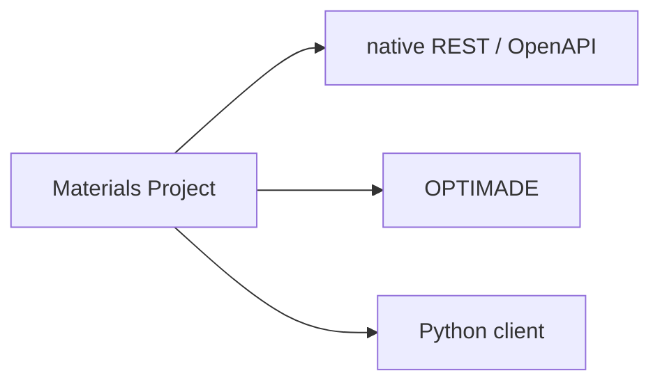
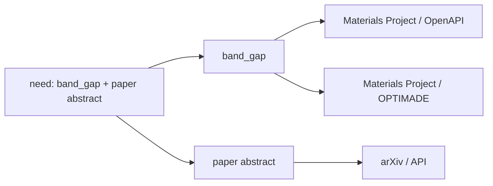
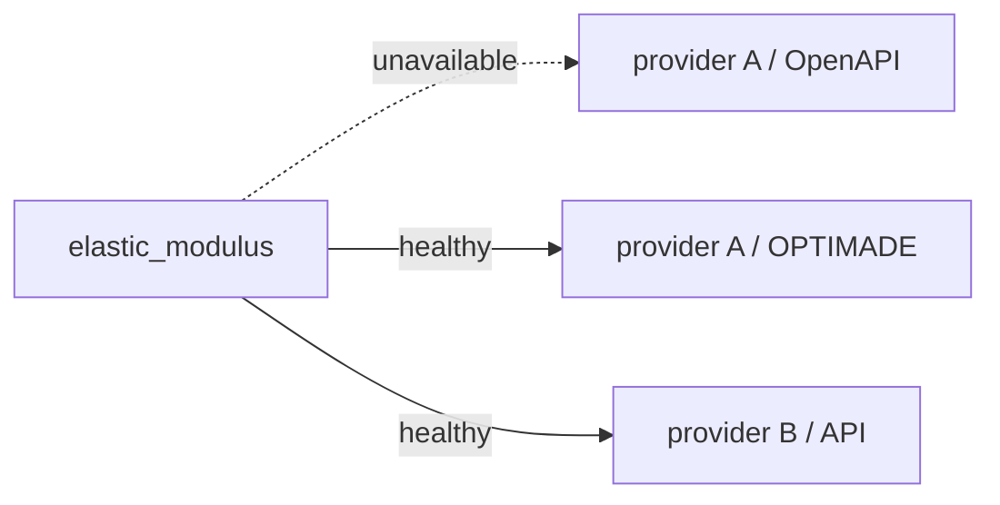

# 설계 원칙

SchemaRouter는 좁고 명확한 생각을 중심으로 설계됩니다. **사용자가 필요로 하는 데이터가 우선**이며 tool, provider, transport는 그 필요를 충족하기 위한 교체 가능한 구현 경로입니다.

이 페이지는 새로운 runtime 기능, adapter, integration을 설계할 때 따라야 할 원칙을 정리합니다.

## 1. 경로보다 정보 요구를 먼저 결정합니다

계획은 query에 답할 수 있는 가장 작은 선언된 semantic field surface에서 시작합니다.

```text
user query
  -> semantic data need
  -> logical fields
  -> eligible providers/access paths
  -> validated execution
```

planner가 먼저 "어떤 API를 호출할까?"를 결정한 뒤 그 API가 반환하는 모든 것을 받아들이는 방식이어서는 안 됩니다. 필요한 data surface를 식별한 다음 provider를 선택합니다.

## 2. Provider와 access mode는 서로 다른 identity입니다

한 조직이 같은 기반 정보를 여러 access path로 제공할 수 있습니다.



SchemaRouter는 다음을 구분합니다.

- `provider`: 정보를 소유하거나 제공하는 주체
- `access_mode`: 해당 contract가 정보에 접근하는 방식
- tool/endpoint: 구체적인 실행 가능 schema boundary

동등한 access path는 서로 다른 semantic answer로 취급하지 않으면서 fallback 대안이 될 수 있습니다.

Provider-first 등록도 이 구분을 없애지 않습니다. `ProviderProfile`은 사용자가 알려진 protocol/SDK를 직접 열거하는 수고를 줄일 뿐이며, 등록된 각 method는 자체 `access_mode`, schema identity, health, policy state를 유지합니다.

## 3. Field는 단순 response key가 아니라 contract입니다

logical field는 이름 외에도 다음 정보를 가질 수 있습니다.

- canonical `semantic_id`
- provider별 source/result path
- alias
- JSON datatype/shape
- 선택적 unit metadata와 명시적 normalization
- temperature, pressure, phase, orientation, measurement method 같은 정확한 qualifier
- 선언된 경우 provenance/license/source-type metadata

모델이 같다고 판단했다는 이유만으로 provider wire name이 semantic equivalence가 되지는 않습니다. mapping은 trusted local contract입니다.

## 4. Unit은 semantics에 따라 선택적입니다

모든 capability source에서 `FieldSpec.unit`은 optional입니다. unit이 없다는 것이 "web text만 해당"한다는 뜻은 아닙니다.

문자열, identifier, category, boolean, 선언된 schema의 날짜, dimensionless numeric value 모두 정당하게 `unit=None`일 수 있습니다. scientific quantity는 source unit을 선언하고 필요한 경우 explicit normalization contract를 가질 수 있습니다.

unit 존재 여부는 source type이 아니라 field semantics가 결정합니다.

## 5. 하나의 query가 여러 source를 요구할 수 있습니다

한 endpoint만으로는 제공할 수 없는 field union이 필요할 수 있습니다.



애플리케이션이 `PlanRequest.max_calls > 1`로 여러 호출을 명시적으로 허용하면 SchemaRouter는 이미 충족된 field의 동등 route에 제한된 call slot을 쓰기보다 상호 보완적인 semantic-field coverage를 우선합니다.

한계는 계속 명시적입니다. SchemaRouter는 `max_calls`를 조용히 늘리지 않으며 현재 매칭된 semantic field requirement가 충족되면 bound보다 적은 호출에서 멈출 수 있습니다.

## 6. Health는 semantic field가 아니라 access path에 속합니다

field 자체가 "살아 있음" 또는 "죽어 있음" 상태를 갖는 것이 아닙니다. 해당 field를 제공할 수 있는 access path가 healthy, unavailable, unbound 또는 stale 상태일 수 있습니다.

실질적인 field availability는 해당 field contract를 충족할 수 있는 현재 trusted route에서 파생됩니다.



일시적 실패에는 유한 cooldown과 선택적 trusted read-only health probe를 사용합니다. 한 번의 실패가 영구 blacklist를 만들면 안 됩니다.

## 7. Availability는 route를 바꿀 수 있지만 semantic requirement는 바꾸지 않습니다

fallback은 provider나 access mode를 바꿀 수 있지만 필요한 field semantics는 보존해야 합니다.

scientific value에서는 호환 가능한 datatype, unit/canonical-unit contract, 그리고 필요의 일부인 정확한 qualifier까지 포함됩니다. 호환성을 로컬에서 증명할 수 없으면 fallback을 거부합니다.

## 8. 데이터를 두 번 최소화합니다

trusted server-side projection contract가 있으면 planned field만 upstream에 요청합니다. raw-response validation 뒤에는 local projection으로 최종 `ToolResult`를 다시 좁힙니다.

이를 통해 raw schema validation을 약화하지 않으면서 provider payload, parsing 작업, downstream LLM context를 줄입니다.

## 9. 모델은 선택을 도울 수 있지만 권한을 만들 수 없습니다

선택적 hosted/local decision backend는 유한한 locally registered candidate 위에서만 동작합니다. tool, schema, credential, health state, mutation authority 또는 새로운 execution loop를 만들어낼 수 없습니다.

SchemaRouter는 bounded planning/execution layer이지 또 다른 agent framework가 아닙니다.

## 10. 동등성을 증명할 수 없으면 fail closed합니다

schema drift, 지원하지 않는 schema semantics, 모호한 alias, 호환되지 않는 scientific contract, stale binding, policy failure는 숨겨진 coercion이 아니라 명시적인 실패로 남아야 합니다.

field intent가 모호할 때 recall은 보존할 수 있지만 execution authority는 추론하지 않습니다.

## 11. Observability는 숨겨진 reasoning이 아니라 구조를 보여줘야 합니다

inspection, plan explanation, trace, dashboard는 routing에 영향을 준 로컬 관찰 가능 사실을 보여줘야 합니다.

- 선택된 tool/endpoint/provider/access mode
- 선택된 field
- deterministic score component
- health/binding state
- fallback transition
- schema fingerprint와 field contract
- host-visible candidate에 대한 unified decision-trace reason code

private model chain-of-thought를 노출하거나 이에 의존해서는 안 됩니다. decision trace 역시 hidden capability, rank score, credential, private header, request/result payload를 노출해서는 안 됩니다.

## 설계 테스트

새 기능은 다음 boundary를 강화할 때 SchemaRouter에 속합니다.

```text
natural-language request
  -> bounded semantic field plan
  -> trusted route selection
  -> validated execution
  -> minimal typed result
```

conversation memory, autonomous tool loop, graph orchestration 또는 일반적인 agent strategy를 소유하는 기능이라면 SchemaRouter가 아니라 그 상위 계층에 속합니다.
