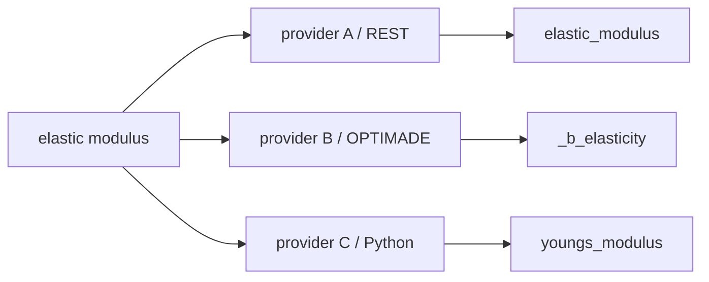

# 필드 우선 실행

SchemaRouter의 핵심 원칙은 **field-first, route-second** 입니다.

도구 하나를 고르는 것이 목적이 아니라, 질문에 필요한 최소 declared data surface를 먼저 정한 뒤
그 데이터를 제공할 수 있는 trusted route를 고릅니다.

```text
user query
  -> semantic data need
  -> required logical fields
  -> provider/access path
  -> availability + policy + evidence
  -> server-side field selection
  -> raw schema validation
  -> final local projection
  -> minimal ToolResult
```

## 왜 field-first인가

예를 들어 사용자가 탄성계수 하나를 묻는데 material record 전체를 가져오면 다음 비용이 생깁니다.

- provider response size 증가
- latency 증가
- JSON parsing/validation 증가
- downstream LLM context 오염
- prompt token 증가

그래서 field를 execution plan의 일부로 취급합니다.

## Provider보다 logical field가 먼저

같은 개념이 provider마다 다른 이름으로 나타날 수 있습니다.



`FieldSpec.semantic_id`, `aliases`, `path`, `result_path`,
`ServerProjectionSpec.field_map` 같은 trusted contract가 이 차이를 연결합니다. 모델이 임의로
field mapping을 발명하지 않습니다.

## Unit은 field semantics에 따라 optional

다음 값들은 정상적으로 unit이 없을 수 있습니다.

- paper title / abstract / snippet
- material identifier / DOI
- category / phase label
- boolean flag
- object / array metadata
- dimensionless score

물리량처럼 실제 unit이 필요한 경우에만 `FieldSpec.unit`과 필요시
`UnitNormalizationSpec`을 선언합니다.

Mixed request는 field별 evidence requirement를 줄 수 있습니다.

```python
PlanRequest(
    query="band gap and paper abstract",
    max_calls=2,
    field_evidence={
        "band_gap": EvidenceRequirements(units=True),
    },
)
```

## 여러 source가 필요한 질문

한 endpoint가 모든 field를 주지 못한다면 caller가 `max_calls`를 늘린 범위 안에서
complementary route를 선택할 수 있습니다.

```text
query
  -> band_gap -> materials provider
  -> abstract -> literature provider
```

SchemaRouter는 `max_calls`를 자동으로 늘리지 않습니다. multi-source fan-out은 caller가 명시적으로
허용해야 합니다.

## 두 단계의 projection

### 1. Server-side projection

Endpoint가 trusted `ServerProjectionSpec`을 선언한 경우 필요한 field를 upstream request에
반영할 수 있습니다.

```python
server_projection=ServerProjectionSpec(
    parameter="fields",
    field_map={
        "elastic_modulus": "elasticity.bulk_modulus",
    },
)
```

SchemaRouter는 generic parameter 이름만 보고 field projection이라고 추측하지 않습니다.

### 2. Final local projection

Provider가 broad payload를 반환하더라도 raw response를 먼저 검증한 뒤 planned field만
`ToolResult`에 남깁니다.

## Availability는 route만 바꿉니다

Provider outage, cooldown, health 상태는 route를 바꿀 수 있지만 요청된 logical field를 넓히거나
다른 데이터로 대체하지 않습니다.

## Recall-first

명확한 semantic match가 있을 때만 적극적으로 field를 줄입니다.

```text
clear semantic match -> minimize
ambiguous semantic need -> preserve recall
```

과도한 minimization으로 answer recall을 잃는 것보다 declared field를 보존하는 쪽을 선택합니다.
