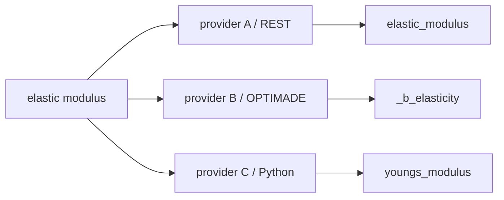
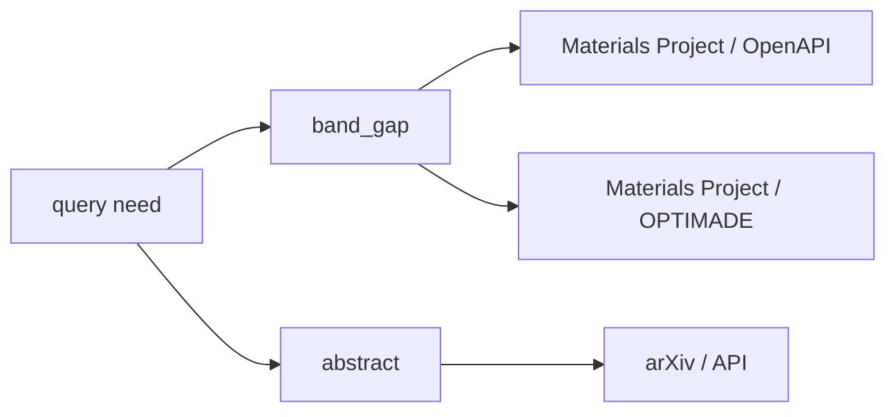
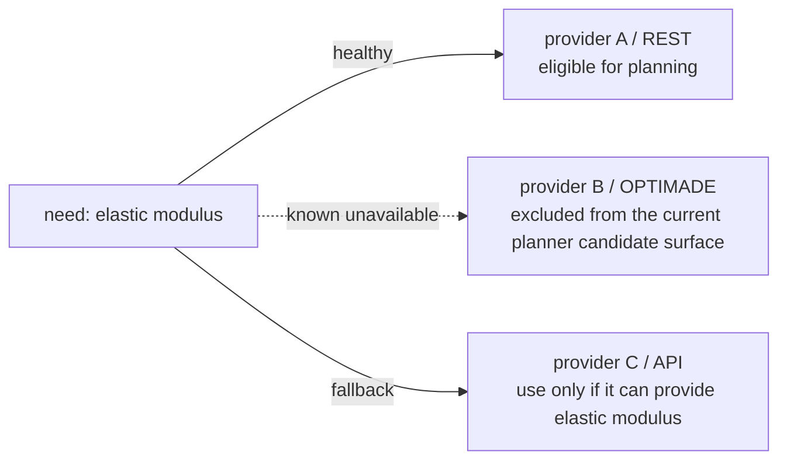

# Field-first execution

SchemaRouter는 **field-first, route-second** 원칙으로 설계됩니다. 목표는 tool 하나를 고르는 것이 아니라 사용자 질문에 답할 수 있는 가장 작은 declared data surface를 찾고 그 surface를 제공할 trusted access path를 선택하는 것입니다.

```text
user query
  -> semantic data need
  -> required logical fields
  -> providers/access paths that can supply those fields
  -> availability + policy + evidence
  -> server-side field selection when supported
  -> raw schema validation
  -> final local projection
  -> minimal ToolResult context
```

## Field-first가 중요한 이유

Elastic modulus 하나만 필요한데 complete material record를 가져오면 upstream bytes/latency, JSON parsing/validation, downstream LLM의 irrelevant value, prompt token, distractor 위험이 증가합니다. 그래서 response field를 afterthought가 아니라 execution plan 일부로 취급합니다.

## Provider 선택보다 logical field가 먼저

동일 개념이 provider/access mode마다 다른 이름일 수 있습니다.



Local `FieldSpec`이 known semantic equivalence를 선언합니다. Canonical local `FieldSpec.name`을 사용하고 provider request selector는 `ServerProjectionSpec.field_map`, response location은 `FieldSpec.path`, canonical output location이 다르면 `FieldSpec.result_path`에 둡니다. `aliases`는 user phrasing/legacy/provider terminology 인식에 사용합니다.

세 path 모두 local `elastic_modulus`를 노출하면서 wire에서는 서로 다른 이름을 사용할 수 있습니다. Provider-specific source path도 `result_path=["elastic_modulus"]`로 project해 planner/final `ToolResult`를 provider-neutral하게 유지합니다. Model은 field mapping을 만들 수 없습니다.

## Unit metadata는 field semantics에 따라 optional

`FieldSpec.unit`은 특정 arXiv·웹 소스만을 위한 예외가 아니라, 모든 제공자에 적용하는 선택적 필드 계약입니다. 물리량이나 그 밖에 명시적으로 단위를 갖는 값에만 단위를 선언해야 하며, 단위가 없는 필드는 출처나 접근 방식에 관계없이 허용됩니다.

```text
paper abstract / title / snippet   -> string, unit=None
material identifier / DOI         -> string, unit=None
phase / category / label          -> string, unit=None
flags                             -> boolean, unit=None
structured metadata              -> object/array, unit=None
dimensionless score or ratio      -> number, unit=None
physical quantity                 -> number/array, unit="..." when declared
```

OpenAPI/MCP/OPTIMADE/Python/문서 기반 어댑터 및 승인된 플러그인 모두 단위가 없는 필드를 제공할 수 있습니다. 단위의 유무는 제공자의 유형이 아니라 해당 필드의 계약으로 결정합니다.

Global `EvidenceRequirements(units=True)`를 명시하면 selected answer field 모두 unit evidence를 만족해야 합니다. Mixed request는 semantic field별 evidence를 지정할 수 있습니다.

```python
PlanRequest(
    query="band gap and paper abstract",
    max_calls=2,
    field_evidence={
        "band_gap": EvidenceRequirements(units=True),
    },
)
```

Materials route의 `band_gap`에는 unit metadata가 필요하지만 arXiv `abstract`는 unitless여도 됩니다. 필드별 증거 요건은 신뢰된 `FieldSpec.semantic_id`를 기준으로 매칭하며, 의미 식별자가 없을 때만 필드 이름을 사용합니다. 제공자마다 필드 이름이 달라도 동일한 의미적 요건을 충족할 수 있지만 모델이 임의로 매핑을 작성하도록 맡기지 않습니다. Execution 시 evidence를 다시 검사하고 compiled call은 **required** evidence와 **available** route evidence를 분리하므로 forged/edited `ToolCall`이 flag 하나로 authority를 얻을 수 없습니다.

## Heterogeneous multi-source field requirement

한 query가 single endpoint가 제공하지 못하는 field를 요구할 수 있습니다. Caller가 `max_calls > 1`을 명시적으로 허용하면 bounded multi-call plan을 compile합니다.



`max_calls=2`이면 동일 covered field의 equivalent path 두 개보다 **complementary semantic field coverage**를 선호합니다. Equivalent route는 `semantic_id`로 collapse하고 `temperature=300 K` 같은 qualifier는 query에서 명시된 경우 별도 requirement로 유지합니다.

```python
plan = router.plan(
    PlanRequest(
        query="band gap and paper abstract",
        max_calls=2,
    )
)
```

Hard bound는 `max_calls`이며 자동 증가하지 않고 한 route가 남은 requirement를 모두 커버하면 더 적게 사용할 수 있습니다. Default는 1입니다. 각 call은 독립 field projection/fingerprint/provider identity/health-binding/policy/fallback chain을 갖습니다. 모두 read-only이면 bounded `parallel_read_only`를 사용할 수 있고 아니면 sequential policy-gated execution입니다.

## Projection의 두 계층

### 1. Server-side projection

Explicit trusted `ServerProjectionSpec`이 있으면 planned field를 upstream request로 push합니다.

```python
EndpointSpec(
    name="search",
    # ...
    server_projection=ServerProjectionSpec(
        parameter="fields",
        field_map={
            "elastic_modulus": "elasticity.bulk_modulus",
        },
    ),
)
```

`material_id`와 `elastic_modulus`만 선택하면 `GET /materials?fields=material_id,elasticity.bulk_modulus`가 될 수 있습니다.

Generic OpenAPI parameter를 field projection이라고 추측하지 않습니다. Local/trusted adapter contract가 필요하며 OPTIMADE `response_fields`가 built-in 예입니다.

`elasticity.bulk_modulus` 같은 source path는 nested object-only path를 recursively 좁힐 수 있고 root array의 object item도 지원합니다. Array traversal, unresolved `$ref`, union 등 보수적으로 좁힐 수 없는 shape는 full declared schema를 유지해 validation을 약화하지 않습니다.


```text
material_id
elastic_modulus
```

```text
GET /materials?fields=material_id,elasticity.bulk_modulus
```

### 2. Final local projection

Upstream이 projection을 무시하거나 지원하지 않아도 raw response를 먼저 validate한 뒤 planned logical field만 final `ToolResult`에 유지합니다. Provider payload가 넓어도 downstream context는 좁습니다.

## Availability는 route를 바꾸지만 data need는 바꾸지 않음



Preferred route가 실패했다고 requested field를 넓히지 않습니다. 새 outage는 precompiled fallback chain이 처리하고 cooldown에 들어간 route는 만료/trusted health reopen 전까지 이후 plan에서 제외됩니다. [Provider-aware fallback](../guides/provider-fallback.md)을 참고하십시오.

## Passive/active availability

Timeout, connection failure, HTTP 429, transient 5xx는 bounded cooldown을 만들 수 있습니다. Cooldown은 항상 만료되어 permanent blacklist가 되지 않습니다. Trusted read-only health probe와 background monitor는 probe 성공 시 더 빨리 reopen할 수 있으며 monitor가 probe를 발명하거나 arbitrary data call을 health check로 바꾸지 않습니다.

## Recall-first safety boundary

Query-to-field match가 명확할 때만 적극적으로 minimize합니다.

```text
clear semantic match -> minimize
ambiguous semantic need -> preserve recall
```

Answer field를 확신할 수 없으면 declared field를 보존합니다. 더 강한 domain minimization은 validation을 약화하지 말고 local alias/schema 또는 bounded analyzer를 개선해야 합니다.

## Typed scientific field와 unit

`FieldSpec.json_schema`는 value type/shape, `FieldSpec.unit`은 provider source unit을 가집니다. Provider unit이 다르면 explicit `UnitNormalizationSpec`을 추가합니다.

```python
FieldSpec(
    name="elastic_modulus",
    semantic_id="elastic_modulus",
    json_schema={"type": "number"},
    unit="GPa",
    unit_normalization=UnitNormalizationSpec(
        dimension="pressure",
        canonical_unit="Pa",
        scale=1e9,
    ),
)
```

Unit string에서 conversion factor를 추론하지 않습니다. Symbol은 case/punctuation-sensitive이며 conversion contract는 trusted local configuration입니다.

Fallback compatibility:

```text
same semantic field
  AND explicit compatible JSON value type
      (required for unit-bearing cross-provider fallback)
  AND (
        same explicit source unit
        OR same declared dimension + same canonical unit
      )
```

Unit label만으로 scientific value contract가 되지 않습니다. Automatic fallback의 unit-bearing field 양쪽은 `FieldSpec.json_schema` 또는 endpoint output schema로 explicit datatype shape를 제공해야 합니다. Unknown datatype + known unit은 부족한 evidence입니다.

Field schema와 raw endpoint schema가 같은 value를 설명하면 type shape가 compatible해야 합니다. Raw response 전체를 먼저 validate하고 selected value도 stronger `FieldSpec.json_schema`로 검사한 뒤 normalize합니다.

Integer-producing fallback은 numeric requirement를 만족할 수 있지만 arbitrary number는 integer-only requirement를 만족할 수 없습니다. Numeric array도 item type을 비교합니다.

```text
provider raw value
  -> raw JSON Schema validation
  -> field projection / canonical result path
  -> explicit unit normalization
  -> ToolResult
```

Numeric GPa field에 provider가 `"130"` string을 반환하면 conversion 전에 실패합니다.

`ToolResult.field_contracts`는 selected field contract만 노출합니다.

```python
result.field_contracts["elastic_modulus"]
# ResultFieldContract(
#     semantic_id="elastic_modulus",
#     json_schema={"type": "number"},
#     source_unit="GPa",
#     unit="Pa",
#     dimension="pressure",
# )
```

Affine conversion은 `canonical_value = source_value * scale + offset`으로 명시적으로 지원합니다. SI prefix와 offset unit을 포함하며 예를 들어 degC→K는 `scale=1.0, offset=273.15`를 사용할 수 있습니다. Source/canonical unit이 같으면 identity transform이어야 하며 contradictory same-unit conversion은 거부/제외합니다.

Planner는 provider raw datatype만이 아니라 **post-normalization result datatype**을 비교합니다. Affine conversion된 integer source는 canonical JSON `number`로 취급할 수 있습니다.

Unit symbol 주변 whitespace는 거부하며 nonlinear/logarithmic conversion은 추론/합성하지 않습니다. Non-finite/overflow normalized value도 fail-closed합니다.


```text
canonical_value = source_value * scale + offset
```

## Scientific field qualifier

Semantic field name/datatype/unit만으로 두 scientific value의 interchangeability를 증명하지 못할 수 있습니다. Temperature, pressure, phase, crystal orientation, measurement method, sample state 같은 fixed context가 있을 수 있습니다.

```python
FieldSpec(
    name="elastic_modulus",
    semantic_id="elastic_modulus",
    json_schema={"type": "number"},
    unit="GPa",
    qualifiers={
        "temperature": "300 K",
        "phase": "alpha",
        "orientation": "[100]",
    },
)
```

`FieldSpec.qualifiers`는 측정·재료 조건을 보존하는 선택적 trusted exact-string map입니다. Text/document/search field나 fixed constraint가 없는 scientific field는 보통 `qualifiers={}`입니다.

Automatic fallback은 semantic/type/unit 검사 뒤 exact qualifier equality를 요구합니다. 300 K field를 500 K 또는 unqualified field로 조용히 대체하지 않습니다.

Qualifier value는 opaque/case-sensitive입니다. `300 K`와 `26.85 degC`의 equivalence, phase normalization, crystallographic notation parsing, natural-language condition derivation을 하지 않습니다. Equivalent representation은 trusted adapter/application이 registration 전에 canonicalize해야 합니다.

Selected qualifier는 `ToolResult.field_contracts`에 보존됩니다.

### Qualifier-aware routing은 lexical/bounded

User query에 qualifier value가 명시되면 otherwise-equivalent schema candidate의 tie를 깰 수 있습니다. `elastic modulus at 500 K`는 500 K field에 deterministic score boost를 줍니다.

이는 exact lexical routing이지 scientific inference가 아닙니다. Temperature conversion/synonym expansion/unstated condition inference를 하지 않습니다. ASCII/numeric qualifier는 token boundary에서 match하므로 `300 K`가 `1300 K`와 match하지 않습니다. 매우 짧은 ASCII qualifier는 value alone으로 match하지 않습니다. Bounded field-selection backend도 trusted qualifier tag를 option description으로 받지만 execution metadata는 decision surface 밖에 유지합니다.
