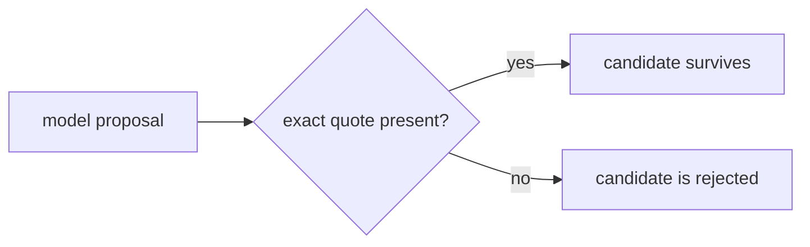

# Human-readable documentation

Human-readable API page는 OpenAPI나 MCP보다 약한 evidence이므로 SchemaRouter는 이를 executable schema source가 아니라 **proposal source**로 취급합니다.

## Documentation page 검사

```python
from schemarouter import SchemaRouter

async def documentation_model(payload: dict) -> dict:
    # Send payload to a structured-output model.
    ...

router = SchemaRouter()
proposal = await router.inspect_url(
    "https://docs.example.com/api",
    model=documentation_model,
)
```

The proposal contains:

- a grounded/non-grounded status;
- a proposed `ToolSpec` when enough evidence survives;
- a grounding score;
- uncertainties;
- rejected items.

## Grounding 규칙

Every accepted endpoint, parameter, and field must carry an evidence quote that appears in the
fetched document.



Scripts, styles, noscript content, and SVG are removed before the model sees the document text.

## Approval은 별도의 authority transition

A grounded proposal is still non-executable.

```python
router.approve_proposal(
    proposal,
    base_url="https://api.example.com",
    min_grounding_score=0.8,
)
```

Mutating methods require an additional explicit opt-in:

```python
router.approve_proposal(
    proposal,
    base_url="https://api.example.com",
    allow_mutations=True,
)
```

Execution policy still applies after approval, so approval does not bypass the runtime side-effect
gate.

## Redirect and URL safety

Documentation URLs must be absolute HTTP(S) URLs without embedded credentials. Redirects are limited
to the original origin.

SchemaRouter deliberately supports local/private endpoints. If untrusted end users can supply URLs,
the hosting application must add its own URL admission and egress policy. See the
[security threat model](../security/threat-model.md).

## Limitations

The current path reads the initial HTTP response. Documentation that requires browser-side
JavaScript rendering or spans many pages may need a future crawler/rendering adapter.
