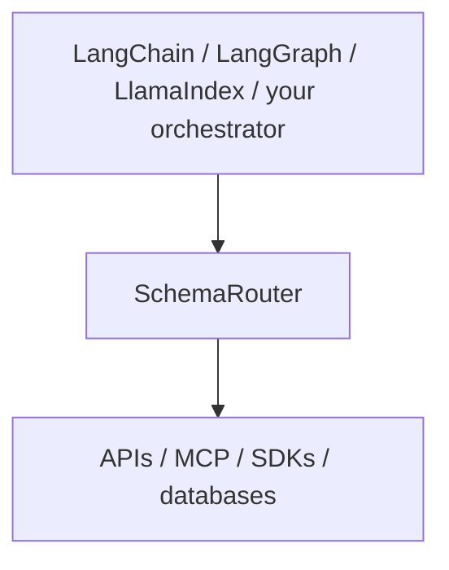

<div class="brand-lockup">
  
  
</div>

<div class="sr-hero" markdown>

<span class="sr-kicker">SchemaRouter 0.17.0</span>

# 에이전트와 도구 사이에 타입 기반 실행 경계를 두세요

SchemaRouter는 API·도구·데이터 시스템 전반에서 AI 에이전트를 위한 **타입 기반 capability routing과 정책 통제형 실행 계층**입니다.

연결하는 도구가 많아질수록 에이전트의 동작을 통제하기 어려워지고, 각 도구는 요청에 필요한 것보다 훨씬 많은 데이터를 반환할 수 있습니다. SchemaRouter는 필요한 **선언된 데이터 필드**를 결정하고, 해당 필드를 제공할 수 있는 등록된 도구 집합만 제한적으로 노출하며, 결과가 모델에 도달하기 전에 선언된 필드만 남깁니다.

```bash
pip install schemarouter
```

[시작하기](getting-started/installation.md){ .md-button .md-button--primary }
[예제 갤러리](getting-started/examples.md){ .md-button }
[신뢰성·릴리스 근거 확인](project/trust-and-evidence.md){ .md-button }
[MCP 결과 계약 선언](guides/mcp.md#declare-a-result-contract-the-server-does-not-publish){ .md-button }
[GitHub](https://github.com/JDeun/SchemaRouter){ .md-button }

</div>

<div class="grid cards" markdown>

-   **최소화**

    먼저 의미상 필요한 데이터를 결정합니다. endpoint가 server-side projection을 명시적으로 지원할 때만 upstream에서 계획된 필드만 요청하고, downstream에서도 해당 필드만 유지합니다.

-   **컴파일**

    OpenAPI, MCP, OPTIMADE, Python callable 또는 승인된 문서를 하나의 typed Provider / Access path / Tool / Endpoint / Parameter / Field 모델로 변환합니다.

-   **검증**

    선언되지 않은 인자, 유효하지 않은 raw output, 오래된 schema fingerprint와 binding, 지원되지 않는 schema 가정을 거부합니다.

-   **강제**

    변경 권한, credential, retry, budget, approval, execution hook을 신뢰된 로컬 경계 내부에 유지합니다.

</div>

## 어디에 위치하는가



SchemaRouter는 agent나 RAG pipeline을 대체하지 않으며 최종 답변을 생성하지도 않습니다. 구조화 API, 도구, SDK, 등록된 데이터 시스템 전반에 typed capability routing과 governed execution boundary를 제공합니다.

registry는 논리적 capability graph/index이고, 등록된 schema는 실행 권한의 근거입니다.

[RAG에서의 위치와 capability 모델 읽기 →](concepts/capability-catalog.md)

SchemaRouter의 범위는 agent framework보다 좁습니다. orchestrator는 대화, graph, model invocation 전략, memory, checkpoint, agent loop를 담당하고 SchemaRouter는 **tool-schema execution boundary**를 담당합니다.

Laya, Ollama, Jev 같은 선택적 decision backend는 **제한된 선택 단계 내부**에 위치합니다. 이들은 로컬 schema catalog에서 이미 생성된 유한한 candidate ID만 받으며 orchestrator가 되거나 실행 가능한 capability를 만들어 내거나 실행 권한을 부여할 수 없습니다.

GPT, Gemini, Claude 또는 다른 hosted model을 이미 사용하는 애플리케이션은 기존 client를 SchemaRouter의 provider-neutral analyzer 또는 decision-backend callable contract를 통해 주입할 수 있습니다. 별도의 두 번째 local model stack은 필요하지 않습니다.

## 실제 사용 시나리오


하나의 요청이 서로 다른 provider의 semantic field 조합을 요구할 수 있습니다. SchemaRouter는 먼저 field 집합을 결정한 다음 명시적인 `max_calls` 범위 안에서 상호 보완적인 검증 경로를 선택합니다. 예를 들어 Materials Project에서 `band_gap`, arXiv에서 `abstract`를 가져올 수 있습니다.

[Field-first execution 모델 →](concepts/field-first-execution.md) ·
[설계 원칙 →](concepts/design-principles.md)

## 5분 안에 시작하기

첫 사용자 경로는 인증이 필요 없는 공개 APIs.guru OpenAPI 문서를 사용합니다. 값은 하드코딩된 로컬 데모가 아니라 실제 provider에서 가져옵니다.

```python
import asyncio

from schemarouter import PlanRequest, SchemaRouter


async def main():
    router = await SchemaRouter.from_url(
        "https://api.apis.guru/v2/openapi.yaml",
        kind="openapi",
    )
    async with router:
        tool = next(
            tool
            for tool in router.registry.tools()
            if any(endpoint.name == "getMetrics" for endpoint in tool.endpoints)
        )
        plan = router.plan(
            PlanRequest(
                query="API directory metrics total number of APIs",
                preferred_tools=[tool.key],
                max_calls=1,
            )
        )
        result = (await router.execute(plan))[0]
        print(result.tool, result.endpoint, result.data["numAPIs"])


asyncio.run(main())
```

필수 CI는 결정적이고 offline으로 유지됩니다. live provider는 첫 사용 경험과 compatibility evidence를 위한 것이며 release-blocking dependency가 아닙니다.

[실제 provider quickstart 계속하기 →](getting-started/quickstart.md)

## Capability source 연결하기

<div class="grid cards" markdown>

-   **Provider identity**

    원하는 서비스는 알지만 그 서비스가 노출하는 모든 protocol이나 SDK를 알지 못할 때 적합합니다.

    `await router.add_provider("materials-project")`

    [Provider-first registration →](guides/provider-first-registration.md)

-   **Python**

    capability가 로컬에 있고 typed일 때 적합합니다.

    [Python tools →](guides/python-tools.md)

-   **OpenAPI**

    HTTP API가 이미 machine-readable contract를 제공할 때 적합합니다.

    [OpenAPI →](guides/openapi.md)

-   **MCP**

    도구가 이미 MCP를 통해 노출되어 있을 때 적합합니다.

    [MCP →](guides/mcp.md)

-   **OPTIMADE**

    OPTIMADE를 제공하는 materials-data provider에 적합합니다.

    [OPTIMADE →](guides/optimade.md)

</div>

사람이 읽는 API 문서는 별도의 **inspect → proposal → explicit approval** 흐름을 따르며 자동으로 실행 가능 상태가 되지 않습니다.

[문서 기반 도구 →](guides/html-documentation.md)

## 핵심 런타임 보장

- 알 수 없는 tool, endpoint, parameter, field는 실행 가능 상태가 되지 않습니다.
- input과 raw output은 JSON Schema로 검증됩니다.
- 오래된 schema fingerprint와 invoker binding은 fail closed됩니다.
- remote metadata와 model output은 mutation 또는 destructive authority를 부여할 수 없습니다.
- credential은 model-visible planner argument 밖에 유지됩니다.
- retry, wall-clock time, remote call, response size와 선택적 cost unit을 제한할 수 있습니다.
- OpenAPI compatibility gap은 조용히 추측하지 않고 보고합니다.
- event payload는 명시적으로 활성화하지 않는 한 redaction됩니다.
- 일시적 access failure는 영구 blacklist 대신 유한 cooldown과 선택적 trusted health probe를 사용합니다.
- provider/access fallback은 query에서 컴파일된 논리적 field need를 확장하지 않습니다.

## 현재 릴리스

현재 안정판은 **0.17.0 (Beta / pre-1.0)** 입니다. Python 3.10–3.14는 release-blocking 대상이고 Python 3.15는 preview 대상입니다.

0.17은 provider-first routing, governed execution, enterprise authorization, schema-introspection 기반 relational/vector/graph/document data onboarding, 강화된 runtime isolation, 외부 검증 인프라를 통합하면서 credential, native data-system permission, raw query authority는 model-visible boundary 밖에 유지합니다.

[0.17.0 릴리스 노트 →](releases/0.17.0.md) ·
[Enterprise data onboarding →](guides/enterprise-data-onboarding.md) ·
[연구 현황 →](research/routing-status.md)

## 더 알아보기

<div class="grid cards" markdown>

-   **실행 모델**

    Tool, endpoint, schema identity, planning, policy.

    [핵심 개념 →](concepts/schema-router.md) · [설계 원칙 →](concepts/design-principles.md)

-   **런타임 제어**

    Retry, execution policy, approval, hook, event, trace, operational inspection.

    [Registry와 run 검사 →](guides/inspection.md)

-   **Framework와 decision backend**

    LangChain/LangGraph/LlamaIndex는 SchemaRouter 위에서 통합됩니다. Laya/Ollama/Jev는 내부의 선택적 bounded decision provider이고 OpenTelemetry는 telemetry를 내보냅니다.

    [Decision backend →](concepts/decision-backends.md)

-   **아키텍처**

    Maturity, compatibility policy, security boundary, API reference.

    [아키텍처 →](architecture.md)

-   **신뢰성과 근거**

    Release digest, SBOM/attestation 경로, CI/security control, hardening history, research claim boundary.

    [공개 근거 확인 →](project/trust-and-evidence.md)

</div>
