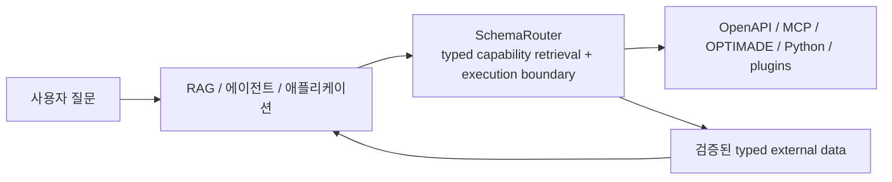

<div class="brand-lockup">
  
  
</div>

<div class="sr-hero" markdown>

<span class="sr-kicker">SchemaRouter 0.13.0</span>

# 에이전트와 도구 사이에 타입 기반 실행 경계를 두세요

SchemaRouter는 MCP, OpenAPI, Python, 프레임워크 도구를 아우르는 **LLM/RAG 에이전트용 typed
capability retrieval 및 schema-aware execution 계층**입니다.

도구가 늘어날수록 에이전트가 모든 스키마를 한 번에 보게 하는 방식은 비효율적이고 위험해집니다.
SchemaRouter는 먼저 **필요한 데이터 필드**를 식별하고, 그 필드를 제공할 수 있는 등록된 capability만
제한된 범위로 노출한 뒤, 실행 직전에 스키마·정책·바인딩을 다시 검증합니다.

```bash
pip install schemarouter
```

[빠른 시작](getting-started/quickstart.md){ .md-button .md-button--primary }
[예제와 데모](getting-started/examples.md){ .md-button }
[신뢰성·릴리스 근거 확인](project/trust-and-evidence.md){ .md-button }
[GitHub](https://github.com/JDeun/SchemaRouter){ .md-button }

</div>

<div class="grid cards" markdown>

-   **최소화**

    요청에 필요한 semantic field를 먼저 정하고, 가능한 경우 upstream에서도 해당 필드만 요청한 뒤
    downstream에는 선언된 필드만 전달합니다.

-   **컴파일**

    OpenAPI, MCP, OPTIMADE, Python callable과 승인된 adapter를 공통 Provider / Access path /
    Tool / Endpoint / Parameter / Field 모델로 정규화합니다.

-   **검증**

    미등록 인자, 잘못된 raw output, stale fingerprint, stale binding, 지원되지 않는 스키마 가정을
    fail-closed로 처리합니다.

-   **권한 분리**

    retrieval score나 모델 출력은 실행 권한이 아닙니다. 실제 실행 권한은 로컬 정책과 등록된
    계약이 갖습니다.

</div>

## SchemaRouter가 필요한 이유

전통적인 tool router는 보통 `Query -> Tool`을 고릅니다. SchemaRouter는 더 세분화된 경계를
다룹니다.

```text
사용자 질문
  -> 필요한 semantic data
  -> 필요한 output field
  -> provider / access path
  -> tool / endpoint
  -> parameter
  -> schema + fingerprint
  -> policy / availability
  -> validated execution
```

즉, **도구를 하나 고르는 문제**뿐 아니라 **어떤 데이터를 어떤 계약으로 가져올지**까지 다룹니다.

## RAG/에이전트에서의 위치



SchemaRouter는 범용 agent framework, LLM provider gateway, 메모리 시스템, 최종 답변 생성기가
아닙니다. LangChain/LangGraph/LlamaIndex 같은 상위 계층과 함께 사용할 수 있습니다.

## 현재 안정판과 연구

현재 안정판은 **0.13.0 (Beta / pre-1.0)** 입니다. Python 3.10–3.14가 release-blocking CI
대상이며 Python 3.15는 preview로 확인합니다.

0.14 연구는 stable product contract와 분리되어 진행됩니다. 연구 결과가 좋아도 자동으로 제품
기본값이 바뀌지 않습니다.

[설치하기 →](getting-started/installation.md) ·
[SchemaRouter의 역할 →](concepts/schema-router.md) ·
[Field-first execution →](concepts/field-first-execution.md)
