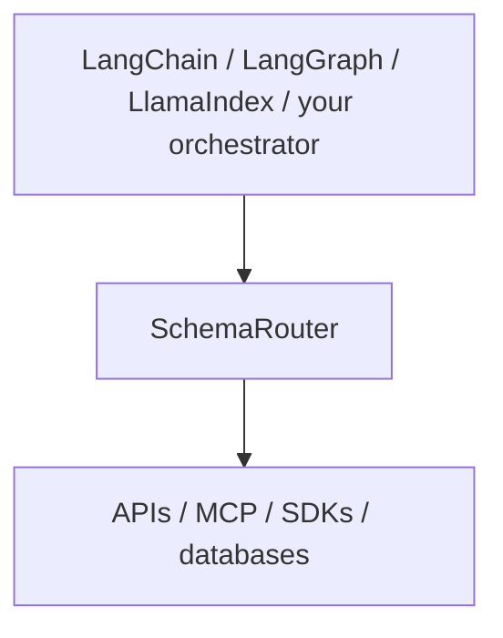

<div class="brand-lockup">
  
  
</div>

<div class="sr-hero" markdown>

<span class="sr-kicker">SchemaRouter 0.17.0</span>

# 에이전트와 도구 사이에 타입 기반 실행 경계를 두세요

SchemaRouter는 API·도구·데이터 시스템 전반에서 AI 에이전트를 위한 **타입 기반 기능 라우팅(typed capability routing) 및 정책 통제형 실행(governed execution) 계층**입니다.

에이전트에 연결하는 도구가 늘어나면 실행 경로를 통제하기 어려워지고, 각 도구가 요청에 필요한 양보다 훨씬 많은 데이터를 반환할 수 있습니다. SchemaRouter는 먼저 필요한 **선언된 데이터 필드**를 판별하고, 해당 필드를 제공할 수 있도록 등록된 도구만 제한된 범위에서 노출합니다. 그 결과를 모델에 전달하기 전에도 선언된 필드만 유지합니다.

```bash
pip install schemarouter
```

[시작하기](getting-started/installation.md){ .md-button .md-button--primary }
[예제 모음](getting-started/examples.md){ .md-button }
[신뢰성 및 릴리스 근거 검증](project/trust-and-evidence.md){ .md-button }
[MCP 응답 계약 선언](guides/mcp.md#declare-a-result-contract-the-server-does-not-publish){ .md-button }
[GitHub](https://github.com/JDeun/SchemaRouter){ .md-button }

</div>

<div class="grid cards" markdown>

-   **최소화(Minimize)**

    먼저 의미적 데이터 요구사항을 해석합니다. 엔드포인트가 서버 측 필드 투영을 명시적으로 지원한다면 계획된 필드만 요청하고, 반환 데이터에서도 해당 필드만 남깁니다.

-   **컴파일(Compile)**

    OpenAPI, MCP, OPTIMADE, Python callable 또는 승인된 문서에서 얻은 계약을 하나의 타입 기반 Provider / Access path / Tool / Endpoint / Parameter / Field 모델로 통합합니다.

-   **검증(Validate)**

    선언되지 않은 인자, 유효하지 않은 원시 응답, 오래된 스키마 지문(fingerprint), 오래된 바인딩, 근거가 없는 스키마 가정을 거부합니다.

-   **정책 집행(Enforce)**

    변경 작업 권한, 자격 증명, 재시도, 예산, 승인, 실행 훅을 신뢰할 수 있는 로컬 경계 안에서만 관리합니다.

</div>

## 적용 위치



SchemaRouter는 에이전트나 RAG 파이프라인을 대체하지 않으며 최종 답변을 생성하지도 않습니다. 구조화된 API·도구·SDK·등록된 데이터 시스템에 걸쳐 타입 기반 기능 라우팅과 정책 통제형 실행 경계를 제공합니다.

SchemaRouter의 레지스트리는 논리적인 기능 그래프이자 인덱스이며, 실제 **실행 권한의 기준은 등록된 스키마**입니다.

[RAG에서의 위치와 기능 모델 자세히 보기 →](concepts/capability-catalog.md)

SchemaRouter의 역할은 에이전트 프레임워크보다 좁습니다. 오케스트레이터가 대화, 그래프, 모델 호출 전략, 메모리, 체크포인트, 에이전트 반복 실행을 책임지는 반면 SchemaRouter는 **도구 스키마를 기준으로 한 실행 경계**를 담당합니다.

Laya, Ollama, Jev 등의 선택적 의사결정 백엔드는 **범위가 제한된 선택 단계 내부**에서만 동작합니다. 이들은 로컬 스키마 카탈로그에서 미리 추출된 유한한 후보 ID만 받습니다. 오케스트레이터가 되거나 실행 가능한 기능을 임의로 만들어 내거나 실행 권한을 부여할 수 없습니다.

이미 GPT, Gemini, Claude 또는 다른 호스팅 모델을 사용하는 애플리케이션은 기존 클라이언트를 SchemaRouter의 공급자 중립적인 분석기 또는 의사결정 백엔드 callable 계약에 주입할 수 있습니다. 별도의 로컬 모델 스택은 필요하지 않습니다.

## 실제 사용 시나리오


하나의 요청에 서로 다른 공급자가 제공하는 의미적 필드의 합집합이 필요할 수 있습니다. SchemaRouter는 필드 집합을 먼저 확정하고, 명시된 `max_calls` 범위 내에서 상호 보완적인 검증된 경로를 선택합니다. 예를 들어 Materials Project에서 `band_gap`을, arXiv에서 `abstract`를 가져오는 방식입니다.

[필드 우선 실행 모델 →](concepts/field-first-execution.md) ·
[설계 원칙 →](concepts/design-principles.md)

## 5분 안에 시작하기

첫 사용자 예제는 인증이 필요 없는 공개 APIs.guru OpenAPI 문서를 사용합니다. 고정된 로컬 데모 값이 아니라 실제 공급자로부터 결과를 얻는 것이 핵심입니다.

```python
import asyncio

from schemarouter import PlanRequest, SchemaRouter


async def main():
    router = await SchemaRouter.from_url(
        "https://api.apis.guru/v2/openapi.yaml",
        kind="openapi",
    )
    async with router:
        tool = next(
            tool
            for tool in router.registry.tools()
            if any(endpoint.name == "getMetrics" for endpoint in tool.endpoints)
        )
        plan = router.plan(
            PlanRequest(
                query="API directory metrics total number of APIs",
                preferred_tools=[tool.key],
                max_calls=1,
            )
        )
        result = (await router.execute(plan))[0]
        print(result.tool, result.endpoint, result.data["numAPIs"])


asyncio.run(main())
```

필수 CI는 오프라인에서도 결정론적으로 검증합니다. 실제 공급자 호출은 첫 사용 경험과 호환성 검증을 위한 것이며, 외부 서비스 장애 때문에 릴리스가 차단되도록 만들지 않습니다.

[실제 공급자를 사용하는 빠른 시작 가이드 →](getting-started/quickstart.md)

## 기능 제공원 연결하기

<div class="grid cards" markdown>

-   **공급자 식별자(Provider identity)**

    사용하려는 서비스는 알지만 그 서비스가 공개하는 프로토콜이나 SDK를 모두 알지는 못할 때 적합합니다.

    `await router.add_provider("materials-project")`

    [Provider 이름으로 등록하기 →](guides/provider-first-registration.md)

-   **Python**

    기능이 로컬에 있고 타입을 선언할 수 있을 때 적합합니다.

    [Python 도구 →](guides/python-tools.md)

-   **OpenAPI**

    HTTP API가 기계가 읽을 수 있는 계약을 이미 제공할 때 적합합니다.

    [OpenAPI →](guides/openapi.md)

-   **MCP**

    도구가 이미 MCP를 통해 노출되어 있을 때 적합합니다.

    [MCP →](guides/mcp.md)

-   **OPTIMADE**

    OPTIMADE를 제공하는 재료 데이터 공급자에 적합합니다.

    [OPTIMADE →](guides/optimade.md)

</div>

사람이 읽는 API 문서는 별도의 **검사 → 계약 제안 → 명시적 승인** 절차를 거칩니다. 문서를 읽었다는 이유만으로 자동으로 실행 가능한 도구가 되지는 않습니다.

[문서에서 도구 계약 생성하기 →](guides/html-documentation.md)

## 핵심 런타임 보장 사항

- 알려지지 않은 도구, 엔드포인트, 파라미터, 필드는 실행 가능한 대상으로 취급하지 않습니다.
- 입력값과 원시 출력값을 JSON Schema로 검증합니다.
- 오래된 스키마 지문이나 invoker 바인딩이 발견되면 안전하게 실행을 거부합니다.
- 원격 메타데이터와 모델 출력은 변경 작업 또는 파괴적 작업에 대한 권한을 부여할 수 없습니다.
- 자격 증명은 모델이 볼 수 있는 planner 인자 밖에 둡니다.
- 재시도, 실제 경과 시간, 원격 호출 수, 응답 크기, 선택적 비용 단위를 제한할 수 있습니다.
- 지원하지 않는 OpenAPI 호환성 차이는 임의로 추측하지 않고 보고합니다.
- 명시적으로 활성화하지 않는 한 이벤트 페이로드의 민감한 값은 가립니다.
- 일시적인 접근 실패에는 영구 블랙리스트 대신 유한한 쿨다운과 선택적 신뢰 기반 상태 프로브를 사용합니다.
- 공급자 또는 접근 경로의 대체(fallback)가 쿼리에서 컴파일된 논리적 필드 요구사항을 확대하지 못하도록 합니다.

## 현재 릴리스

**0.17.0**은 현재 안정적인 Beta / pre-1.0 릴리스입니다. Python 3.10–3.14는 릴리스 차단 검증 대상이며 Python 3.15는 미리보기 대상입니다.

0.17은 provider-first 라우팅, 정책 통제형 실행, 기업용 권한 관리, 관계형·벡터·그래프·문서 데이터 시스템의 스키마 자동 파악을 통한 등록, 강화된 런타임 격리, 외부 검증 인프라를 통합합니다. 자격 증명, 데이터 시스템 고유 권한, 원시 쿼리 권한은 모델에 노출되는 경계 밖에 유지합니다.

[0.17.0 릴리스 노트 →](releases/0.17.0.md) ·
[기업용 데이터 등록 →](guides/enterprise-data-onboarding.md) ·
[연구 현황 →](research/routing-status.md)

## 자세히 알아보기

<div class="grid cards" markdown>

-   **실행 모델**

    도구, 엔드포인트, 스키마 식별성, 계획, 정책을 설명합니다.

    [핵심 개념 →](concepts/schema-router.md) · [설계 원칙 →](concepts/design-principles.md)

-   **런타임 제어**

    재시도, 실행 정책, 승인, 훅, 이벤트, 추적, 운영 상태 검사를 설명합니다.

    [레지스트리와 실행 검사 →](guides/inspection.md)

-   **프레임워크 및 의사결정 백엔드**

    LangChain/LangGraph/LlamaIndex는 SchemaRouter 상위에서 통합됩니다. Laya/Ollama/Jev는 내부에서 제한된 범위의 의사결정 공급자로 작동하며, OpenTelemetry는 텔레메트리를 내보냅니다.

    [의사결정 백엔드 →](concepts/decision-backends.md)

-   **아키텍처**

    성숙도, 호환성 정책, 보안 경계, API 레퍼런스를 다룹니다.

    [아키텍처 →](architecture.md)

-   **신뢰성 및 근거**

    릴리스 해시, SBOM/attestation 경로, CI·보안 통제, 강화 이력, 연구 주장의 적용 범위를 다룹니다.

    [공개 검증 근거 확인 →](project/trust-and-evidence.md)

</div>
