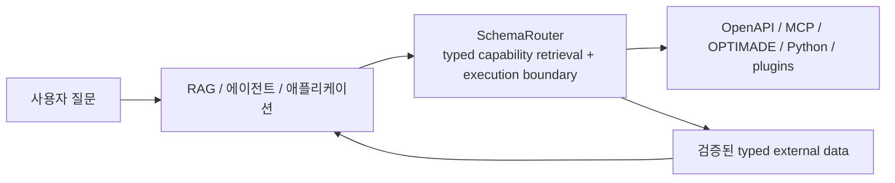

<div class="brand-lockup">
  
  
</div>

<div class="sr-hero" markdown>

<span class="sr-kicker">SchemaRouter 0.14.0</span>

# 에이전트와 도구 사이에 타입 기반 실행 경계를 두세요

SchemaRouter는 MCP, OpenAPI, Python, 프레임워크 도구를 하나의 **타입 기반 검색·실행 경계**로
묶어 주는 라이브러리입니다.

도구가 많아질수록 모든 스키마를 한꺼번에 모델에 넘기는 방식은 비용도 크고 통제하기도 어렵습니다.
SchemaRouter는 질문에 필요한 **데이터 필드**를 먼저 찾고, 그 필드를 제공할 수 있는 등록된
capability만 좁혀서 보여 줍니다. 실제 호출 직전에는 스키마, 정책, 바인딩을 다시 확인합니다.

```bash
pip install schemarouter
```

[빠른 시작](getting-started/quickstart.md){ .md-button .md-button--primary }
[예제와 데모](getting-started/examples.md){ .md-button }
[신뢰성·릴리스 근거 확인](project/trust-and-evidence.md){ .md-button }
[GitHub](https://github.com/JDeun/SchemaRouter){ .md-button }

</div>

<div class="grid cards" markdown>

-   **최소화**

    질문에 필요한 의미 단위의 필드를 먼저 정합니다. API가 필드 선택을 지원하면 필요한 값만
    요청하고, 최종 결과에도 선언된 필드만 남깁니다.

-   **컴파일**

    OpenAPI, MCP, OPTIMADE, Python callable과 승인된 adapter를 같은
    Provider / Access path / Tool / Endpoint / Parameter / Field 구조로 정리합니다.

-   **검증**

    등록되지 않은 인자, 스키마와 맞지 않는 응답, 오래된 fingerprint나 binding처럼
    실행 계약을 어기는 상태는 허용하지 않습니다.

-   **권한 분리**

    검색 점수나 모델의 선택만으로는 도구를 실행할 수 없습니다. 실행 권한은 로컬 정책과
    등록된 계약에서만 나옵니다.

</div>

## SchemaRouter가 필요한 이유

일반적인 tool router가 `Query -> Tool` 선택에 집중한다면, SchemaRouter는 그 다음 단계까지
계약으로 다룹니다.

```text
사용자 질문
  -> 필요한 semantic data
  -> 필요한 output field
  -> provider / access path
  -> tool / endpoint
  -> parameter
  -> schema + fingerprint
  -> policy / availability
  -> validated execution
```

핵심은 도구 이름 하나를 고르는 데서 끝나지 않는다는 점입니다. 어떤 필드를 어떤 경로와
계약으로 가져올지까지 실행 계획에 포함합니다.

## RAG/에이전트에서의 위치



SchemaRouter는 범용 agent framework나 LLM gateway가 아니며, 메모리나 최종 답변 생성도
담당하지 않습니다. LangChain, LangGraph, LlamaIndex 같은 상위 계층 아래에 붙여 쓰는 구조입니다.

## 현재 안정판과 연구

현재 안정판은 **0.14.0 (Beta / pre-1.0)** 입니다. Python 3.10–3.14는 릴리스 차단 CI에서
검증하고, Python 3.15는 별도 preview job으로 확인합니다.

진행 중인 연구는 안정판의 제품 계약과 분리되어 있습니다. 실험 결과가 좋아도 검증 절차 없이
제품 기본값으로 들어가지는 않습니다.

[0.14.0 릴리스 노트 →](releases/0.14.0.md)

[설치하기 →](getting-started/installation.md) ·
[SchemaRouter의 역할 →](concepts/schema-router.md) ·
[Field-first execution →](concepts/field-first-execution.md)
