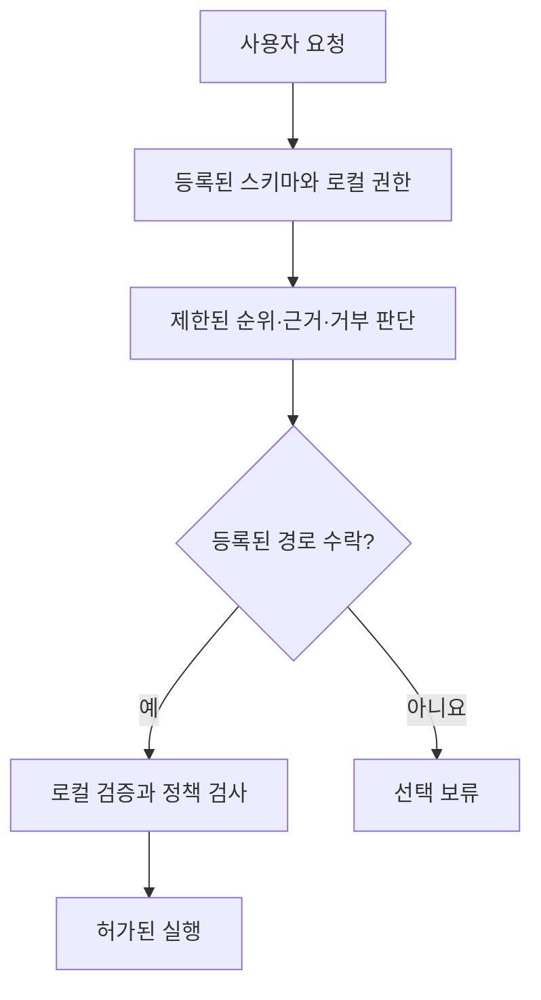

# 연구 근거 패키지

SchemaRouter의 research record는 `benchmarks/research-experiment-ledger.json`에 유지합니다. Ledger가 source of truth이며 paper table은 derived view이므로 독립적인 experimental fact source가 되어서는 안 됩니다.

## 근거 자료 생성

```bash
python scripts/export_research_evidence.py
```

기본 출력 경로는 `docs/research/generated/`입니다:

- `research-evidence-package.json` — target, governance, current conclusion, flattened experiment, invalidated run을 포함한 machine-readable aggregate
- `research-experiments.csv` — 논문 표 작성에 사용할 수 있는 실험·출처·지표 행
- `invalidated-runs.csv` — model-quality evidence로 인용하면 안 되는 invalid/pre-result technical run
- `research-evidence-table.md` — compact human-readable experiment table

생성된 파일은 정식 실험 원장의 대체물이 아닌 빌드 산출물입니다. CI에서 내보내기 스크립트를 실행하여 논문 준비 전에 스키마 변경으로 인한 불일치를 확인합니다.

## 0.14 최종 연구 결과 보고서 준비

[0.14 최종 근거 보고서 템플릿](https://github.com/JDeun/SchemaRouter/blob/main/benchmarks/agent-utility-0.14-terminal-report-prep.md)에는
동결된 출처 정보, 홀드아웃 쌍대 비교의 통계 분석 단위, 최종 답변 품질표,
논문 주장 허용 조건, 무효 실행 분류 및 종료 점검표를 정리했습니다.
아직 검증되지 않은 측정값은 추정하지 않고 **Pending(미확정)**으로 표시합니다.

[0.14 실험 컨베이어](https://github.com/JDeun/SchemaRouter/issues/500)는 동결된 실험 순서와 완료 조건을 추적합니다.
컨트롤러 실행이 성공하더라도 내부 상태가 `waiting_heldout`이면 연구가 완료된 것이 아닙니다.
모든 샤드가 모인 정본 아티팩트를 출처 및 집계 기준으로 검증한 뒤에만
연구 결과로 인정합니다. 일부 샤드, 실행 중인 워크플로 또는 인프라 재시도를
완료된 홀드아웃 결과로 서술해서는 안 됩니다.

## 근거 유형 구분

Exporter는 ledger의 evidence-role distinction을 보존합니다. 특히 tuning DEV, fresh confirmation, calibration, blind-final, design-known stress, compatibility, infrastructure evidence를 role 없이 하나의 accuracy table로 합치면 안 됩니다.

Development pass는 generalization claim이 아닙니다. Fresh-confirmation failure는 consumed negative evidence이며 threshold repair에 사용할 수 없습니다. Exact frozen candidate가 repository freeze protocol 아래 새로운 zero-overlap fresh confirmation을 통과할 때까지 calibration/blind-final은 blocked입니다.

## 출처 검증 요건

Available record가 experiment, source revision, workflow run, artifact/digest, corpus identity/role, frozen configuration, metrics, terminal decision을 식별할 때만 paper-ready입니다. Missing historical field는 missing value로 표시하며 exporter는 provenance를 만들어내지 않습니다.

Invalidated-run table은 contract failure, cancelled pre-result run, leakage incident 등 non-evidence execution이 narrative에서 사라지지 않게 합니다.

## 아키텍처 해석

SchemaRouter는 execution authority와 semantic evidence를 분리합니다.



Semantic model은 preregistered experiment에 따라 finite registered authority 위에서 rank/veto/abstain할 수 있습니다. 새로운 executable tool, endpoint, field, argument, pseudo-route를 만들 수 없습니다.

## 타당성에 대한 위협

Evidence package의 한계:

- benchmark corpus는 synthetic controlled workload이며 production prevalence/user-distribution performance를 단독으로 입증할 수 없음
- multilingual template coverage는 English-only testing보다 넓지만 각 언어 community의 natural traffic과 동일하지 않음
- GitHub-hosted CPU latency는 reproducible infrastructure evidence이지 universal hardware benchmark가 아님
- canonical DEV에서 반복 architecture search는 selection pressure를 높이므로 zero-overlap fresh confirmation과 one-shot calibration/blind evidence를 분리
- registry description/trusted alias는 tested system의 일부이며 실제 integration마다 quality가 다를 수 있음
- provider/model compatibility는 routing quality evidence가 아님
- aggregate metric은 route/language/family collapse를 숨길 수 있으므로 promotable candidate는 slice diagnostic과 authority/error count를 유지해야 함

## 최종 논문을 위한 연구 종료 조건

0.14 연구 주기가 진행되는 동안 패키지를 다시 생성할 수 있지만, 논문의 최종 결과표에 실행 중인 작업이나 인프라 장애로 무효 처리한 실행을 과학적 성능 근거로 포함해서는 안 됩니다. 2026년 10월 10일 기준으로 이미 판정된 게이트와 남은 종료 조건은 다음과 같습니다.

- **#431 판정 완료:** 동결된 교정 검색 조건은 홀드아웃 평가 대상으로 **승격되지 않았습니다**. 이 부정적 게이트 결과를 그대로 보고하며 진행 중인 실험으로 표시하지 않습니다.
- **#432 실행 중:** 독립 과제 780개의 동결된 대규모 홀드아웃 평가는 [실행 `38012340016`](https://github.com/JDeun/SchemaRouter/actions/runs/38012340016)에서 시작됐습니다. 정본 집계와 일반화 결과는 아직 승인되지 않았습니다.
- **#424 대기 중:** #432의 정본 성공과 아티팩트 해시 검증 이후에만 최종 답변의 사실·값·단위·출처 정확도 평가를 시작합니다.
- **#510 부정적 결과로 종료:** 사전 등록한 강한 에이전트 후보 중 근거 기반 출력의 측정 도구로 적격 판정을 받은 모델은 없습니다. 따라서 별도 연구인 #506 출력 필드 투영의 후속 실험은 해당 조건으로 **실행을 승인받지 못했으며**, 투영의 개선 효과나 동등성을 주장할 수 없습니다.

이전 operation-routing lineage의 historical calibration/blind work는 ledger 일부지만 위 frozen 0.14 held-out/final-answer evidence를 대체하지 않습니다. 모든 final table은 consumed/invalid run에서 semantic retuning 없이 canonical ledger와 immutable workflow/artifact provenance로 재구성 가능해야 합니다.
