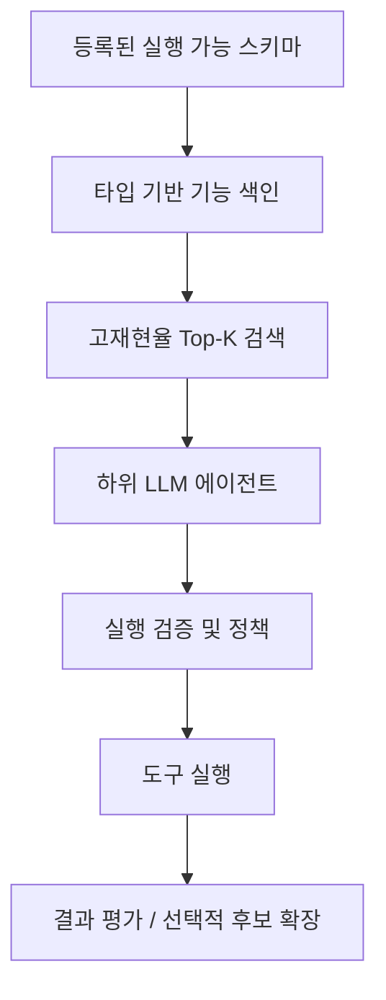

# Open-set capability routing 선행연구 로드맵

이 문서는 `benchmarks/research-prior-art-registry.json`과 GitHub Issue #388의 사람이 읽을 수 있는 companion입니다. 새 연구 세션이 대화 기억에 의존하지 않고 이미 검토한 문헌, 그 문헌이 만든 SchemaRouter 가설, terminal experiment, 다음 실험을 재구성하도록 하는 것이 목적입니다.

## Session bootstrap

새 routing experiment를 만들기 전에:

1. Issue #388을 읽습니다.
2. `benchmarks/research-prior-art-registry.json`을 읽습니다.
3. `benchmarks/research-experiment-ledger.json`을 읽습니다.
4. [Routing research status](routing-status.md)를 읽습니다.
5. 기존 issue와 `research/*` branch를 검색합니다.
6. 중복 experiment를 만들지 말고 첫 active canonical experiment를 이어갑니다.

## 현재 workstream map

| Workstream | Work item | 상태 | 현재 SchemaRouter 사용 |
| --- | ---: | --- | --- |
| Adaptive/open decision boundaries | #384 | terminal | V6A positive-only spherical ADB가 모든 DEV request를 거부 |
| Hard-negative OOS generation | #389 / #395 | terminal | V6B가 synthetic evidence는 분리했지만 모든 natural DEV query를 거부 |
| Energy/density/open-space scoring | #390 / #397 / #399 / #401 | terminal / active successor 없음 | V6C/V6D/V6E terminal; consumed geometry 재튜닝 금지 |
| Selective/conformal abstention | #391 / #412 | terminal tested formulation | E5 conformal safety가 open-set gate는 통과했지만 supported recall 파괴 |
| Tool/executable-schema retrieval / agent utility | #392 / #417 / #418 / #420 | active primary direction | Phase A/B1 및 B2 종료, #431 게이트 판정 완료·미승격, #432 홀드아웃 실행 중, #424 대기 |

진행 중인 연구의 상위 이슈는 #417이며, 과거 0.13 선행연구의 상위 이슈는 #388입니다.

**실행 현황(2026-10-10):** #431 교정 검색의 게이트 판정이 종료됐고 조건은 승격되지 않았습니다. 동결된 #432 홀드아웃 평가는 [워크플로 38012340016](https://github.com/JDeun/SchemaRouter/actions/runs/38012340016)에서 실행 중이나 아직 정식 집계 결과는 없습니다. #424는 계속 게이트로 대기합니다. 과거 원장 상태를 현재 실행 상태로 해석하지 말고 [최신 연구 현황](routing-status.md)과 #500을 참조하세요.

## 0. Active 0.14 연구 질문: agent용 typed capability retrieval

0.11~0.13 open-set 연구는 evidence로 보존하지만 더 이상 primary product objective가 아닙니다. 해당 cycle은 하나의 retrieval layer가 positive route selection과 executor-grade abstention을 동시에 담당하면 심각한 safety/coverage trade-off가 생긴다는 점을 반복해서 보여줬습니다.

Active 0.14 architecture:



현재 관련 작업:

- #417 — active research parent
- #418 — FULL·Top-K·점진적 검색 간 작업 효용성 비교 프로토콜, 종료
- #420 — B1 local downstream-agent A/B, terminal
- #423 — stronger-agent B2 replication, terminal success
- #431 — 실행 상태 인식 교정 검색, 게이트 판정 완료·조건 미승격
- #432 — 독립 과제 780개의 동결된 홀드아웃 평가 실행 중, 결과 대기
- #424 — 최종 답변 사실성 평가 144개 과제, #432 결과를 기다리는 중

Phase A의 corrected frozen benchmark는 Recall@1 68.97%, Recall@3 96.55%, Recall@5/10 **100%/100%**이며 250 endpoints에서 Top-5는 평균 FULL serialized schema context의 2.38%만 노출합니다.

평가 계층은 다음과 같습니다.

1. **Recall@K / required-tool-set coverage** — agent가 필요한 capability를 retrieval이 보존했는가?
2. **downstream deterministic task success** — 동일 agent가 task를 완료하는가?
3. **context/token/latency/cost** — candidate reduction이 운영상 유용한가?
4. **recovery** — hidden ground truth 없이 progressive expansion이 initial miss를 복구하는가?
5. **execution safety** — rank와 무관하게 policy가 unauthorized destructive action을 막는가?
6. **final-answer quality** — context reduction이 factual completeness, unit, provenance를 보존하는가?

Top-1 exact는 diagnostic이며 이 여섯 outcome 전체의 proxy로 취급하지 않습니다. 이 framing을 지지하는 독립 문헌은 ToolRet(Findings ACL 2025), ToolReAGt(KnowLLM 2025), execution-grounded feedback 관점의 GRETEL(arXiv 2025)입니다.

## 1. Adaptive Decision Boundary

Primary reference는 Hanlei Zhang, Hua Xu, Ting-En Lin의 *Deep Open Intent Classification with Adaptive Decision Boundary* (AAAI 2021)입니다.

전이 가능한 아이디어:

- known class를 learned feature region으로 표현
- unknown/open input이 class-specific boundary 밖이면 거부
- labeled open example 없이 decision boundary 학습 가능

SchemaRouter의 차이:

- intent가 fixed human-labeled taxonomy가 아님
- capability가 OpenAPI/MCP/ToolSpec registration에서 동적으로 나타남
- positive evidence는 registration 시 schema에서 compile되어야 함
- route authority는 registry-backed 상태를 유지하며 boundary model이 만들 수 없음

Terminal canonical experiment #384 / branch `research/0.13-schema-adb-baseline` / V6A 결과는 raw BGE supported exact 91.67%, ADB supported exact 0%, near-domain/OOD rejection 100%/100%였습니다. Raw-correct supported winner 209개 전부 veto됐고 DEV query 552개 전부 spherical boundary 밖에 있었습니다. Confirmation은 열지 않았습니다.

Positive-only spherical formulation은 terminal이며 failed DEV evidence로 radius를 rescale하거나 positive view를 다시 써서 수리해서는 안 됩니다. Duplicate/superseded artifact는 machine-readable registry에 기록합니다.

## 2. Hard-negative OOS

주요 참고문헌은 LREC-COLING 2024의 *Generating Hard-Negative Out-of-Scope Data with ChatGPT for Intent Classification*과 *Improved Out-of-Scope Intent Classification with Dual Encoding and Threshold-based Re-Classification*입니다.

핵심은 단순히 synthetic data를 쓰는 것이 아니라, supported class와 vocabulary/domain feature를 공유하면서 unsupported behavior를 요구하는 **near-domain OOS가 어려운 경우**라는 점입니다.

SchemaRouter adaptation:

```text
registered tool capabilities
    retrieve
    update
        ↓
generic capability complement
    delete
    cancel
    refund
    export
    translate
    ...
        ↓
schema-derived resource anchor
        ↓
hard-negative OOS examples
```

Generator는 registry-independent 상태를 유지하며 benchmark route name이나 failed DEV row를 사용해 특수 negative를 만들 수 없습니다.

#389의 concrete experiment #395/V6B는 terminal입니다. Registry-derived same-resource hard negative와 low-rank anisotropic ellipsoid boundary를 결합하고 raw BGE-M3만 positive route authority로 유지했습니다. DEV에서 unsupported rejection은 완벽했지만 모든 natural query가 learned ellipsoid 밖에 있어 supported request를 전부 거부했습니다. Raw BGE supported exact는 97.37%였고 confirmation은 열지 않았습니다. Hard-negative evidence bank는 재사용할 수 있지만 exact ellipsoid formulation은 재사용하지 않습니다.

## 3. Energy, density, open-space scoring

Work item #390은 membership을 semantic `OUTSIDE` class 대신 registered capability space의 scalar/density-like property로 표현할 수 있는지 묻습니다.

비교 family는 energy-style OOD score, prototype/centroid distance, class-conditional density, Gaussian-mixture membership, open-space risk, spherical/ellipsoidal class region을 포함합니다.

Positive route selection과는 분리합니다.

```text
BGE registered-route retrieval
        ↓
raw positive winner
        ↓
open-space membership score
        ├─ inside  -> preserve raw winner
        └─ outside -> NO_ROUTE
```

현재 0.13 sequence:

- **#397/V6C** 공유 가우시안 밀도비: 지원 요청 정확도 93.86%, 근접 도메인 거부율 39.29%, 분포 밖 거부율 56.94%, 잘못된 경로 비율 56.79%, 원래 정답이던 경로의 거부 0건
- **#399/V6D** 성분별 가우시안 혼합 밀도비: 지원 요청 정확도 89.91%, 근접 도메인 거부율 39.68%, 분포 밖 거부율 5.56%, 잘못된 경로 비율 67.90%, 원래 정답이던 경로의 거부 0건, p95 250.49ms
- **#401/V6E** non-parametric local membership: k=3 cosine-neighborhood에서 supported exact 83.33%, near reject 60.71%, OOD 54.17%, false-route 40.74%, p95 176.50ms

V6C는 relative evidence가 supported route를 보존할 수 있지만 class당 Gaussian 하나가 multimodal structure를 무너뜨림을 보였습니다. V6D는 endpoint-level Gaussian mode를 보존해도 synthetic-to-natural membership gap이 해결되지 않음을 보였습니다. V6E는 Gaussian assumption을 제거하고 unsupported recall을 개선했지만 rejection target에 크게 못 미쳤고 supported routing도 손상했습니다. 다음 실험은 consumed DEV에서 또 다른 distance threshold, neighborhood size, Gaussian parameter를 tuning하는 대신 semantic signal/representation 자체를 바꿔야 합니다.

## 4. Selective prediction과 conformal abstention

Work item #391입니다. 추적 reference는 covariate shift 아래 conformal predictive systems와 fine-grained robust conformal inference입니다.

SchemaRouter에서 conformal/selective prediction은 semantic detector 자체가 아니라 **safety layer**입니다. Membership score가 신뢰할 수 있는 precision/recall profile을 가진 뒤에만 시험해야 하며, 약한 detector를 구하기 위해 protected #198 calibration/blind surface를 소비해서는 안 됩니다.

## 5. Tool retrieval과 executable-schema retrieval

Work item #392입니다. 주요 reference는 ToolRet(Findings ACL 2025)과 ToolReAGt(KnowLLM 2025)입니다.

| RAG | SchemaRouter |
| --- | --- |
| PDF / HTML | OpenAPI / MCP / Python Tool |
| parser | source adapter |
| chunk | Tool / Endpoint / Field |
| metadata | schema, datatype, unit, qualifier, read/write/destructive |
| index | registry + capability representation |
| retriever | registered-route retrieval |
| relevant text chunk | executable endpoint |
| generator / agent | downstream application, SchemaRouter 외부 |

이 문헌은 retrieval architecture와 benchmark에 영향을 주지만 task decomposition, ReAct loop, autonomous agent behavior를 SchemaRouter 안으로 옮길 근거는 아닙니다.

## Post-V6E terminal sequence

| Experiment | Role | Supported exact | Near reject | OOD | False-route | p95 | Decision |
| --- | --- | ---: | ---: | ---: | ---: | ---: | --- |
| #404 naturalistic MiniLM probes | veto-only membership | 75.44% | 59.52% | 95.83% | 32.41% | 297.36 ms | terminal |
| #406 Tool-Embed-0.6B | positive selector | 78.07% | — | — | — | 287.42 ms | terminal; same-surface BGE 86.84% |
| #408 mMARCO cross-encoder | veto-only membership | 79.39% | 19.84% | 59.72% | 71.30% | 2992.17 ms | terminal |
| #409 GTE multilingual | positive selector | 71.49% | — | — | — | 100.14 ms | terminal; same-surface BGE 88.16% |
| #412 E5 split conformal | veto-only membership | 10.09% | 99.21% | 100% | 0.62% | 244.24 ms | terminal |

관련 confirmation surface는 모두 열지 않았습니다.

종합 결과:

- BGE-M3가 여전히 가장 강한 tested positive-route reference지만 fresh supported exact는 surface-sensitive
- tool-specialized/general multilingual retriever로 교체해도 generalize하지 않음
- naturalistic generic-operation learning은 broad OOD recognition을 개선하지만 same-domain capability membership을 확립하지 못함
- joint relevance cross-encoding은 counterfactual capability document를 신뢰할 수 있는 open-set boundary로 만들지 못하며 CPU에서 너무 느림
- conservative conformal calibration은 <=1% false-route target을 만족할 수 있지만 supported/unsupported request의 scalar membership score가 크게 겹치면 supported recall을 유지할 수 없음

현재 active frozen 0.13 child experiment는 없습니다. 다음 실험은 materially new membership representation/decision structure여야 하며 V6A-E geometry, #404 training bank/probe, #408 candidate text/threshold, #409 GTE weight/fusion, #412 alpha/E0/model의 post-hoc 변경이어서는 안 됩니다.

## Research invariant

- registered schema-backed endpoint만 positive execution authority를 가짐
- open-set evidence는 route를 보존하거나 abstain할 수 있을 뿐 route를 만들 수 없음
- rank-2 fallback/pseudo-route 금지
- 새 API 등록마다 per-route retraining 금지
- datatype, `semantic_id`, optional unit, normalization, dimension, qualifier는 first-class capability/data-contract fact
- failed experiment는 method가 실질적으로 바뀐 새 experiment가 아니면 terminal 유지
- consumed DEV/fresh/confirmation row를 terminal method patch에 사용 금지
- 새 experiment는 어떤 prior-art work item을 구현하는지 명시

## Execution order

현재 순서는 #417/#500이 통제합니다.

1. B1/B2 terminal evidence 보존
2. frozen task/state/model/scoring semantics를 바꾸지 않고 #431 완료
3. preregistered boolean gate에서 #432 held-out condition manifest 동결
4. gated conveyor를 통해 #432 실행 후 #424 실행

이전 pre-terminal 0.14 launch plan은 이 gated conveyor로 대체됐습니다. Historical run/protocol provenance는 Git history, experiment ledger, terminal issue comment에 남습니다.

#392는 executable-schema retrieval과 active 0.14 agent-utility work 사이 prior-art bridge로 유지합니다. Open-set/conformal method는 consumed DEV의 post-hoc repair가 아니라 새로 preregistered question에 대해서만 다시 검토합니다.

Historical 0.13 order는 V6A, V6B, V6C/V6D, V6E, #404/#406/#408/#409/#412를 terminal reference로 유지하고 모든 confirmation을 unopened로 두며, successor 전 prior art/repository history에서 materially different representation을 찾고, 더 discriminative한 semantic membership score가 생긴 뒤에만 #391 selective/conformal safety를 재검토하는 순서였습니다.

## 0.14 fixed-K baseline 이후 staged successor

B1 aggregate 이전에 staging되며 B1 row-level failure에서 파생되어서는 안 됩니다.

- **#428** public typed Top-K API — final agent choice/execution authority를 retriever 밖에 둔 first-class retrieval surface
- **#430** adaptive shortlist depth — fixed K=3/5/10 evidence 이후 preregistered per-query K 시험
- **#431** execution-state-aware corrective re-retrieval — bounded typed observation/current state 기반 retrieval과 static widening 비교
- **#432** large independent held-out surface — B1이 23 unique semantic task만 catalog size별 반복하므로 필수

### B1 aggregate 전 statistical scope correction

B1의 semantic task당 네 catalog-size row는 독립 sample이 아니라 repeated measure입니다. Canonical paired bootstrap은 **task_id cluster**를 resample하며 네 catalog-size delta를 함께 유지합니다. -2pp gate는 B1에서 descriptive engineering threshold입니다. Population-level non-inferiority/generalization claim은 독립 동결된 훨씬 큰 population과 preregistered precision/sample-size analysis를 갖는 #432가 필요합니다.

### B1 v2 canonical execution status

Accepted B1 path는 v2입니다.

- frozen task SHA: `bc0b78ff2be11b89e6ac54ea0ee336f944f04b3c203fc61da70a46ff48b4e03c`
- canonical workflow: `36529108855`
- canonical source: `b9eadefd3cd076f026a54bbc55a949f0424f5dab`
- 실행 환경: Python 3.12.14, torch 2.14.0+cpu, transformers 4.57.6, tokenizers 0.22.2, safetensors 0.8.0
- 30 frozen inference job이 정확히 552 unique episode로 aggregate

Accepted aggregate 전 B1 v2는 hidden user-argument requirement를 수정하고 tool-observation causality barrier를 강제했습니다. Assistant turn당 tool call 하나만 실행하며 dependent call은 이전 observation이 필요합니다.

v2 preflight는 Phase A를 재실행해 Recall@3 96.55%, Recall@5/10 100%, 250 endpoints에서 mean Top-5 schema context **FULL의 2.383%**를 유지했습니다.

Paired uncertainty는 동일 23 task의 catalog size가 repeated measure이므로 task-cluster bootstrap을 사용합니다. 이는 pseudoreplication을 막지만 B1을 population-level non-inferiority study로 만들지는 않습니다. 그 주장은 #432가 담당합니다.

## Evidence-to-Action / SafeActBench

Issue #1203과 PR #1204는 Lin et al., *From Evidence to Action: How Tool-Using Agents Fail* (arXiv:2610.07753)에서 동기를 얻은 별도의 execution-boundary research track입니다. SafeActBench는 provenance-bound Evidence Ledger와 deterministic trajectory evaluator를 사용해 6개 operational domain, 5개 protocol의 656 case를 평가합니다.

SchemaRouter의 현재 8-case corpus는 deterministic contract regression일 뿐 SafeActBench reproduction으로 계산하지 않습니다. [Evidence-to-Action boundary](evidence-to-action.md)를 참고하십시오.

다음 과학적으로 의미 있는 단계는 published benchmark/evaluator에 대한 external evaluation입니다. Multi-action dependency evaluation을 이유로 SchemaRouter core에 general DAG orchestration을 추가해서는 안 됩니다.
