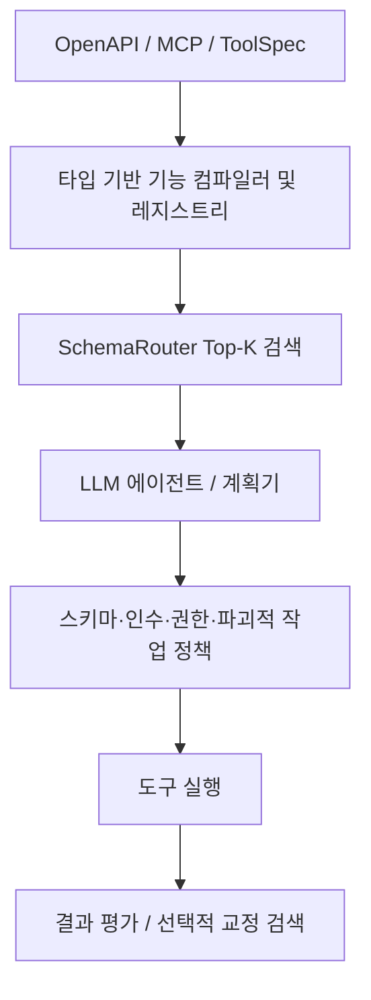
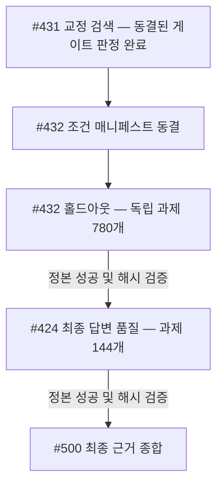

# Research 상태

이 페이지는 전체 experiment log가 아니라 **현재 상태 요약**입니다. Product capability와 research evidence는 의도적으로 분리합니다. Stable runtime feature는 다른 문서에서 설명하고, 이 페이지는 empirical claim과 evidence boundary를 추적합니다.

전체 research 기록:

- [전체 실험 색인](experiment-index.md) — 기계가 읽을 수 있는 실험 기록 92건;
- [설계 및 실험 이력](design-and-experiment-history.md) — 아키텍처의 변화와 의사결정 연혁;
- [0.11 최종 보고서](operation-routing-v4-terminal-report.md) — 종료된 연구 주기의 결론;
- [선행연구 로드맵](prior-art-roadmap.md) — 세션 간 문헌·작업 항목 대응 관계와 실험 순서 통제;
- [기계 판독형 선행연구 레지스트리](https://github.com/JDeun/SchemaRouter/blob/main/benchmarks/research-prior-art-registry.json) — 세션 초기화 및 정식 작업 흐름의 상태;
- [기계 판독형 실험 원장](https://github.com/JDeun/SchemaRouter/blob/main/benchmarks/research-experiment-ledger.json) — 정확한 출처 추적 색인.

SchemaRouter는 라우팅 연구 근거를 안정적인 라이브러리 계약과 구분해 공개합니다.

**실행 현황(2026-10-10):** 동결된 #431 교정 검색 게이트는 승격 없이 종료 판정됐습니다. [홀드아웃 실행 38012340016](https://github.com/JDeun/SchemaRouter/actions/runs/38012340016)은 234개 평가 샤드의 실행 단계에 들어갔습니다. 정식 결과와 후속 #424 답변 품질 결과는 아직 **미확정**입니다. 컨베이어 실행이 성공했다는 것은 오케스트레이션이 정상 동작했다는 의미이지 홀드아웃 평가가 완료됐다는 뜻은 아닙니다.

## 진행 중인 연구: 0.14 에이전트 작업 효용성

현재 research question은 더 이상 SchemaRouter가 final authoritative open-set classifier 역할을 할 수 있는가가 아닙니다.

현재 연구 질문은 다음과 같습니다:

> **SchemaRouter가 대규모 registered catalog에서 compact typed executable capability set을 retrieve함으로써 LLM agent의 end-to-end tool-use performance를 개선하는가?**

현재 의도한 product boundary는 다음과 같습니다:

SchemaRouter는 여전히 레지스트리에 등록된 기능 식별자와 타입이 지정된 메타데이터를 관리합니다.
하지만 검색 점수가 높다는 사실만으로 되돌릴 수 없는 실행 권한이 부여되지는 **않습니다**.
Top-1 경로의 정확한 일치는 유용한 진단 지표이지만 제품의 유일한 목표는 아닙니다.

### #418 Phase A — passed

수정 후 동결된 벤치마크는 엔드포인트 카탈로그 크기 20 / 50 / 100 / 250에 걸친 과제 23개로 구성됩니다.

| Metric | Result |
| --- | ---: |
| Required-route Recall@1 | 65.52–68.97% by catalog |
| Recall@3 | 96.55% |
| Recall@5 | 100% |
| Recall@10 | 100% |
| All-required task coverage@5 | 100% |
| MRR | 0.80172–0.81897 by catalog |

FULL 대비 Top-5 직렬화 스키마 컨텍스트의 평균 비율:

| Catalog | Top-5 / FULL |
| --- | ---: |
| 20 endpoints | 26.69% |
| 50 endpoints | 11.44% |
| 100 endpoints | 5.872% |
| 250 endpoints | 2.383% |

이 결과는 연구 목표를 변경한 핵심 이유입니다. Top-1 정확도만으로 평가하면 여러 도구를 사용하는 과제의 검색 성능이 과도하게 낮아 보입니다. 반면 제한된 Top-K 집합은 이 동결된 과제 집합에서 필요한 기능을 모두 유지하면서 카탈로그가 커질수록 스키마 컨텍스트를 크게 줄였습니다.

B1-v2 정식 동결 식별 정보:
- 작업 SHA256: `bc0b78ff2be11b89e6ac54ea0ee336f944f04b3c203fc61da70a46ff48b4e03c`;
- 카탈로그 SHA256 값은 수정된 카탈로그 동결본에서 변경되지 않음;
- v2 사전 검증과 정확한 버전 고정 스모크 테스트는 정식 워크플로 `36529108855`에 포함됨.

### #420 Phase B1 — terminal

정본 B1 워크플로 `36529108855`는 동결된 마이크로 샤드 **30개**와 고유한 `(catalog_size, task_id, condition)` 에피소드 **552개**를 모두 완료했습니다.

| Condition | Task pass | Mean tool-schema tokens | Schema tokens vs FULL |
| --- | ---: | ---: | ---: |
| FULL | 68.48% | 24,269.6 | 100.00% |
| SR-3 | 82.61% | 800.6 | 3.30% |
| **SR-5** | 91.30% | 1,315.9 | **5.42%** |
| SR-10 | 81.52% | 2,476.8 | 10.21% |
| SR-PROGRESSIVE | 82.61% | 2,986.9 | 12.31% |
| ORACLE | 86.96% | 441.3 | 1.82% |

이 통제된 표면에서 SR-5는 필요한 경로의 검색 재현율을 **100%** 보존했고, FULL 대비 과제 통과율은 **+22.83pp** 높았으며, 무단 파괴적 실행은 **0건**이었습니다. 과제별 클러스터 부트스트랩으로 측정한 SR-5 − FULL 차이의 신뢰구간은 **+9.78pp ~ +36.96pp**였습니다. 이는 메커니즘과 정상 동작을 확인하는 근거이며, 모집단 수준의 비열등성 증명은 아닙니다.

### #423 Phase B2 — terminal success

더 강력한 SmolLM3-3B 모델을 이용한 재현 실험은 동결된 23개 과제, 카탈로그 크기 4종, 조건 5종, 에피소드 460개의 프로토콜을 사용해 정식 실행 `36642658406`에서 성공적으로 종료됐습니다.

Canonical provenance:

- 소스 커밋 `01edb00fe7e8bff803988ce6bce5e05f79801e43`;
- 모델 리비전 `a07cc9a04f16550a088caea529712d1d335b0ac1`;
- ARM64 + PyTorch SDPA;
- 정식 산출물 다이제스트
  `sha256:edbccbbfb44d58ba936af7af82efe844177edc24dd587e3c52cff1505c37c256`.

이전 중복 실행 `36641753066`은 정본이 아니며, 해당 실행의 부분 결과는 최종 분석에서 제외합니다.

### Structural shortlist-depth result — K3 not promoted

A separately preregistered strong-agent K3-vs-K5 gate completed in run `36670280971`:

- STRUCT-FIXED-3 작업 통과율: 82.61%;
- STRUCT-FIXED-5 작업 통과율: 85.87%;
- 대응 쌍 K3-K5 차이: -3.26%p;
- 사전등록된 하한: -2%p;
- 부트스트랩 95% 구간: **[-13.04%p, +3.26%p]**;
- K3는 도구 스키마 토큰 사용량이 더 적었음;
- 실행 정책의 무결성 검증을 통과했으며 승인되지 않은 파괴적 실행은 0건이었음.

The task-pass gate failed, so K3 is **not** promoted into #432. No K/weight/threshold retuning is
permitted from those evaluated rows.

## External validation 상태

External comparison은 maintainer-owned product validation과 분리해 추적합니다. Development fixtures and protocol preparation are **not external evidence**.

| Track | Current state | Evidence boundary |
| --- | --- | --- |
| SmartMCP (#1114) | native development fixture/smoke prepared; maintainer protocol confirmation pending | held-out freeze waits for upstream agreement |
| Clear Your Tools (#839) | v2.17.6 native BM25 development smoke being integrated | visible development fixture only; no held-out claim |
| Jev (#796) | frozen 82-tool / 16-query package delivered upstream | waiting for upstream execution/review; no post-freeze tuning |
| HYSET (#795) | public-code fresh-retraining protocol prepared | must be labeled independently retrained HYSET; no paper-checkpoint reproduction claim |

The canonical freeze rules live in [External validation freeze](external-validation-freeze.md). Negative or null external results remain publishable evidence and must not be repaired from held-out rows.

### Active conveyor

남은 0.14 주요 연구는 사람이 임의로 예약하는 방식이 아니라 앞 단계의 종료 게이트를 통과한 뒤 진행하는 컨베이어입니다.

#431의 정식 교정·복구 근거는 컨베이어에서 확인됐으며, 상태 인식 교정 조건과 구조적 K3 조건은 **승격되지 않았습니다**. #432는 동결된 홀드아웃 평가를 실행 중입니다. #424는 #432의 정식 성공 이후에만 시작해야 합니다. 컨베이어를 우회해 직접 실행하면 안 됩니다. 홀드아웃 통과율·신뢰구간·최종 답변 품질에 대해서는 아직 결과를 주장할 수 없습니다.

출력 필드 투영에 관한 별도 연구(#506/#510)는 독립된 필드 수준 문제입니다. 런타임 적격성 검사는 계측 근거이며 기능 검색 성과 주장과 섞어서는 안 됩니다.

0.14 연구의 승격 기준:

- 현재 후보 예산에서 필요한 도구 집합 Recall이 **97% 이상**
- 과제 통과율이 FULL보다 **2 percentage points** 넘게 낮지 않을 것
- 도구 스키마 토큰은 FULL의 **40% 이하**
- 전체 입력 토큰은 FULL보다 적을 것
- 무단 파괴적 실행은 **0건**

이 문서는 개발 집합의 성공을 운영환경 검증으로 주장하지 않습니다. 새로운 확인 코퍼스를 한 번 소비하면 튜닝에 재사용하지 않습니다.

## Historical 0.11–0.13 operation-routing target

The current research target for the multilingual open-set operation-routing work is:

| Metric | Target |
| --- | ---: |
| Supported exact route | >= 85% |
| Near-domain unsupported rejection | >= 97% |
| Ordinary OOD rejection | 100% |
| False-route rate | <= 1% |
| Authority / execution errors | 0 |
| Executable p95 | <= 250 ms |

The canonical v4 development corpus contains 1,800 cases. Its SHA-256 is
`fc085c58ed7c667d71024e60cf9e213e66da8f7b43f6e79551ed810a9e328216`.

## 실제로 입증된 내용

종료된 0.11 architecture-search cycle(#324/#325)에서 가장 강한 executable development candidate의 결과는 다음과 같습니다:

| Evidence | Exact | Near reject | OOD | False-route | p95 |
| --- | ---: | ---: | ---: | ---: | ---: |
| Canonical DEV | 85.07% | 99.31% | 100% | 0.62% | 176.94 ms |
| Frozen zero-overlap fresh confirmation | 84.81% | 90.45% | 100% | 8.49% | 278.37 ms |

두 번째 row가 결정적입니다. 변경하지 않은 candidate가 independent request-surface shift에 실패했으므로 **promote하지 않았습니다**. Calibration과 blind-final evidence는 소비하지 않았습니다.

So the closed cycle does **not** claim that SchemaRouter has validated the 85/97/100/1 +
250 ms production target under independent surface shift.

## Experiment가 시사하는 점

The frozen BGE-M3 registered-route ranker reaches about **88.45% raw top-1** on canonical DEV. Late
experiments suggest that closed-set ranking is no longer the main blocker.

더 어려운 문제는 open-set **capability membership**입니다:

> Request가 registered domain과 주제상 가깝더라도 실제로는 어떤 registered endpoint도 지원하지 않는 operation을 요구할 수 있습니다.

임베딩 유사도, 경로 간 점수 차이, 범용 NLI, 학습된 DEV 기하학적 특성,
재순위화 모델, 여러 Jev/System-One 모델 경로, ColBERT 근거, 레지스트리 별칭
외피 및 모델 합의 방식 모두 독립적으로 정의된 전체 목표를 입증하기에는 부족했습니다.

## Conservative reference

The #259 BGE-M3 reference profile remains useful for safety-oriented comparison:

- supported exact: 83.77%;
- near-domain unsupported rejection: 98.96%;
- false-route: 0.93%;
- planner p95: approximately 134.95 ms.

Supported exact routing이 85% 미만이므로 production-target pass는 아닙니다.

## 최초 registry-compiled capability prototype

Experiment #338 tested a provider-neutral registry-compiled capability verifier after the closed
architecture-search cycle.

인프라 측면의 목표는 달성했습니다. 동일한 컴파일러가 네이티브 `ToolSpec`, OpenAPI 및
MCP 등록을 처리했고, 타입이 지정된 필드·단위 메타데이터를 보존했으며,
원래 BGE의 경로 선택 권한을 변경하지 않았습니다. 권한 부여나 실행 오류도 추가하지 않았습니다.

The learned synthetic veto, however, was far too conservative:

| Surface | Exact | Near reject | OOD | False-route | Correct raw-winner retention | p95 |
| --- | ---: | ---: | ---: | ---: | ---: | ---: |
| Canonical DEV (1,800) | 5.03% | 100% | 100% | 0% | 5.69% | 196.93 ms |
| Registration holdout (228) | 2.08% | 100% | 100% | 0% | 2.46% | 192.85 ms |

The registration holdout contained previously unseen native/OpenAPI/MCP tool identities, opaque
endpoint names, empty operation aliases and variable endpoint counts.

This candidate is **terminally rejected** under its preregistered stopping rule. It may not
be repaired using canonical/holdout labels.

유용한 결과는 promoted quality method가 아니라 architecture 측면에 있습니다. Provider-neutral typed capability/data-contract compilation은 SchemaRouter의 product model과 계속 정렬되지만, 이 synthetic learned veto는 그렇지 않습니다.

Run: `36393153612`  
Source: `ef75100abc1bb03a80ef2d7cfbd9d463accfb623`  
Artifact: `10957952613`  
Digest: `sha256:2a24d50c563ee872fdad8d498e30ab7a55e6c82e0650bf27ac4bfbadc4fc4269`

## 0.12 query-first typed-frame screen

0.12의 첫 후속 실험(#347)은 엔드포인트 유사도 임계값을 더하는 대신 표현 방식을 바꿨습니다. 레지스트리와 독립적인 명시적 요청 프레임을 파싱하고, 동결한 BGE-M3로 도구·도메인만 고정한 다음 신뢰된 타입 계약과 모순되는 엔드포인트를 제거했습니다. 마지막에 제한된 한 번의 순위 선택을 수행했습니다.

새로운 **936개 DEV 사례**와 별도의 **1,008개 등록 확인 사례**를 점수 계산 전에 동결했습니다. DEV가 실패했으므로 확인 코퍼스는 **아직 점수를 산출하지 않았습니다**.

DEV 결과:

| Metric | Result |
| --- | ---: |
| Supported exact | 97.22% |
| Raw supported tool accuracy | 99.54% |
| Near-domain unsupported rejection | 70.37% |
| OOD rejection | 95.83% |
| False-route | 25.99% |
| p95 | 179.53 ms |
| Authority / execution errors | 0 / 0 |

타입 기반 쿼리 필터링은 지원 요청의 경로 선택과 실행 성능을 잘 보존하지만, 정밀한 어휘 기반 프레임만으로는 자연어 작업 의도를 충분히 포괄하지 못해 open-set 소속 판단을 해결하지 못했습니다. 이 후보는 종료되었으며 DEV의 개별 행을 이용해 수정하지 않습니다.

다음 후속 가설은 엔드포인트 유사도를 기능 실행 권한으로 되돌리지 않으면서 **쿼리 측의 의미적 작업 신호**를 실질적으로 넓히는 것입니다.

## 0.12 semantic ontology screens

Two follow-up experiments tested whether a generic operation ontology could provide that broader
signal without route-specific retraining.

| Experiment | Supported exact | Near reject | OOD | False-route | Raw exact | Raw tool | p95 |
| --- | ---: | ---: | ---: | ---: | ---: | ---: | ---: |
| #349 flat semantic action ontology | 44.91% | 56.48% | 100% | 32.64% | 77.31% | 94.44% | 197.55 ms |
| #354 hierarchical capability ontology | 30.42% | 68.65% | 88.89% | 26.85% | 85.42% | 100% | 164.33 ms |

Both candidates were terminally rejected on their newly frozen DEV surfaces; neither confirmation
corpus was opened.

#354에서 얻은 가장 중요한 architectural lesson은 raw BGE ranker가 이미 supported exact target을 충족하고 모든 supported DEV request에서 올바른 tool을 선택했지만 hard semantic ontology filtering이 그 좋은 signal을 훼손했다는 점입니다. Ontology는 registered capability semantics의 structured representation으로는 유용하지만 **endpoint removal authority를 가진 noisy positive selector로 사용해서는 안 됩니다**.

## 0.12 asymmetric ontology veto

Experiment #358 preserved the raw BGE-M3 top-1 as the sole positive selector and allowed ontology
evidence only to veto to `NO_ROUTE`. It never filtered to another endpoint and never reranked a
positive route.

DEV result:

| Metric | Result |
| --- | ---: |
| Supported exact | 96.05% |
| Raw supported exact | 96.05% |
| Raw supported tool accuracy | 99.56% |
| Raw-correct winners vetoed | 0 / 0% |
| Near-domain unsupported rejection | 26.59% |
| OOD rejection | 84.72% |
| False-route | 60.49% |
| Veto precision | 99.22% |
| Veto recall | 39.51% |
| p95 | 236.02 ms |
| Authority / execution errors | 0 / 0 |

이는 유용한 authority result이지만 quality pass는 아닙니다. Negative-only ontology evidence can preserve
supported routing when it is not allowed to choose another endpoint, but requiring exact same-leaf
agreement across independent signals is far too conservative to provide enough unsupported recall.

정확한 #358 rule은 terminal이며 frozen confirmation corpus는 **unscored** 상태로 유지합니다.

## 0.12 capability-set membership consensus

실험 #363은 #358에서 요구했던 미지원 세부 기능의 정확한 일치 조건을 완화하여
유한 집합 소속 여부를 판단하도록 바꾸었습니다. 각 독립 신호는 요청된 기능이
기준 도구에 등록된 기능 집합 밖에 있다는 점만 동의하면 되었습니다.
Raw BGE-M3만 실제 경로를 긍정적으로 선택할 수 있었으며, 온톨로지 근거는
`NO_ROUTE`를 반환하는 거부권만 가졌습니다.

DEV result:

| Metric | Result |
| --- | ---: |
| Supported exact | 86.40% |
| Raw supported exact | 94.30% |
| Raw supported tool accuracy | 99.56% |
| Near-domain unsupported rejection | 54.76% |
| OOD rejection | 97.22% |
| False-route | 35.80% |
| Veto precision | 91.23% |
| Veto recall | 64.20% |
| Raw-correct winners vetoed | 18 / 8.37% |
| p95 | 249.73 ms |
| Positive route switches / authority / execution errors | 0 / 0 / 0 |

Set-level consensus는 #358 대비 recall을 39.51%에서 64.20%로 크게 개선했지만 97% near-domain target에는 여전히 미달했고 올바른 supported winner를 reject하기 시작했습니다. This closes further rule
tuning over the same BGE/MiniLM ontology-projection evidence family on consumed DEV.

#363의 해당 규칙에 관한 실험은 종료됐습니다. 별도로 동결한 552개 사례의 확인 코퍼스는
여전히 **채점되지 않았습니다**. 후속 연구는 같은 투영 결과를 대상으로 임계값이나
합의 규칙만 다시 조절하는 대신, 실질적으로 다른 의미론적 소속 신호를 도입해야 합니다.

## 0.12 external multilingual zero-shot membership

실험 #371은 동결된 BGE-M3만 긍정적 경로 선택자로 유지하면서 BGE/MiniLM 온톨로지
투표 계열을 독립적으로 사전학습된 다국어 제로샷 분류기로 교체했습니다.
BGE가 기준으로 선택한 도구에는 등록된 작업 세부 기능들과 일반적인
`outside registered capabilities` 레이블 하나를 유한한 다중 분류 집합으로 제시했습니다.
외부 분류기는 원래 선택된 경로를 유지하거나 `NO_ROUTE`로 거부할 수만 있었습니다.

The model was resolved before scoring to immutable revision
`d8c48cf2e7c7640ad5bbb379bdb2f72f5ebde7c4`.

DEV result:

| Metric | Result |
| --- | ---: |
| Supported exact | 93.42% |
| Raw supported exact | 93.86% |
| Raw supported tool accuracy | 99.12% |
| Near-domain unsupported rejection | 1.59% |
| OOD rejection | 2.78% |
| False-route | 98.15% |
| Veto precision | 85.71% |
| Veto recall | 1.85% |
| Raw-correct winners vetoed | 1 / 0.47% |
| External classifier p95 | 93.15 ms |
| End-to-end p95 | 274.52 ms |
| Positive route switches / authority / execution errors | 0 / 0 / 0 |

Architecture는 authority-safe 상태를 유지했지만 generic OUTSIDE catch-all은 concrete supported capability label과의 multiclass normalization에서 거의 선택되지 않았습니다. The exact formulation is
terminal and its separately frozen confirmation corpus remains **unscored**.

The next candidate must condition the actual registered capability set directly in the membership
question instead of asking one generic OUTSIDE label to compete with concrete positive labels.

## 0.12 set-conditioned binary entailment

실험 #374는 #371의 일반적인 OUTSIDE 레이블 경쟁을 하나의 직접적인 NLI 문장 쌍으로
교체했습니다. 그 가설에는 기준 도구의 등록된 기능 설명을 명시적으로 열거했습니다.
동결된 BGE-M3만 긍정적인 경로 선택자였으며, NLI 모델에는 해당 경로를 유지하거나
`NO_ROUTE`로 거부할 권한만 부여했습니다.

DEV result:

| Metric | Result |
| --- | ---: |
| Supported exact | 0% |
| Raw supported exact | 92.54% |
| Raw supported tool accuracy | 99.56% |
| Near-domain unsupported rejection | 100% |
| OOD rejection | 100% |
| False-route | 0% |
| Entailment / not-entailment decisions | 0 / 552 |
| Raw-correct winners vetoed | 211 / 100% |
| NLI p95 | 56.16 ms |
| End-to-end p95 | 254.55 ms |
| Positive route switches / authority / execution errors | 0 / 0 / 0 |

Single disjunctive hypothesis는 모든 supported request를 포함해 모든 DEV request에서 `not_entailment`로 collapse했습니다. The exact formulation is terminal, and its separately frozen confirmation
corpus remains **unscored**.

이 결과는 해당 NLI 모델에서 유한한 기능 집합 소속 여부를 하나의 긴 집합 소속
문장으로 표현해서는 안 된다는 점을 보여줍니다. 후속 연구는 이미 사용된 가설의
문구만 수정하지 말고 다른 대조 표현을 사용해야 합니다.

## 0.12 independent per-capability entailment

실험 #377은 소속 여부의 질문을 BGE가 기준으로 선택한 도구 아래 등록된 각각의
세부 기능에 대한 독립적인 NLI 판단으로 분해했습니다. 하나의 질의에 대한 판단은
모두 단일 배치에서 평가했습니다. 동결된 BGE-M3만 긍정적인 경로를 선택할 수 있었고,
NLI는 해당 결과를 유지하거나 `NO_ROUTE`로 거부할 수만 있었습니다.

DEV result:

| Metric | Result |
| --- | ---: |
| Supported exact | 45.61% |
| Raw supported exact | 96.49% |
| Raw supported tool accuracy | 100% |
| Near-domain unsupported rejection | 71.03% |
| OOD rejection | 95.83% |
| False-route | 23.46% |
| Veto precision | 66.85% |
| Veto recall | 76.54% |
| Raw-correct winners vetoed | 116 / 52.73% |
| NLI batch p95 | 79.53 ms |
| End-to-end p95 | 278.09 ms |
| Positive route switches / authority / execution errors | 0 / 0 / 0 |

Per-capability decomposition은 하나의 aggregate set hypothesis보다 더 informative했지만 binary argmax는 여전히 supported request를 과도하게 veto하여 raw-correct winner의 절반 이상을 reject했습니다.
The exact #377 formulation is terminal and its frozen confirmation corpus remains **unscored**.

The next preregistered experiment (#378) compares the strongest supported-leaf entailment with the
strongest counterfactual-leaf entailment, without adding thresholds or positive reranking.

## 0.12 pairwise supported-vs-counterfactual NLI

실험 #378은 BGE가 지정한 도구의 등록된 기능 leaf에서 가장 강한 독립 NLI 함의 점수와 가상 반례 도구·비도구 leaf의 가장 강한 점수를 비교했습니다. 반례 근거에는 `NO_ROUTE`로 거부할 권한만 부여했고, 동결한 BGE-M3만이 양수 경로를 선택할 수 있었습니다.

DEV 결과:

| Metric | Result |
| --- | ---: |
| Supported exact | 67.54% |
| Raw supported exact | 95.18% |
| Raw supported tool accuracy | 98.25% |
| Near-domain unsupported rejection | 55.95% |
| OOD rejection | 95.83% |
| False-route | 35.19% |
| Veto precision | 75.54% |
| Veto recall | 64.81% |
| Raw-correct winners vetoed | 63 / 29.03% |
| NLI batch p95 | 387.87 ms |
| End-to-end p95 | 539.92 ms |
| Positive route switches / authority / execution errors | 0 / 0 / 0 |

**결정: 해당 구조 종료.** 동결된 확인 코퍼스는 **점수를 산출하지 않은 상태**로 유지합니다. #371, #374, #377과 함께 Horizon NLI 의미 분해 계열을 종료하는 근거입니다.

연구는 ADB, hard-negative OOS 및 에너지 기반 OOD 문헌에 따른 스키마 유도 open-set 의사결정 경계를 살피는 #382/#383으로 이동했습니다.

## Reproducibility

The closed-cycle machine-readable decision is stored at
`benchmarks/operation-routing-v4-terminal-decision.json`.

The full evidence ledger is stored at
`benchmarks/research-experiment-ledger.json`.

The complete design/experiment narrative is stored at
`docs/research/design-and-experiment-history.md`.

The terminal report is available at
[Operation routing v4 terminal report](operation-routing-v4-terminal-report.md).

## 0.13 schema-derived open-set membership sequence

0.13 단계에서는 **양수 경로 검색**과 **open-set 기능 소속 판별**을 분리했습니다. 동결 BGE-M3만 양수 엔드포인트 실행 권한을 갖습니다. 모든 0.13 검증기는 거부 전용(veto-only)이며 등록된 원시 1순위 경로를 유지하거나 `NO_ROUTE`를 반환할 수 있을 뿐, 다른 엔드포인트로 재정렬하거나 2순위 폴백을 실행하거나 가상의 경로를 만들어서는 안 됩니다.

이 연구에서 유지하는 운영 지향 승격 기준은 다음과 같습니다.

| Metric | Gate |
| --- | ---: |
| Supported exact route accuracy | >= 85% |
| Near-domain unsupported rejection | >= 97% |
| OOD rejection | 100% |
| False-route rate | <= 1% |
| Query p95 | <= 250 ms |
| Authority violations / route switches / execution errors | 0 / 0 / 0 |

### V6A — schema-derived spherical ADB (#384)

Positive-only schema-derived spherical region은 synthetic schema surface에서 natural user request로 전이하는 데 치명적으로 실패했습니다. Raw BGE supported exact remained 91.67%, but the gate
rejected every supported DEV request and all 209 raw-correct winners. Near-domain and OOD
rejection were both 100% only because every query lay outside every learned region.

**Decision:** terminal. Confirmation은 열지 않은 상태로 유지합니다.

### V6B — hard-negative ellipsoid (#395)

V6B는 등록된 기능의 보완 집합에서 동일 리소스의 미지원 작업에 해당하는 부정 사례와 저차원 비등방성 타원체 경계를 추가했습니다. 합성 데이터에서는 의도한 대로 분리됐지만 자연어 DEV 표면으로 옮기는 과정에서 분포 이동이 발생했습니다. 모든 DEV 쿼리가 경계 밖에 놓였습니다.

| Metric | Result |
| --- | ---: |
| Raw supported exact | 97.37% |
| Raw supported tool accuracy | 97.81% |
| Gated supported exact | 0% |
| Near-domain / OOD rejection | 100% / 100% |
| Raw-correct winners vetoed | 222 / 100% |
| p95 | 139.91 ms |

**결정: 종료.** 보완 집합에서 얻은 부정 근거는 재사용할 수 있지만 타원체 공식은 재사용하지 않습니다. 확인 코퍼스는 아직 열지 않았습니다.

### V6C — tied-Gaussian density ratio (#397)

Replacing absolute inclusion with a relative positive-vs-complement density score eliminated
catastrophic supported vetoes.

| Metric | Result |
| --- | ---: |
| Supported exact | 93.86% |
| Raw supported tool accuracy | 100% |
| Near-domain rejection | 39.29% |
| OOD rejection | 56.94% |
| False-route | 56.79% |
| Raw-correct winner veto | 0% |
| p95 | 152.15 ms |

이 결과는 relative evidence가 supported traffic에 더 안전하지만 class당 하나의 Gaussian으로는 multimodal operation structure가 collapse된다는 점을 보여줍니다.

**Decision:** terminal. Confirmation remains unopened.

### V6D — component Gaussian-mixture density ratio (#399)

V6D preserved endpoint-level positive components and complement resource×operation components with
one tied diagonal covariance and a fixed zero log-likelihood-ratio boundary.

| Metric | Result |
| --- | ---: |
| Supported exact | 89.91% |
| Raw supported tool accuracy | 95.61% |
| Near-domain rejection | 39.68% |
| OOD rejection | 5.56% |
| False-route | 67.90% |
| Veto precision / recall | 96.30% / 32.10% |
| Raw-correct winner veto | 0% |
| p95 | 250.49 ms |

Component structure는 supported winner를 보존했지만 핵심 synthetic-to-natural membership 문제를 해결하지 못했습니다. Natural unsupported/OOD queries were often still more likely under the
registered mixture than under the synthetic complement mixture.

**Decision:** terminal; PR #400 closed without merge. Confirmation remains unopened.

### V6E — non-parametric kNN membership (#401)

V6E에서는 가우시안 가정을 완전히 제거했습니다. BGE가 기준으로 선택한 도구에 대해
고정된 k=3 코사인 이웃 거리를 세 가지 불변 근거 뱅크와 비교했습니다.
해당 뱅크는 스키마 양성 사례, 동일 리소스의 여집합 음성 사례, 기존 #279의
일반적 배경 앵커 16개로 구성됐습니다.

| Metric | Result |
| --- | ---: |
| Supported exact | 83.33% |
| Raw supported exact | 84.21% |
| Raw supported tool accuracy | 94.30% |
| Near-domain rejection | 60.71% |
| OOD rejection | 54.17% |
| False-route | 40.74% |
| Veto precision / recall | 95.05% / 59.26% |
| Raw-correct winner veto | 1.04% |
| Background / complement vetoes | 6 / 196 |
| p95 | 176.50 ms |

이는 latency target 안에서 V6C–V6E density/local-geometry sequence 중 가장 강한 unsupported recall이지만 모든 open-set quality gate를 여전히 충족하지 못했고 supported routing도 소폭 악화했습니다. The complement bank supplies most useful veto signal; the generic
background bank is too sparse to cover natural OOD. Positive and complement neighborhoods still
overlap substantially in natural-language embedding space.

**Decision:** terminal; PR #402 closed without merge. Confirmation remains unopened.

### 현재 0.13 결론

V6A–V6E rule out a progressively broader family of straightforward schema-synthetic geometry:

- 절대적인 구형·타원체 경계는 합성 데이터와 실제 데이터 간 반경 이동 때문에 실패했습니다;
- 연결된 단일·다중 성분 가우시안 밀도비는 지원 사례의 통과를 유지했지만
  미지원 사례를 충분히 거부하지 못했습니다;
- 임계값이 없는 로컬 kNN은 재현율을 개선했지만 서로 겹치는 실제 양성·여집합
  분포를 여전히 구분하지 못했습니다;
- 일반적인 배경 앵커만으로는 실제 분포 밖(OOD) 사례를 나타내기에 부족했습니다.

다음 experiment는 **실질적으로 다른 semantic representation 또는 membership signal**을 도입해야 합니다. It must not be a post-hoc sweep over V6E k, distance thresholds, margins,
neighbor weights, background anchors, or schema/complement wording. All V6A–V6E confirmation
surfaces remain unopened.

## 0.13 post-V6E evidence

The first 0.13 open-set sequence is now terminal with **no active frozen child experiment**.

| Experiment | Tested signal | Supported exact | Near reject | OOD | False-route | p95 | Result |
| --- | --- | ---: | ---: | ---: | ---: | ---: | --- |
| #404 | naturalistic MiniLM scope + 18-way operation probes | 75.44% | 59.52% | 95.83% | 32.41% | 297.36 ms | terminal |
| #406 | Tool-Embed-0.6B positive selector | 78.07% | — | — | — | 287.42 ms | terminal; BGE 86.84% on same surface |
| #408 | multilingual relative cross-encoder membership | 79.39% | 19.84% | 59.72% | 71.30% | 2992.17 ms | terminal |
| #409 | frozen GTE multilingual positive selector | 71.49% | — | — | — | 100.14 ms | terminal; BGE 88.16% on same surface |
| #412 | multilingual-E5 + fixed alpha=0.01 split conformal | 10.09% | 99.21% | 100% | 0.62% | 244.24 ms | terminal |

#412의 핵심 contrast는 이 sequence에서 최초로 near-domain rejection, OOD rejection, false-route, authority, runtime gate를 동시에 충족했지만 raw-correct BGE winner **181개 중 158개**를 veto했다는 점입니다. The safety calibration worked; the underlying scalar catalog-membership
score did not separate supported traffic strongly enough.

The retained research conclusion is:

> The unresolved bottleneck is a **surface-invariant executable-capability membership
> representation**, not another threshold or calibration rule over a weak score.

Terminal DEV row는 successor tuning에 사용할 수 없으며 위의 모든 confirmation surface는 unopened 상태로 유지합니다. The canonical continuation point is issue #388, then issue #382, the
machine-readable prior-art registry, and the experiment ledger.

### Staged post-B1 work

The following items are preregistered/staged and **must not** be selected from B1 row-level errors:

- #428 — 공개된 일급 타입 기반 Top-K 검색 API;
- #430 — 고정 K 검증 이후 질의별 적응형 후보 목록 깊이;
- #431 — 실행 상태를 인식한 기능 재검색;
- #432 — 명시적인 표본 수·정밀도 계획을 포함한, 실질적으로 더 큰 독립 다국어
  홀드아웃 벤치마크.

These are successors to the fixed controlled baseline, not repairs to consumed B1 rows.
