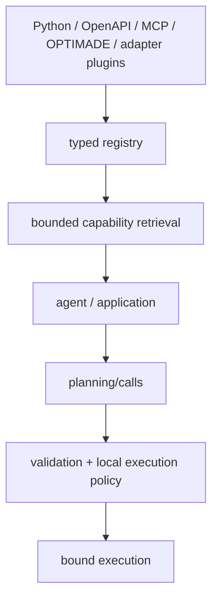

# 안정 코어 계약

SchemaRouter의 현재 제품 아키텍처는 연구가 독립적으로 계속되는 동안 동결할 수 있을 만큼 완성된 것으로 간주합니다.

이 문서는 1.0 API 보장을 선언하지 **않습니다**. SchemaRouter는 여전히 pre-1.0이며 [버전 관리](versioning.md)의 호환성 규칙을 따릅니다. 이 동결의 목적은 더 좁습니다. 연구 결과가 제품 경계를 반복해서 재정의하기보다 현재 제품 경계 뒤의 구현과 기본값을 개선하도록 하는 것입니다.

## 동결된 제품 경계

다음 구분은 제품 계약의 일부입니다.

### 검색은 실행 권한이 아닙니다

`retrieve`와 `aretrieve`는 등록된 capability contract에서 제한된 typed candidate를 반환합니다. 도구를 실행하지 않으며 실행 권한도 부여하지 않습니다.

`retrieve_executable`과 `aretrieve_executable`은 현재 로컬 binding readiness까지 추가로 필터링합니다. 그래도 실행하거나 side effect를 승인하지는 않습니다.

명시적 state-aware surface는 안정적인 stateless facade의 대체물이 아니라 추가 기능입니다. `retrieve_state_aware`는 고정 Top-K를 host가 제공한 typed state에 따라 필터링하고, `reretrieve_state_aware`는 K개의 eligible candidate를 찾거나 보이는 surface가 소진될 때까지 같은 host-visible ranked surface에서 보충합니다. 어느 메서드도 workflow state를 추론하거나 visibility를 넓히거나 capability를 실행하지 않습니다.

### Candidate contract는 실행 가능한 schema를 보존합니다

`CapabilityCandidate`는 다음을 보존합니다.

- route/tool/endpoint identity
- 완전한 effective input/output JSON Schema
- 선언된 parameter와 output field
- semantic ID, datatype, 선택적 unit/dimension/qualifier
- read/write/destructive 분류
- provider/source/access metadata
- tool 및 endpoint fingerprint

Downstream agent에는 더 작은 serialized view를 전달할 수 있지만 SchemaRouter 결과 자체는 등록된 typed contract를 유지합니다.

### 실행은 계속 fail-closed합니다

실제 호출에는 다음 조건이 적용됩니다.

- 등록된 tool/endpoint identity
- schema 및 fingerprint validation
- local binding readiness
- execution policy
- approval rule
- retry restriction
- execution budget
- trusted hook 및 transport boundary

Retrieval ranking, 외부 agent, LangChain, LangGraph, LlamaIndex 또는 다른 adapter는 실행 권한을 부여할 수 없습니다.

### Integration은 대체 runtime이 아니라 adapter입니다

LangChain, LangGraph, LlamaIndex integration surface는 선택 사항입니다. SchemaRouter의 validation이나 policy를 대체하지 않습니다.

Core package는 이러한 optional dependency 없이도 import하고 사용할 수 있어야 합니다.

## 현재 연구 주기에 동결된 public facade

연구는 다음 facade를 보존하면서 내부 ranking/index 구현을 변경할 수 있습니다.

- `SchemaRouter.retrieve(..., k=5)`
- `SchemaRouter.aretrieve(..., k=5)`
- `SchemaRouter.retrieve_executable(..., k=5)`
- `SchemaRouter.aretrieve_executable(..., k=5)`
- 추가형 `retrieve_state_aware` / `aretrieve_state_aware` 및 `reretrieve_state_aware` / `areretrieve_state_aware` typed-state surface
- 동등한 `ConfiguredSchemaRouter` retrieval method
- 기존 planning, invocation, batch, streaming, policy, inspection API

전체 top-level export 목록은 `tests/test_public_api.py`로 계속 보호합니다.

## 제품을 재설계하지 않고 연구가 변경할 수 있는 것

근거가 있다면 다음과 같은 호환 변경을 정당화할 수 있습니다.

- 대체 retrieval index 또는 representation
- 향후 minor release의 다른 문서화된 기본 K
- adaptive shortlist depth
- corrective re-retrieval
- 추가 scoring backend
- 성능 최적화
- 새로운 optional adapter

이러한 변경은 일반적으로 동일한 typed retrieval 및 execution boundary 뒤에 남아야 합니다.

Provider-first registration, versioned capability artifact/snapshot, atomic snapshot publication, dependency-graph indexing, decision trace 역시 이 경계 주변의 인프라입니다. 두 번째 planner를 만들거나 실행 권한을 부여하지 않습니다.

## 제품 아키텍처를 다시 열어야 하는 경우

Public boundary 재설계에는 최소한 다음 중 하나가 필요합니다.

- 재현 가능한 correctness defect
- security 또는 execution-authority flaw
- 기존 facade로 표현할 수 없는 중요한 user workflow
- adapter로 해결할 수 없는 ecosystem compatibility constraint
- migration documentation을 동반한 의도적인 breaking minor release

Benchmark 개선만으로 facade를 재설계할 충분한 이유가 되지는 않습니다.

## 완성도와 외부 운영의 구분

다음 항목은 core freeze를 막지 않습니다.

- stronger-agent 또는 held-out research
- final-answer-quality research
- ecosystem-directory/listing response
- repository About metadata
- PyPI Trusted Publisher environment hardening

이들은 계속 추적되는 작업이지만 로컬 패키지 architecture/API가 완전하고 내부적으로 일관적인지와는 별개의 문제입니다.
