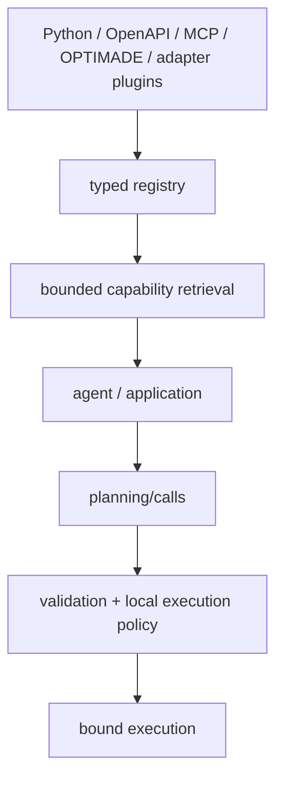

# Stable core contract

SchemaRouter의 현재 product architecture는 research가 독립적으로 계속되는 동안 freeze할 수 있을 만큼 완성된 것으로 봅니다. 이는 1.0 API guarantee가 아니며 pre-1.0 compatibility policy는 [Versioning](versioning.md)을 따릅니다.

## 고정된 product boundary

retrieval은 execution authority가 아닙니다. `retrieve`/`aretrieve`는 registered contract에서 bounded typed candidate를 반환할 뿐 실행/권한을 부여하지 않습니다. executable variant도 current binding readiness를 추가로 filter할 뿐 side effect를 authorize하지 않습니다.

`CapabilityCandidate`는 route/tool/endpoint identity, effective input/output JSON Schema, parameter/output field, semantic ID/datatype/unit/qualifier, read/write/destructive classification, provider/source/access metadata, fingerprint를 보존합니다.

실제 invocation은 identity, schema/fingerprint, binding readiness, execution policy, approval, retry restriction, budget, trusted hook/transport를 계속 통과해야 합니다. external agent/framework/ranking이 authority를 부여할 수 없습니다.

LangChain/LangGraph/LlamaIndex는 optional adapter이지 alternate runtime이 아니며 core package는 optional dependency 없이 import/use 가능해야 합니다.

research는 같은 public facade 뒤에서 alternate retrieval index/representation, future K, adaptive shortlist, corrective re-retrieval, scoring backend, performance optimization, optional adapter 등을 시험할 수 있습니다.

public-boundary redesign은 reproducible correctness/security flaw, 기존 facade로 표현 불가능한 중요한 workflow, adapter로 해결할 수 없는 ecosystem constraint, 명시적 breaking minor release 같은 근거가 필요합니다. benchmark 개선만으로 facade를 재설계하지 않습니다.

## 현재 main의 호환 확장

기존 `retrieve(request, *, k=5)` / `aretrieve(request, *, k=5)` facade는 그대로 stateless하게
유지합니다. Host state가 필요한 경우에는 별도 `retrieve_state_aware` /
`aretrieve_state_aware`를 사용하고, visible ranked surface에서 eligible Top-K를 backfill해야
할 때만 `reretrieve_state_aware` / `areretrieve_state_aware`를 사용합니다.

Provider-first 등록, indexed/incremental capability dependency graph, atomic snapshot publication,
versioned artifact/snapshot migration, unified decision trace는 이 stable boundary 주위의
인프라 확장입니다. Workflow state를 추론하거나 hidden capability를 노출하거나 execution
authority를 추가하지 않습니다.
